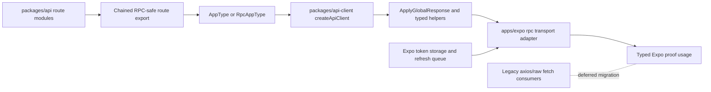

# refactor: Establish Hono RPC foundation with standalone api-client workspace

## Overview

Establish a repo-wide Hono RPC foundation that exports a stable typed API surface from `packages/api`, consumes that surface from a new standalone `packages/api-client` workspace, and proves end-to-end request/response inference from an Expo consumer without yet replacing the entire `axios` and raw `fetch` call graph.

This first milestone is intentionally narrow. It should leave the repo in a state where type-safe RPC is demonstrably viable and ergonomically consumable. Broad consumer migration comes after that proof.

## Problem Frame

The current server already uses Hono and `OpenAPIHono`, but the client side is split across:

- `apps/expo/lib/api/client.ts` with an `axios` instance, token attachment, refresh retry queue, and re-auth trigger behavior
- many feature-level `axiosInstance.*` calls across Expo
- several raw `fetch` calls in auth flows and a few other feature paths

That transport layer has no compile-time coupling to the server routes. Renaming a route, changing query/body shapes, or changing response types can break consumers silently until runtime.

Upstream Hono RPC guidance is strict about a few things that materially affect this repo:

- monorepo RPC typing requires `"strict": true` in both client and server tsconfigs
- larger apps should export the type of a chained route registration, not an ad hoc mutable router object
- global `onError()` responses are not inferred automatically by `hc`
- IDE/type-instantiation cost increases with route volume, so the exported type surface must be deliberate

The goal of this plan is to make the type-safe path real and provable before touching the full consumer migration.

## Requirements Trace

- R1. Introduce a standalone `api-client` workspace that owns Hono RPC client creation and shared client-side typing concerns.
- R2. Export a stable RPC-safe server type from `packages/api` that survives nested route composition and `OpenAPIHono`.
- R3. Preserve the current Expo auth behavior model for future migration: bearer token attachment, refresh retry queue, and `needsReauthAtom` signaling.
- R4. Prove that a consumer in `apps/expo` gets strongly inferred request and response types from the Hono server without hand-written DTO duplication.
- R5. Keep the first milestone narrow: no repo-wide replacement of `axios` and raw `fetch` yet.
- R6. Bump Hono-related dependencies as part of the foundation work, but do so as one compatibility-checked family rather than piecemeal.

## Scope Boundaries

- No full replacement of every `axiosInstance` call in `apps/expo`.
- No removal of `apps/expo/lib/api/client.ts` in this milestone.
- No broad rewrite of auth flows that currently use raw `fetch`.
- No generated OpenAPI client or schema-codegen pipeline.
- No changes to `apps/landing` or `apps/guides` consumers unless needed for shared package compatibility.

### Deferred to Separate Tasks

- Full migration of Expo feature modules from `axios` to the new RPC client.
- Migration of auth entry points (`login`, `register`, social auth, password reset) to typed RPC calls.
- Cleanup/removal of legacy transport helpers after all consumers have moved.
- Any further client adoption in non-Expo apps.

## Context & Research

### Relevant Code and Patterns

- `packages/api/src/index.ts` mounts the API at `app.route('/api', routes)` and owns global middleware plus `onError()`.
- `packages/api/src/routes/index.ts` composes public and protected subrouters with imperative `route()` calls on mutable `OpenAPIHono` instances.
- Domain router index files such as `packages/api/src/routes/packs/index.ts` and `packages/api/src/routes/trips/index.ts` follow the same imperative composition pattern.
- Route handlers already declare request/response contracts with `createRoute(...)` plus `app.openapi(...)`, which is the right source of truth for RPC typing.
- `apps/expo/lib/api/client.ts` centralizes auth header injection, token refresh, retry queueing, and re-auth fallback.
- `apps/expo/features/auth/README.md` documents the required non-blocking re-auth behavior and should remain the behavioral contract for any future RPC transport.
- `apps/expo/tsconfig.json` and `packages/api/tsconfig.json` already have `"strict": true`, which satisfies the Hono monorepo RPC prerequisite.

### Institutional Learnings

- No `docs/solutions/` knowledge base exists in this repo today, so there are no prior institutional learnings to reuse for this migration.

### External References

- Hono RPC guide: `https://hono.dev/docs/guides/rpc`
- Hono Best Practices, especially larger apps and RPC chaining: `https://hono.dev/docs/guides/best-practices`
- Hono full docs export: `https://hono.dev/llms-full.txt`
- `@hono/zod-openapi` README, RPC mode: `https://github.com/honojs/middleware/tree/main/packages/zod-openapi#rpc-mode`
- Hono releases page for current family updates: `https://github.com/honojs/hono/releases`

## Key Technical Decisions

- Use Hono RPC directly, not OpenAPI code generation.
  Rationale: the server is already authored in Hono and `OpenAPIHono`; direct `hc<AppType>` preserves source-of-truth typing with less moving machinery.

- Introduce `packages/api-client` as the only shared client-entry workspace.
  Rationale: this isolates Hono RPC setup, keeps app consumers thin, and avoids scattering `hc` configuration across Expo features.

- Export a dedicated RPC-safe route type from chained route composition.
  Rationale: upstream Hono guidance for larger applications is explicit that chained `route()` composition is the safe path for inferred `AppType`.

- Keep auth/retry behavior in an adapter layer outside the core RPC package.
  Rationale: token storage, refresh queues, and re-auth atoms are Expo-specific concerns; `packages/api-client` should stay portable while `apps/expo` owns runtime auth wiring.

- Add compile-time proof before runtime migration.
  Rationale: the user’s success criterion is type safety first. If inference is weak or brittle, broad migration should stop.

- Treat global 500 responses as an explicit typed concern.
  Rationale: Hono does not infer `onError()` responses automatically, so the client package must either apply `ApplyGlobalResponse` or deliberately leave those responses untyped. This plan chooses explicit typing.

- Bump Hono-family dependencies together.
  Rationale: `hono`, `@hono/zod-openapi`, `@hono/zod-validator`, and related middleware have been evolving quickly. Moving them in one audited pass reduces mixed-version type breakage.

## Open Questions

### Resolved During Planning

- Should the first pass also migrate all consumers?
  Resolution: no. This milestone ends once typed RPC is exported, consumable, and proven from Expo.

- Should auth behavior move into the shared `api-client` package?
  Resolution: no. The shared package should expose a transport seam; Expo keeps ownership of token persistence, refresh queueing, and re-auth signaling.

- Should this work happen in an isolated branch/worktree?
  Resolution: yes. Use a dedicated worktree/branch for this milestone, with a concise branch name such as `refactor/hono-rpc-foundation`.

### Deferred to Implementation

- Exact target versions for the Hono-family dependency bump.
  Why deferred: the implementation should resolve the newest mutually compatible set at install time rather than hard-coding a guessed version in the plan.

- Whether a single exported `AppType` is ergonomically acceptable for IDE performance, or whether the client package should also export route-slice types.
  Why deferred: the correct split depends on actual type-check and editor performance after the first proof harness lands.

- Whether Expo should instantiate one singleton RPC client or multiple specialized clients.
  Why deferred: the type foundation should be built first; final ergonomics can be tuned during consumer migration.

## Output Structure

```text
docs/
  plans/
    2026-04-15-001-refactor-hono-rpc-foundation-plan.md
packages/
  api-client/
    package.json
    tsconfig.json
    src/
      index.ts
      client.ts
      responses.ts
      types.ts
    test/
      rpc-types.test.ts
apps/
  expo/
    lib/
      api/
        rpcClient.ts
        rpcTransport.ts
    test/
      rpc-client-proof.test.ts
```

## High-Level Technical Design

> *This illustrates the intended approach and is directional guidance for review, not implementation specification. The implementing agent should treat it as context, not code to reproduce.*



The important separation is:

- `packages/api` owns the typed route graph
- `packages/api-client` owns RPC client construction and shared response typing
- `apps/expo` owns runtime auth behavior

## Implementation Units

- [ ] **Unit 1: Create isolated workspace scaffold and dependency alignment**

**Goal:** Add the `packages/api-client` workspace, wire it into repo-level TypeScript/package resolution, and align Hono-family dependencies before any route typing work begins.

**Requirements:** R1, R6

**Dependencies:** None

**Files:**
- Modify: `package.json`
- Modify: `tsconfig.json`
- Modify: `packages/api/package.json`
- Modify: `apps/expo/package.json`
- Modify: `bun.lock`
- Create: `packages/api-client/package.json`
- Create: `packages/api-client/tsconfig.json`

**Approach:**
- Add a new workspace package named `@packrat/api-client`.
- Add repo-level path aliases or package consumption paths so Expo can import it as a normal workspace package rather than by source-relative hacks.
- Bump Hono-family dependencies in a single pass after checking upstream compatibility notes and changelogs.
- Keep `strict` enabled in the new package tsconfig from day one.

**Patterns to follow:**
- `packages/ui/package.json` for workspace package naming and placement
- `apps/expo/tsconfig.json` and `packages/api/tsconfig.json` for package-local strict TypeScript configuration

**Test scenarios:**
- Happy path: workspace install resolves `@packrat/api-client` from Expo and API packages without manual symlinks or path hacks.
- Edge case: root type-check still resolves existing `@packrat/api/*` and `@packrat/ui/*` imports after adding the new alias/package.
- Error path: incompatible Hono-family version bumps fail fast during install or type-check rather than surfacing later as ambiguous route typing.

**Verification:**
- The monorepo installs cleanly and recognizes `@packrat/api-client` as a workspace package.
- Type-check configuration for the new package is strict and reachable from Expo.

- [ ] **Unit 2: Export an RPC-safe server type surface from chained route composition**

**Goal:** Refactor server route composition so the repo exports a stable type suitable for Hono RPC across nested `OpenAPIHono` routers.

**Requirements:** R2, R4

**Dependencies:** Unit 1

**Files:**
- Modify: `packages/api/src/index.ts`
- Modify: `packages/api/src/routes/index.ts`
- Modify: `packages/api/src/routes/packs/index.ts`
- Modify: `packages/api/src/routes/trips/index.ts`
- Modify: `packages/api/src/routes/catalog/index.ts`
- Modify: `packages/api/src/routes/guides/index.ts`
- Modify: `packages/api/src/routes/packTemplates/index.ts`
- Test: `packages/api/test/health.test.ts`
- Test: `packages/api/test/auth.test.ts`
- Test: `packages/api/test/packs.test.ts`

**Approach:**
- Capture the return value of top-level `route()` composition in a dedicated exported variable such as `rpcRoutes` or `apiRoutes`, instead of relying only on mutable router instances.
- Preserve the worker entry shape in `packages/api/src/index.ts` so deployment behavior does not change.
- Export the route type from the routed graph rather than from the worker default export object.
- Audit route aggregators that currently register subrouters imperatively and update the boundaries that must contribute to the exported RPC type.
- If needed, add an explicit typed global error wrapper using Hono client utilities so the shared client can account for the global `500` JSON shape from `onError()`.

**Execution note:** Start with a compile-only proof of the exported route type before any Expo integration.

**Patterns to follow:**
- Existing domain router index files in `packages/api/src/routes/*/index.ts`
- Hono Best Practices for larger applications and RPC chaining

**Test scenarios:**
- Happy path: the exported app type exposes mounted paths such as `/api/packs`, `/api/trips`, `/api/auth`, and nested parameterized routes to a client type.
- Edge case: route composition through nested router index files still preserves parameter, query, and body inference.
- Error path: explicit `404`, `401`, and `400` route responses remain inferable as typed JSON unions where those routes already declare them.
- Integration: the runtime worker export still responds through `fetch` exactly as before after the route-type export refactor.

**Verification:**
- A type import from `packages/api` can be fed to `hc<...>()` without losing mounted route paths.
- Existing API tests continue to pass against the unchanged runtime entry point.

- [ ] **Unit 3: Build the standalone shared RPC client package**

**Goal:** Implement `packages/api-client` as the canonical location for Hono client creation, response typing helpers, and transport hooks.

**Requirements:** R1, R2, R4

**Dependencies:** Unit 2

**Files:**
- Create: `packages/api-client/src/index.ts`
- Create: `packages/api-client/src/client.ts`
- Create: `packages/api-client/src/responses.ts`
- Create: `packages/api-client/src/types.ts`
- Test: `packages/api-client/test/rpc-types.test.ts`

**Approach:**
- Import the server `AppType` from `@packrat/api` and expose a small factory such as `createApiClient(...)`.
- Use `hc<AppType>(baseUrl, options)` as the core client primitive.
- Centralize any Hono-specific typing helpers here, including `InferResponseType`, `InferRequestType`, and `ApplyGlobalResponse` if the server keeps a global typed error contract.
- Keep the shared package runtime-agnostic by accepting injected `fetch`, headers, and request init options instead of directly touching Expo storage or Jotai state.
- Export a narrow public surface so future consumers do not depend on raw `hc` internals everywhere.

**Patterns to follow:**
- `apps/expo/lib/api/client.ts` as the behavioral reference for what the transport layer eventually needs to support
- Hono RPC guide for `hc`, status-specific response typing, custom `fetch`, and custom query serialization

**Test scenarios:**
- Happy path: a typed client factory exposes correct method names and request shapes for representative routes such as packs list, weather lookup, and auth refresh.
- Edge case: route helpers correctly infer parameterized routes and query-bearing routes.
- Error path: a route with explicit `404` or `401` responses produces a typed union rather than `unknown`.
- Integration: global error typing is present for the shared `500` JSON contract if `ApplyGlobalResponse` is adopted.

**Verification:**
- The shared package can be imported without Expo-only dependencies.
- Type tests fail if a server route shape changes in a way the client package no longer matches.

- [ ] **Unit 4: Add an Expo RPC transport adapter that preserves current auth semantics**

**Goal:** Instantiate the shared RPC client inside Expo using a custom transport that preserves bearer token injection, refresh retries, and re-auth signaling.

**Requirements:** R3, R4

**Dependencies:** Unit 3

**Files:**
- Create: `apps/expo/lib/api/rpcTransport.ts`
- Create: `apps/expo/lib/api/rpcClient.ts`
- Modify: `apps/expo/features/auth/README.md`
- Test: `apps/expo/test/rpc-client-proof.test.ts`

**Approach:**
- Build a custom `fetch` adapter for Hono `hc` that mirrors the current `axios` interceptor contract:
  attach bearer token, catch `401`, queue concurrent retries during refresh, update stored tokens on success, and trigger `needsReauthAtom` on hard failure.
- Keep legacy `apps/expo/lib/api/client.ts` in place during this milestone; the new adapter is additive.
- Limit runtime wiring to one shared client instantiation point in Expo so future consumer migration does not recreate auth logic per feature.
- Document which auth flows remain outside RPC for now.

**Execution note:** Add characterization coverage for refresh queue behavior before trying to replace any existing runtime callers.

**Patterns to follow:**
- `apps/expo/lib/api/client.ts`
- `apps/expo/features/auth/README.md`
- Hono RPC custom `fetch` guidance

**Test scenarios:**
- Happy path: authenticated requests include the current bearer token and succeed through the RPC client.
- Edge case: multiple concurrent `401` responses trigger one refresh flow and replay queued requests once tokens are updated.
- Error path: refresh failure sets `needsReauthAtom` and rejects queued callers consistently.
- Integration: the Expo-specific transport can be passed into the shared `createApiClient(...)` factory without weakening route inference.

**Verification:**
- Expo has a single typed RPC client entry point ready for future adoption.
- The new transport reproduces the existing auth-refresh semantics in tests or characterization coverage.

- [ ] **Unit 5: Prove end-to-end type safety from an Expo consumer without broad migration**

**Goal:** Add a consumer-side proof harness that demonstrates the type-safe path is real before the repo commits to migrating all callers.

**Requirements:** R4, R5

**Dependencies:** Unit 4

**Files:**
- Modify: `apps/expo/package.json`
- Test: `apps/expo/test/rpc-client-proof.test.ts`
- Test: `packages/api-client/test/rpc-types.test.ts`

**Approach:**
- Write compile-focused proof usage against a small but representative set of endpoints:
  at least one query route, one param route, one JSON body route, and one route with explicit non-200 responses.
- Use type assertions that fail loudly if request or response inference regresses.
- Keep proof usage out of feature screens for now; the success criterion is compile-time confidence, not visible product change.
- Produce a migration inventory from existing `axiosInstance` and raw `fetch` usage to seed the next task, but do not convert those callers in this milestone.

**Patterns to follow:**
- Existing Vitest setup in `apps/expo/vitest.config.ts`
- Existing repo pattern of colocated test files under `test/` or `__tests__/`

**Test scenarios:**
- Happy path: Expo proof code gets fully typed request inputs and `res.json()` output for representative routes.
- Edge case: route params and query keys autocomplete and reject invalid keys/types at compile time.
- Error path: explicit `404`, `401`, and `500` response shapes are represented in client-side narrowing logic.
- Integration: changing a server route contract breaks the proof harness at compile time without requiring a runtime failure.

**Verification:**
- There is at least one compile-enforced Expo consumer proof showing end-to-end inference from server to client.
- The repo has a concrete migration inventory for the next phase.

## System-Wide Impact

- **Interaction graph:** `packages/api` route composition and `onError()` typing now become an external contract for `packages/api-client`, which in turn becomes a dependency of Expo transport code.
- **Error propagation:** route-level typed JSON errors should remain explicit; global `500` handling should be modeled centrally rather than inferred ad hoc by consumers.
- **State lifecycle risks:** token refresh queueing is the highest-risk runtime concern because it currently coordinates concurrent request replay and re-auth fallback.
- **API surface parity:** any future client consumer should go through `packages/api-client` rather than creating its own `hc` instance.
- **Integration coverage:** compile-time proof alone is insufficient for auth refresh; the adapter must also have runtime-oriented coverage for queue replay and failure signaling.
- **Unchanged invariants:** deployment entry shape in `packages/api/src/index.ts`, auth token storage keys, and the non-blocking re-auth UX contract must remain unchanged in this first milestone.

## Risks & Dependencies

| Risk | Mitigation |
|------|------------|
| Exported route type loses mounted paths because composition remains imperative in one or more aggregators | Refactor all composition boundaries that contribute to the exported client graph and add compile-only route shape proof early |
| Hono-family dependency bump introduces subtle type regressions with `OpenAPIHono` | Bump the family together, type-check immediately, and keep the first proof harness small enough to localize failures |
| IDE performance degrades when exporting the entire route graph | Measure editor/type-check ergonomics during proof and split into route-slice exports later if needed |
| Expo auth semantics drift from existing axios behavior | Treat `apps/expo/lib/api/client.ts` plus `apps/expo/features/auth/README.md` as characterization sources and test the refresh queue explicitly |
| Shared package becomes Expo-specific and hard to reuse | Keep runtime auth logic in Expo adapter files and keep `packages/api-client` transport-agnostic |

## Documentation / Operational Notes

- Update `apps/expo/features/auth/README.md` to explain the coexistence period between legacy `axios` transport and the new RPC transport.
- Capture the existing `axios` and raw `fetch` call inventory during implementation so the next migration plan can batch consumers intentionally.
- Keep the work on an isolated worktree/branch because the server route typing refactor and dependency bump are both broad blast-radius changes.

## Phased Delivery

### Phase 1

- Units 1-3
- Outcome: server exports a usable `AppType` and a shared `@packrat/api-client` package exists

### Phase 2

- Units 4-5
- Outcome: Expo can instantiate the typed client with preserved auth semantics, and type safety is proven without broad consumer migration

## Sources & References

- Related code: `packages/api/src/index.ts`
- Related code: `packages/api/src/routes/index.ts`
- Related code: `apps/expo/lib/api/client.ts`
- Related code: `apps/expo/features/auth/hooks/useAuthActions.ts`
- External docs: `https://hono.dev/docs/guides/rpc`
- External docs: `https://hono.dev/docs/guides/best-practices`
- External docs: `https://hono.dev/llms-full.txt`
- External docs: `https://github.com/honojs/middleware/tree/main/packages/zod-openapi#rpc-mode`
- External docs: `https://github.com/honojs/hono/releases`
