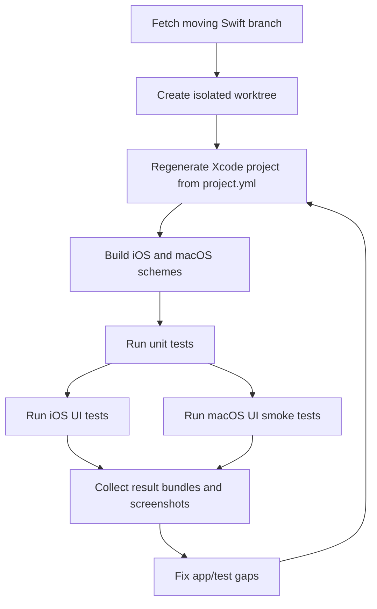

# feat: Harden Swift end-to-end coverage

## Overview

Build on `claude/swift-mac-app-effort-tTGd7` by creating an isolated worktree and turning the current Swift XCTest/XCUITest surface into reliable iOS and macOS end-to-end coverage. The goal is confidence that the new native Swift app can build, launch, authenticate, navigate core flows, and exercise user-visible behavior without depending on fragile shared state or stale branch assumptions.

## Problem Frame

The Swift app branch is active and other agents are pushing to it. It already adds a large `apps/swift/` tree, XcodeGen project configuration, iOS unit tests, and iOS UI tests. The current coverage is a strong start, but it does not yet prove the native app is working end to end across both promised platforms. It also has concurrency risks: agents can unknowingly base work on stale remote commits, modify the same test files, or leave test data in a shared E2E account that changes later test outcomes.

## Requirements Trace

- R1. Create and work from a fresh worktree based on the latest `origin/claude/swift-mac-app-effort-tTGd7`, not the dirty `development` checkout.
- R2. Verify the Swift project can regenerate, build, and run unit tests for the current branch state.
- R3. Expand iOS XCUITest coverage to cover authentication, navigation, packs, trips, templates, weather, catalog, chat, feed, trail conditions, and the newer Expo-parity surfaces.
- R4. Add macOS build and E2E coverage so the native Mac app is tested as a first-class target, not inferred from iOS success.
- R5. Make E2E tests isolated and repeatable when multiple agents are running against the same branch and shared backend.
- R6. Provide a single repeatable test runner path for local agents and CI, with clear output and failure artifacts.
- R7. Keep generated Xcode artifacts out of git and preserve XcodeGen as the source of truth.

## Scope Boundaries

- This plan does not implement new product features unless a test exposes a missing accessibility hook, test-only launch flag, or deterministic fixture path required for coverage.
- This plan does not replace the existing Expo Maestro suite. It covers the native Swift app under `apps/swift/`.
- This plan does not solve backend E2E data isolation globally. It defines the Swift client-side contract and minimal API/data assumptions needed for stable tests.
- This plan does not require pixel-perfect parity between Expo and Swift UI.

### Deferred to Separate Tasks

- Server-side dedicated E2E tenancy or reset APIs: separate backend plan if current API cannot support deterministic cleanup.
- Full App Store signing/archive validation: separate release-readiness plan after functional E2E passes.

## Context & Research

### Relevant Code and Patterns

- `apps/swift/project.yml` defines `PackRat-iOS`, `PackRat-macOS`, `PackRatTests`, and `PackRatUITests`. Tests currently target iOS only.
- `apps/swift/scripts/run-e2e.ts` injects `E2E_EMAIL` and `E2E_PASSWORD` into the generated `PackRat-iOS.xcscheme`, then runs `xcodebuild test -only-testing:PackRatUITests`.
- `apps/swift/Tests/PackRatUITests/AppUITestCase.swift` logs in through the UI and launches with `--disable-animations`.
- `apps/swift/Tests/PackRatUITests/AuthTests.swift` has its own login-state handling and recently added reset-auth behavior.
- Existing UI suites already cover Auth, Navigation, Packs, Pack subflows, Trips, Weather, Catalog, Chat, Feed, Templates, Season Suggestions, Trail Conditions, and More tabs.
- Existing unit suites cover model formatting/decoding, endpoint construction, request encoding, service payloads, and view-model filtering/state.
- `docs/plans/2026-05-02-001-refactor-swift-xcodegen-multiplatform-plan.md` establishes XcodeGen, shared SwiftUI source, bundle IDs, and generated project expectations.
- `docs/plans/2026-05-02-002-feat-swift-expo-parity-plan.md` establishes the Swift feature-parity roadmap and identifies the user-facing surfaces that need coverage.
- `CLAUDE.md` notes that SourceKit can report false positives and that build success is the real signal.

### Institutional Learnings

- No directly matching Swift/Xcode E2E solution exists under `docs/solutions/`.
- Existing PackRat E2E convention uses durable scripts and named flows rather than one-off manual commands.
- The current repo often has dirty unrelated files; implementation must avoid reverting unrelated changes.

### External References

- External research intentionally skipped. The repo already contains the relevant XcodeGen/XCTest structure and the next decisions are local: target definitions, runner shape, data isolation, and coverage gaps.

## Key Technical Decisions

- Use a new worktree from the moving Swift branch: Execution should begin by fetching `origin/claude/swift-mac-app-effort-tTGd7` and creating a new worktree branch from that remote ref. Re-fetch before editing and before final verification because other agents are pushing.
- Treat `project.yml` as authoritative: Add or change test targets and schemes in `apps/swift/project.yml`, then regenerate with the existing `bun swift` flow. Do not hand-edit generated `.xcodeproj` files except through the existing ephemeral scheme credential injection in the runner.
- Split test concerns by layer: Unit tests cover pure models, request encoding, view-model state, and test doubles. UI tests cover app launch, auth, navigation, form validation, CRUD flows, and cross-screen behavior. Runner tests cover environment validation and command construction.
- Add macOS coverage explicitly: Create macOS unit/UI test targets or schemes rather than assuming the iOS test bundle validates macOS behavior. At minimum, macOS E2E must launch, authenticate, exercise sidebar navigation, open settings, and verify multi-window commands for packs/trips where test data exists.
- Make E2E data unique by default: Test-created records should include a run-scoped identifier and clean up through UI or API-backed helper paths where possible. Tests must not depend on a blank account.
- Prefer accessibility identifiers over brittle text queries: Add identifiers only where tests need stable hooks. Keep them semantic and user-flow oriented, such as `pack_form_name`, `pack_item_add`, or `weather_search_field`.
- Preserve live-backend confidence while enabling deterministic smoke mode: Full E2E should run against the configured backend with real credentials, but test-only launch arguments may seed local state, clear auth, disable animations, and point at a local/staging API when available.
- Keep credentials out of logs and durable artifacts: The runner may validate that credentials are present and inject them into ephemeral generated scheme state, but it must never print credential values or include them in committed files, result bundle notes, screenshots, or CI logs.

## Open Questions

### Resolved During Planning

- Should the initial execution use a worktree? Yes. The main checkout is dirty and the Swift branch is moving.
- Is the current Swift test surface empty? No. It already has meaningful unit and iOS UI suites under `apps/swift/Tests`.
- Is macOS currently covered by tests? Not directly. `PackRat-macOS` builds as an app target, but test targets in `project.yml` are iOS-only.
- Should this replace Maestro? No. Maestro remains the Expo E2E suite; Swift should use XCTest/XCUITest for native app coverage.

### Deferred to Implementation

- Exact simulator names and installed runtimes: discover at execution time from local Xcode.
- Whether the current backend supports safe cleanup for every entity: verify while hardening tests; if not, isolate through unique names and document residual test data.
- Whether macOS UI tests need a separate app wrapper target or can share most helpers with conditional compilation: decide after the first generated project test pass.
- Whether local macOS UI automation needs additional Accessibility/TCC permissions on the developer machine or CI runner: discover during the first macOS smoke execution and document the setup if required.

## High-Level Technical Design

> *This illustrates the intended approach and is directional guidance for review, not implementation specification. The implementing agent should treat it as context, not code to reproduce.*

## Implementation Units

- [ ] **Unit 1: Worktree and moving-branch execution guardrails**

**Goal:** Establish an isolated implementation branch/worktree and a repeatable preflight that keeps agents synchronized with the latest Swift branch.

**Requirements:** R1, R5

**Dependencies:** None

**Files:**
- Modify: `CLAUDE.md`
- Modify: `apps/swift/scripts/run-e2e.ts`
- Create: `apps/swift/scripts/run-e2e.test.ts`

**Approach:**
- Create the implementation worktree from the latest `origin/claude/swift-mac-app-effort-tTGd7` using the repo worktree manager, with a branch name dedicated to Swift E2E hardening.
- Add runner preflight messaging that prints the current git branch, HEAD SHA, and upstream SHA before running E2E.
- Add a stale-branch warning when the local branch is behind its upstream, without blocking local smoke runs.
- Document the concurrency rule: re-fetch before touching `apps/swift/Tests/**`, `apps/swift/project.yml`, or shared runner scripts.

**Execution note:** Start by characterizing the current runner behavior before changing it, because other agents may have already modified the same branch.

**Patterns to follow:**
- `apps/swift/scripts/run-e2e.ts` for existing environment loading and scheme mutation.
- `CLAUDE.md` for repo-local workflow notes.

**Test scenarios:**
- Happy path: runner prints current branch and HEAD before launching tests.
- Edge case: no upstream configured -> runner prints a non-fatal warning and continues.
- Edge case: upstream is ahead -> runner prints a clear stale-branch warning.
- Error path: runner output redacts environment values and never prints `E2E_PASSWORD`.
- Integration: worktree branch can regenerate the Xcode project without adding generated `.xcodeproj` files to git.

**Verification:**
- A fresh worktree is available and `git status` there contains only intentional changes.
- Runner preflight output makes stale branch state visible before expensive test work starts.

- [ ] **Unit 2: Baseline build and unit-test hardening**

**Goal:** Make the current Swift unit-test suite a reliable first gate before UI tests run.

**Requirements:** R2, R6, R7

**Dependencies:** Unit 1

**Files:**
- Modify: `apps/swift/project.yml`
- Modify: `apps/swift/Tests/PackRatTests/ModelTests.swift`
- Modify: `apps/swift/Tests/PackRatTests/NetworkTests.swift`
- Modify: `apps/swift/Tests/PackRatTests/ServiceTests.swift`
- Modify: `apps/swift/Tests/PackRatTests/ViewModelTests.swift`
- Modify: `apps/swift/scripts/run-e2e.ts`

**Approach:**
- Verify `PackRatTests` compiles under the generated project and add missing unit coverage for code paths that UI tests depend on: auth reset flags, endpoint base URL selection, request encoding, and view-model empty/error states.
- Decide whether `PackRatTests` should run for both iOS and macOS schemes or whether a separate macOS unit-test target is required. The plan should not rely on iOS-only unit compilation to prove shared Swift source is valid on macOS.
- Add a runner mode that can run unit tests only, UI tests only, or all Swift tests.
- Keep unit tests independent of network and keychain residue. Tests that touch keychain state must use a test namespace or clear state in setup/teardown.

**Patterns to follow:**
- Existing `Testing` framework suites in `ModelTests.swift` and `ViewModelTests.swift`.
- Existing request encoding tests in `ServiceTests.swift`.

**Test scenarios:**
- Happy path: model decoding handles API payloads with nested packs, trips, weather, catalog, and generated types used by UI flows.
- Happy path: endpoint builder produces expected method, path, query, body, and auth flags.
- Edge case: unknown enum values decode into safe fallbacks where the app expects resilience.
- Edge case: keychain tests do not leak tokens between test cases.
- Error path: malformed server payloads used in view models surface a user-safe error state, not a crash.
- Integration: shared source unit tests compile under every platform scheme that claims to ship the shared Swift app.

**Verification:**
- Unit tests pass from the generated Xcode project.
- Unit-test mode fails fast before any simulator UI work when pure Swift behavior is broken.

- [ ] **Unit 3: iOS E2E isolation and shared helpers**

**Goal:** Make existing iOS UI tests deterministic, isolated, and easier to extend.

**Requirements:** R3, R5, R6

**Dependencies:** Unit 2

**Files:**
- Modify: `apps/swift/Tests/PackRatUITests/AppUITestCase.swift`
- Modify: `apps/swift/Tests/PackRatUITests/AuthTests.swift`
- Modify: `apps/swift/Sources/PackRat/Network/AuthManager.swift`
- Modify: `apps/swift/Sources/PackRat/PackRatApp.swift`
- Modify: `apps/swift/scripts/run-e2e.ts`

**Approach:**
- Normalize launch arguments for UI tests: disable animations, optionally reset auth, and expose a run identifier to the app.
- Centralize login helpers so `AuthTests` can force logged-out state while all other suites can login once safely.
- Add reusable helpers for tab navigation, modal dismissal, unique names, eventual assertions, and cleanup.
- Add missing accessibility identifiers for controls that tests currently find through fragile labels or positions.
- Add lightweight accessibility checks for core controls where XCUITest can assert labels, hittability, and keyboard focus without turning the suite into a full accessibility audit.
- Ensure tests can run independently with `-only-testing` and in aggregate without hidden ordering dependencies.

**Patterns to follow:**
- `AppUITestCase.swift` helper style.
- Existing accessibility identifiers in login fields and submit buttons.

**Test scenarios:**
- Happy path: a non-auth test logs in when needed and reaches the tab bar.
- Happy path: an auth test starts logged out even if a previous suite saved tokens.
- Happy path: primary buttons and fields used by tests expose stable accessibility labels/identifiers.
- Edge case: running a single test method from a clean simulator works.
- Edge case: running the full UI suite after a failed previous run does not inherit broken modal/auth state.
- Error path: missing `E2E_EMAIL` or `E2E_PASSWORD` skips or fails with an actionable message before UI assertions cascade.

**Verification:**
- `PackRatUITests` can run as a suite and individual tests can run by name.
- Failures point at the failed screen/control rather than timing out on unrelated prior state.

- [ ] **Unit 4: Complete iOS feature-flow E2E coverage**

**Goal:** Expand iOS XCUITests from reachability checks into end-to-end user flows for all major Swift surfaces.

**Requirements:** R3, R5

**Dependencies:** Unit 3

**Files:**
- Modify: `apps/swift/Tests/PackRatUITests/NavigationTests.swift`
- Modify: `apps/swift/Tests/PackRatUITests/PackTests.swift`
- Modify: `apps/swift/Tests/PackRatUITests/PackSubFlowTests.swift`
- Modify: `apps/swift/Tests/PackRatUITests/TripTests.swift`
- Modify: `apps/swift/Tests/PackRatUITests/PackTemplateTests.swift`
- Modify: `apps/swift/Tests/PackRatUITests/WeatherTests.swift`
- Modify: `apps/swift/Tests/PackRatUITests/WeatherSubFlowTests.swift`
- Modify: `apps/swift/Tests/PackRatUITests/CatalogTests.swift`
- Modify: `apps/swift/Tests/PackRatUITests/ChatTests.swift`
- Modify: `apps/swift/Tests/PackRatUITests/FeedTests.swift`
- Modify: `apps/swift/Tests/PackRatUITests/TrailConditionTests.swift`
- Modify: `apps/swift/Tests/PackRatUITests/MoreTabsTests.swift`
- Modify: `apps/swift/Tests/PackRatUITests/SeasonSuggestionsTests.swift`
- Modify: Swift views under `apps/swift/Sources/PackRat/Features/**` only when stable identifiers or test-only launch handling are needed.

**Approach:**
- For each feature, keep one fast reachability smoke test and add at least one durable create/read/update/delete or submit/validate flow where the UI supports it.
- Use run-scoped names for packs, trips, templates, posts, and trail reports.
- Prefer cleanup through UI after creating entities. If deletion is not available, use unique names and document leftover data.
- Cover negative paths that users can hit: empty submit buttons, invalid credentials, missing required fields, empty search, API unavailable messages, and form cancellation.
- Add coverage for newer parity surfaces from the Swift parity plan: Home, Gear Inventory, Guides, Wildlife, Shopping List, Weather Alerts, Season Suggestions, and Pack Template editing where implemented.

**Patterns to follow:**
- Existing `PackTests.swift` create/open/delete flows.
- Existing `WeatherTests.swift` search/select forecast flow.
- Existing `FeedTests.swift` composer validation pattern.

**Test scenarios:**
- Happy path: create a pack with a unique name, add an item, open item detail, edit pack name, then delete the pack.
- Happy path: create a trip with location/date data, open detail, verify displayed data, then delete it.
- Happy path: create a pack template with an item, open detail, edit metadata, then remove or archive it where supported.
- Happy path: search catalog for a known term and open a result detail.
- Happy path: search weather location, select it, verify forecast rows and alert controls.
- Happy path: submit a trail condition report with hazard toggles and verify it appears or returns a success state.
- Happy path: chat accepts a prompt, streams a response, and renders any known tool-result card without crashing.
- Edge case: empty required fields keep submit disabled across pack, trip, template, feed, and trail forms.
- Edge case: no results or empty state screens show actionable text and no crash.
- Error path: invalid login shows an error and does not reach the app shell.
- Integration: navigating across every primary and overflow tab preserves app state and does not force unexpected logout.

**Verification:**
- The iOS UI suite covers every primary tab and major modal/sheet flow.
- New tests remain stable when run repeatedly against the same E2E account.

- [ ] **Unit 5: macOS build and E2E coverage**

**Goal:** Add direct macOS test coverage for the native Mac target.

**Requirements:** R4, R6, R7

**Dependencies:** Unit 3

**Files:**
- Modify: `apps/swift/project.yml`
- Create: `apps/swift/Tests/PackRatMacUITests/AppMacUITestCase.swift`
- Create: `apps/swift/Tests/PackRatMacUITests/MacLaunchTests.swift`
- Create: `apps/swift/Tests/PackRatMacUITests/MacNavigationTests.swift`
- Create: `apps/swift/Tests/PackRatMacUITests/MacWindowTests.swift`
- Modify: `apps/swift/scripts/run-e2e.ts`
- Modify: `apps/swift/Sources/PackRat/Navigation/PackRatCommands.swift`
- Modify: `apps/swift/Sources/PackRat/Features/Preferences/PreferencesView.swift`

**Approach:**
- Add a macOS UI test target and include it in a macOS test scheme.
- Share helper concepts with iOS tests but keep a separate base class because macOS uses windows, menus, and sidebar navigation rather than an iOS tab bar.
- Cover launch, login, sidebar navigation, settings/preferences, and opening pack/trip windows from the macOS-specific commands or buttons.
- Add stable accessibility identifiers for sidebar rows, settings controls, and open-window buttons where needed.
- Detect and document local prerequisites for macOS automation: UI testing permissions, simulator/device destination choice, signing requirements, and any CI runner limitation.

**Patterns to follow:**
- `apps/swift/Sources/PackRat/PackRatApp.swift` macOS scenes.
- `apps/swift/Sources/PackRat/Shared/OpenWindowButton.swift`.
- `apps/swift/Tests/PackRatUITests/AppUITestCase.swift` for credential handling.

**Test scenarios:**
- Happy path: macOS app launches to login or authenticated shell without crash.
- Happy path: login reaches the sidebar-based main window.
- Happy path: sidebar navigation reaches Packs, Trips, Weather, Catalog, Chat, Feed, Templates, Trail Conditions, and Profile/More surfaces.
- Happy path: Preferences opens and toggles a non-destructive setting.
- Happy path: opening a pack or trip in a separate window creates a new window with expected title/content when test data exists.
- Happy path: keyboard navigation can focus the sidebar and activate a destination.
- Edge case: closing a secondary window leaves the main window usable.
- Error path: invalid credentials keep the app on login with a visible error.
- Error path: missing macOS automation permissions fail with a clear setup message rather than a generic timeout.

**Verification:**
- `PackRat-macOS` builds and has at least a smoke E2E suite that can run locally.
- macOS failures produce result bundles or screenshots comparable to iOS failures.

- [ ] **Unit 6: Unified Swift E2E runner and artifacts**

**Goal:** Make local and CI execution consistent, selective, and inspectable.

**Requirements:** R2, R3, R4, R6

**Dependencies:** Units 2, 3, 5

**Files:**
- Modify: `apps/swift/scripts/run-e2e.ts`
- Create: `apps/swift/scripts/run-e2e.test.ts`
- Modify: `package.json`
- Modify: `.github/workflows/unit-tests.yml`
- Modify: `.github/workflows/e2e-tests.yml`
- Create: `apps/swift/README.md`

**Approach:**
- Extend the runner to support clear modes such as all, unit, ios-ui, mac-ui, and focused `-only-testing` passthrough.
- Write result bundles into a predictable ignored directory under `apps/swift/TestResults/`.
- Print the selected scheme, destination, credentials status, API environment, git HEAD, and result bundle location.
- Redact all secret values from runner output and generated diagnostic summaries; print only presence/absence for credentials.
- Add package scripts for Swift unit and Swift E2E runs without disturbing existing Expo Maestro scripts.
- Update CI only after local behavior is stable, and keep macOS CI optional if runner availability or signing makes it impractical initially.

**Patterns to follow:**
- Existing `bun e2e:swift` script.
- Existing GitHub workflow separation between unit and E2E tests.

**Test scenarios:**
- Happy path: `unit` mode runs only `PackRatTests`.
- Happy path: `ios-ui` mode runs only `PackRatUITests`.
- Happy path: `mac-ui` mode runs only macOS UI tests.
- Happy path: focused arguments pass through to `xcodebuild` unchanged.
- Edge case: missing generated project gives an actionable instruction to regenerate.
- Edge case: missing credentials report only missing variable names, never partial values.
- Error path: failed `xcodebuild` exits non-zero and leaves a result bundle path in logs.
- Integration: CI can upload result bundles/screenshots when a Swift test job fails.

**Verification:**
- One runner path can run every Swift test layer.
- A failed local test leaves enough artifacts to debug without rerunning immediately.

- [ ] **Unit 7: Coverage review and gap closure**

**Goal:** Audit the final Swift coverage against the app’s feature inventory and close or document remaining gaps.

**Requirements:** R3, R4, R5, R6

**Dependencies:** Units 4, 5, 6

**Files:**
- Modify: `apps/swift/README.md`
- Modify: `docs/plans/2026-05-05-001-feat-swift-e2e-coverage-plan.md`
- Create or modify: `todos/` entries only for accepted deferred gaps.

**Approach:**
- Build a simple feature-to-test matrix covering app shell, auth, packs, trips, templates, weather, catalog, chat, feed, guides, gear inventory, wildlife, shopping list, trail conditions, profile/preferences, and macOS windows.
- Mark each surface as unit-covered, iOS-E2E-covered, macOS-E2E-covered, deferred, or blocked.
- For every deferred gap, record why it is not covered now and what would unblock it.
- Re-fetch/rebase the worktree before final verification to catch other agents’ pushed changes.

**Patterns to follow:**
- Current plan status/checklist format under `docs/plans/`.
- Existing todo conventions if todos are needed.

**Test scenarios:**
- Test expectation: none -- this unit is documentation and review of completed behavioral coverage.

**Verification:**
- Coverage matrix exists and matches the actual test files.
- Remaining gaps are explicit rather than hidden behind a broad “E2E covered” claim.

## System-Wide Impact

- **Interaction graph:** Auth state, API base URL, keychain storage, SwiftData persistence, generated Xcode schemes, iOS tab navigation, macOS sidebar/windows, and backend E2E data all interact with test reliability.
- **Error propagation:** Runner failures should fail fast with command/env details; UI failures should preserve screenshots/result bundles; app errors should surface visible user-safe messages that tests can assert.
- **State lifecycle risks:** Shared E2E account data, keychain tokens, saved UserDefaults/SwiftData state, and backend-created entities can leak between tests unless reset or uniquely named.
- **API surface parity:** Swift tests should cover native behavior; existing Expo Maestro tests remain separate coverage for the Expo client.
- **Integration coverage:** Unit tests alone will not prove login, navigation, backend CRUD, streaming chat, weather search, or macOS window behavior. Those need UI/E2E coverage.
- **Unchanged invariants:** XcodeGen remains the source of truth; generated `.xcodeproj` remains ignored; existing Expo scripts and Maestro flows continue to run independently.

## Risks & Dependencies

| Risk | Mitigation |
|------|------------|
| Other agents push new Swift test or app changes mid-work | Fetch before creating the worktree, inspect upstream before editing shared files, and re-fetch/rebase before final verification. |
| E2E account accumulates stale data | Use run-scoped names, cleanup through UI where supported, and avoid assertions that require a blank account. |
| macOS UI automation behaves differently from iOS | Give macOS its own base test class and start with launch/navigation/settings/window smoke coverage. |
| macOS automation or signing prerequisites differ by machine | Detect prerequisites during the first smoke run, document local setup, and keep CI macOS E2E optional until the runner environment is proven. |
| Generated Xcode project churn creates noisy diffs | Change `project.yml`, regenerate locally, and keep generated project ignored. |
| Live backend instability causes false negatives | Keep unit tests network-free, make live E2E failures artifact-rich, and document backend/env failures separately from app regressions. |
| Credentials missing locally or in CI | Runner validates credentials before UI tests and prints a specific setup message without logging secret values. |
| Credentials leak through ephemeral scheme mutation or artifacts | Keep scheme mutation generated and uncommitted, redact runner output, and avoid storing credential values in result bundle metadata. |

## Documentation / Operational Notes

- Add `apps/swift/README.md` with the supported local commands, required `E2E_EMAIL`/`E2E_PASSWORD`, generated project expectations, test modes, and artifact locations.
- Update workflow docs to distinguish Swift XCTest/XCUITest from Expo Maestro E2E.
- Keep branch coordination notes short and practical: fetch/rebase often, avoid editing generated project files, and inspect latest upstream changes before modifying shared test files.

## Sources & References

- Existing Swift project plan: `docs/plans/2026-05-02-001-refactor-swift-xcodegen-multiplatform-plan.md`
- Swift parity plan: `docs/plans/2026-05-02-002-feat-swift-expo-parity-plan.md`
- XcodeGen project: `apps/swift/project.yml`
- Swift E2E runner: `apps/swift/scripts/run-e2e.ts`
- iOS UI test base: `apps/swift/Tests/PackRatUITests/AppUITestCase.swift`
- Unit test suites: `apps/swift/Tests/PackRatTests/`
- UI test suites: `apps/swift/Tests/PackRatUITests/`
