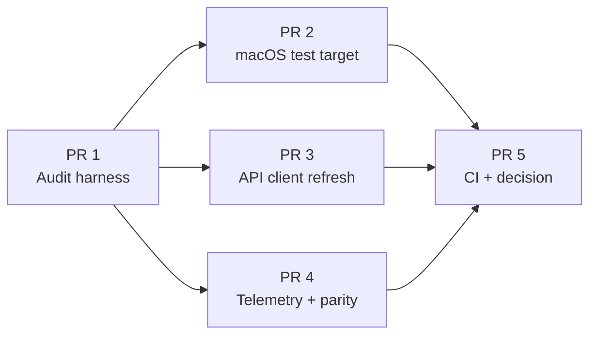
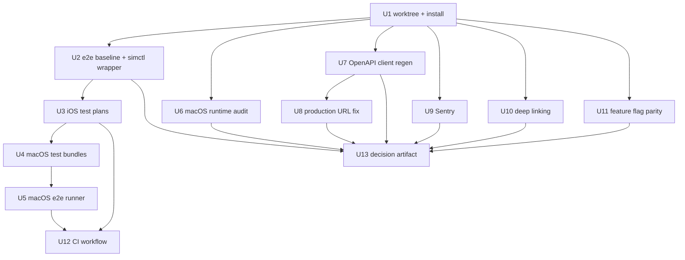

# feat: SwiftUI macOS + iOS ship-readiness audit and hardening stack

## Summary

Stand up a fresh worktree on the SwiftUI branch (`claude/swift-mac-app-effort-tTGd7`), then ship a 5-PR stack that hardens the native `apps/swift/` codebase across both iOS and macOS targets and ends with a written decision artifact on whether native Swift iOS can replace the Expo iOS app (Expo retained as Android-only POC).

The macOS app is the visible deliverable — net-new to the platform. The iOS app is the implicit deliverable — must reach feature-parity-or-better with Expo iOS to validate the swap thesis. The stack format is chosen because the audit findings (URL drift, missing telemetry, no macOS test target, no CI, no test plans) are real defects that block ship; closing them as we go produces actionable progress and makes the final decision artifact a synthesis of *measured* state, not a docs-only desk audit.

Apple-native test automation is load-bearing. The plan leans on XCUITest, Swift Testing, `.xctestplan`, `xcrun simctl`/`devicectl`, `xcresulttool` for CI signal, and (when available) an iOS-simulator MCP server for ce-work-time device control. Browser-MCP tools available today (`mcp__playwright__*`, `mcp__chrome-devtools__*`) do not cover native iOS — the plan explicitly addresses this primitive gap as part of U2.

## Problem Frame

PackRat ships iOS today via Expo (React Native). A parallel native SwiftUI app lives on `claude/swift-mac-app-effort-tTGd7` covering both iOS and macOS via shared sources (XcodeGen `project.yml`, two application targets, single `Sources/PackRat/` tree). The branch is 92 commits ahead and **904 commits behind main** — a real divergence signal.

The native app has rich feature coverage (18 features vs Expo's 14), a full XCUITest suite for iOS (15 test files, recent commits claim "all e2e tests passing"), Keychain-backed auth, SwiftData persistence, and Apple's OpenAPI generator wiring. But it is **not ready to ship** as-is — several blocking gaps exist (production URL hardcoded to a stale `workers.dev` host, zero Sentry instrumentation, no macOS test target, no CI workflow, OpenAPI client diverged from current API surface).

The strategic question — "can iOS native replace Expo iOS?" — can only be answered credibly once the in-flight defects are closed, feature parity is measured, and a recommendation is informed by actual test-suite signal and runtime validation.

## Strategic Framing

| Surface | Today | After this stack |
|---|---|---|
| Expo iOS | Production, all features | Production, awaiting decision on retirement |
| Expo Android | Production | Sole Expo target; downgraded to POC framing |
| Swift iOS | Branch-only, ~all features, no CI, no telemetry, stale API | Buildable on green CI, feature-complete vs Expo (or punch-list documented), production-URL-correct, telemetry on |
| Swift macOS | Branch-only, builds but never tested, no test target, sandboxed | Buildable on green CI, has a test target + e2e plan, runtime audit complete, distribution path decided |

## Requirements

Numbered requirements traceable to the user request:

- **R1**: Worktree exists at a predictable path and is reproducibly checked out on `claude/swift-mac-app-effort-tTGd7`.
- **R2**: The full XCUITest suite runs end-to-end against an iOS simulator via `bun e2e:swift`, baseline pass rate captured in a dated audit doc.
- **R3**: macOS application target builds Debug + Release without errors. A macOS test bundle exists and runs at least one smoke test.
- **R4**: Generated Swift OpenAPI client matches current `packages/api` API surface; the production API base URL points to `https://api.packrat.app`.
- **R5**: Sentry (or equivalent) is initialized in both Swift app targets, mirroring Expo's user-tracking shape.
- **R6**: A GitHub Actions workflow runs `xcodebuild test` against the iOS and (optionally) macOS schemes on every PR that touches `apps/swift/`.
- **R7**: A written feature-parity matrix exists comparing every Swift feature to every Expo feature, with each row marked `parity`, `swift-only`, `expo-only`, or `gap`.
- **R8**: A decision artifact recommends (a) whether to commit to the iOS swap, (b) timing/sequencing if yes, and (c) the scope of the remaining Expo→Android-POC framing.

Non-functional:

- **R9**: All changes land as a 5-PR stack, each PR independently reviewable and revertable.
- **R10**: No Apple Developer account or App Store Connect state is modified during the audit. No swift→main merge during the audit.

## Scope Boundaries

### In scope

- Worktree setup, branch checkout, monorepo install on the swift branch.
- XCUITest expansion + macOS test bundle creation.
- `.xctestplan` authoring and integration into the e2e runner.
- OpenAPI spec sync + Swift client regeneration.
- Production URL realignment to `api.packrat.app`.
- Sentry integration for both Swift targets.
- Feature flag scaffolding mirroring `apps/expo/config.ts`.
- A swift-aware CI workflow.
- Feature-parity matrix authoring.
- The decision artifact at the end of the stack.

### Out of scope (true non-goals)

- Actually retiring or deleting Expo code.
- App Store / TestFlight uploads or Mac App Store submission.
- Code-signing certificate rotation, provisioning profile changes, or anything that touches Apple Developer account state.
- Merging the swift branch into main (defer until the stack is reviewed and accepted).

### Deferred for later (true product-shape gaps; track but do not solve here)

- Universal links (associated-domains) wiring — depends on a server-side `apple-app-site-association` file on `api.packrat.app` that does not exist yet.
- Push notification (APNs) registration — absent from both apps; greenfield feature.
- `offline-ai` (on-device LLM via llama.rn) parity in Swift — would need an MLX or CoreML port, a separate effort.
- `ai-packs` feature parity in Swift — touches generative UX patterns that may not translate 1:1 from React.

### Deferred to follow-up work (planned, but for separate PRs after the stack)

- Adopting the swap (deleting `apps/expo/` iOS build profiles + EAS configs once the decision artifact is approved).
- Mac App Store submission flow + notarized DMG distribution scripts.
- Migrating Expo Android to its own bundle identifier under the POC framing.
- Swift→main merge once the audit is signed off.

## Stack Shape



PR 2, PR 3, PR 4 can land in any order after PR 1 — they touch independent surfaces. PR 5 depends on all four. The stack is reviewable as 5 small PRs against the swift branch, or collapsed into one shipping PR at the end if review fatigue dominates.

## High-Level Technical Design

*Directional guidance for review, not implementation specification.*

### Test pyramid (post-stack)

```
            ┌────────────────────────────┐
            │  GH Actions: xcodebuild     │  ← CI tier (U12)
            │  iOS scheme + macOS scheme  │
            │  xcresult artifact upload   │
            └─────────────┬───────────────┘
                          │
        ┌─────────────────┼─────────────────┐
        │                 │                 │
   ┌────▼─────┐    ┌──────▼──────┐   ┌──────▼──────┐
   │  iOS UI   │    │  macOS UI   │   │  Unit tests │
   │ XCUITest  │    │  XCUITest   │   │ Swift       │
   │ existing  │    │  new (U4)   │   │ Testing     │
   │ 15 files  │    │  port subset│   │ both targets│
   └────┬──────┘    └──────┬──────┘   └─────────────┘
        │                  │
        └────────┬─────────┘
                 │
       ┌─────────▼──────────┐
       │  .xctestplan files │  ← U3
       │  iOS-Smoke         │
       │  iOS-Full          │
       │  macOS-Smoke       │
       └────────┬───────────┘
                │
       ┌────────▼───────────┐
       │  bun e2e:swift     │  ← U2
       │  bun e2e:swift:mac │  ← U5
       │  xcrun simctl      │
       │  xcresulttool      │
       │  optional iOS MCP  │
       └────────────────────┘
```

### Device control primitives

Today's MCP coverage (browser-only):
- `mcp__playwright__*` — web automation
- `mcp__chrome-devtools__*` — Chrome control

Neither drives an iOS simulator or macOS app. The plan's device-control layer is therefore Apple's CLI:

```
xcrun simctl         # simulator lifecycle (boot, install, launch, terminate)
xcrun devicectl      # physical iOS device (Xcode 15+) — out of scope this stack
xcodebuild test      # test execution with -testPlan, -destination, -resultBundlePath
xcrun xcresulttool   # parse .xcresult JSON for pass/fail/coverage
```

U2 adds a small TypeScript wrapper (`apps/swift/scripts/lib/simctl.ts`) that exposes these as Bun-callable verbs. The wrapper is the integration point for an iOS-simulator MCP server should one be wired up later (the plan does not commit to wiring one — it documents the seam).

### Feature parity matrix shape

The U13 deliverable matrix has this column shape (illustrative, not exhaustive):

| Feature | Expo path | Swift path | Status | Swap blocker? |
|---|---|---|---|---|
| Packs | `apps/expo/features/packs` | `Features/Packs` | parity | — |
| Catalog | `apps/expo/features/catalog` | `Features/Catalog` | parity | — |
| Chat / AI | `apps/expo/features/ai` | `Features/Chat` | swift-different | verify behavior |
| ai-packs | `apps/expo/features/ai-packs` | — | expo-only | yes — must reach parity or scope out |
| offline-ai | `apps/expo/features/offline-ai` | — | expo-only | no — deferred per scope boundary |
| Search | — | `Features/Search` | swift-only | no — bonus |
| Preferences | — | `Features/Preferences` | swift-only | no — bonus |
| Shopping | — | `Features/Shopping` | swift-only | no — bonus |

The full matrix is authored in U13 from a side-by-side `git ls-tree` enumeration.

## Worktree Layout

```
.claude/worktrees/swift-ship-audit/      ← new worktree, this plan's home
  apps/swift/                            ← target of the audit
  apps/swift/scripts/lib/simctl.ts       ← new device-control wrapper (U2)
  apps/swift/TestPlans/                  ← new directory (U3, U4)
    iOS-Smoke.xctestplan
    iOS-Full.xctestplan
    macOS-Smoke.xctestplan
  apps/swift/Tests/PackRatMacOSUITests/  ← new (U4)
  .github/workflows/swift-ci.yml         ← new (U12)
  docs/audits/                           ← per-PR audit artifacts
    2026-05-20-swift-baseline.md         ← U2
    2026-05-20-macos-runtime-audit.md    ← U6
    2026-05-20-api-client-drift.md       ← U7
    2026-05-20-feature-flag-parity.md    ← U11
    2026-05-20-feature-parity-matrix.md  ← U13
    2026-05-20-decision-ios-swap.md      ← U13
```

---

## Implementation Units

### U1. Worktree, branch checkout, monorepo install verification

**Goal:** A fresh worktree at `.claude/worktrees/swift-ship-audit/` checked out on `claude/swift-mac-app-effort-tTGd7`, `bun install` complete (including `PACKRAT_NATIVEWIND_UI_GITHUB_TOKEN` resolved from `.env.local`), `bun swift` runs cleanly (xcodegen + fix-xcodeproj produces a Debug-buildable iOS scheme).

**Requirements:** R1.

**Dependencies:** none.

**Files:**
- `.claude/worktrees/swift-ship-audit/` (created via `git worktree add`)
- `docs/plans/2026-05-20-001-feat-swift-mac-and-ios-ship-readiness-plan.md` (commit the plan file into the swift branch so PR 5 can update its frontmatter)
- `docs/audits/2026-05-20-swift-baseline.md` (new, populated by U2 — created empty here)

**Approach:**
- Use `git worktree add` from the repo root to materialize the worktree on the remote branch (`-b swift-ship-audit-local origin/claude/swift-mac-app-effort-tTGd7` to avoid checking out a remote-tracking ref directly).
- Verify `.env.local` has `PACKRAT_NATIVEWIND_UI_GITHUB_TOKEN`, `E2E_EMAIL`, `E2E_PASSWORD` before install (the GitHub Packages auth is a known footgun documented in `CLAUDE.md`).
- Run `bun install` (~120s, never cancel).
- Run `bun swift` from `apps/swift/` to regenerate `PackRat.xcodeproj`.
- Verify the iOS Debug scheme builds for the iPhone 16 simulator via a single `xcodebuild build -scheme PackRat-iOS -destination 'platform=iOS Simulator,name=iPhone 16'` invocation. Capture the build log to `docs/audits/2026-05-20-swift-baseline.md` under a "Build verification" section.

**Patterns to follow:**
- Existing worktree pattern in `/Users/andrewbierman/Code/packrat/.claude/worktrees/` and `/Users/andrewbierman/Code/packrat/.worktrees/` — kebab-cased branch-derived names.
- `bun swift` script in root `package.json` (already wires `xcodegen generate && bun scripts/fix-xcodeproj.ts`).

**Test scenarios:**
- Test expectation: none — pure environment setup. Validation is the successful Debug build, captured to the baseline audit doc.

**Verification:**
- `git -C .claude/worktrees/swift-ship-audit/ rev-parse --abbrev-ref HEAD` returns the local branch name and `git log -1` shows the swift-branch head commit.
- `xcodebuild build` exits 0 for the iOS Debug scheme.

---

### U2. End-to-end XCUITest run + baseline capture + simctl wrapper

**Goal:** The full existing iOS XCUITest suite executes via `bun e2e:swift` against a booted simulator. Results land in a parseable `xcresult` bundle. Pass/fail counts and any failing tests are documented in `docs/audits/2026-05-20-swift-baseline.md`. A minimal `simctl.ts` wrapper exposes boot/shutdown/install verbs the runner depends on.

**Requirements:** R2.

**Dependencies:** U1.

**Files:**
- `apps/swift/scripts/run-e2e.ts` (modify — add `-resultBundlePath` flag, simulator pre-boot, exit-code propagation)
- `apps/swift/scripts/lib/simctl.ts` (new — boot, shutdown, listBooted, getDeviceUDID)
- `apps/swift/scripts/lib/xcresult.ts` (new — `parseSummary(bundlePath): { passed, failed, skipped, failingTests[] }`)
- `apps/swift/scripts/__tests__/simctl.test.ts` (new — unit tests for the wrapper using `vitest`)
- `apps/swift/scripts/__tests__/xcresult.test.ts` (new — fixture-based parser tests)
- `docs/audits/2026-05-20-swift-baseline.md` (populate)

**Approach:**
- The existing `run-e2e.ts` already injects creds into `.xcscheme`. Extend it to: ensure a simulator is booted (call `xcrun simctl boot` if not), pass `-resultBundlePath /tmp/swift-e2e-$timestamp.xcresult`, parse the result bundle with `xcresulttool get test-results --path <bundle> --format json` (Xcode 16+ syntax) on completion.
- `simctl.ts` is a thin wrapper around `xcrun simctl` so future units (U5 macOS, U12 CI) reuse the same shell-out abstraction. Keep it dependency-free.
- `xcresult.ts` parses the JSON output to extract failure counts and names. Use a fixture-based test approach: capture an actual xcresult JSON snapshot, commit a tiny redacted version under `apps/swift/scripts/__tests__/fixtures/`.
- Document baseline pass rate + list failing tests in `docs/audits/2026-05-20-swift-baseline.md`. If the recent commits' claim of "all 74 passing" holds, baseline is 74/74 — write that down. If not, the discrepancy itself is a finding.

**Execution note:** This is the first unit that actually exercises the test harness. If `bun e2e:swift` cannot reach a green baseline, **do not proceed to U3** — file findings against the failures and resolve them inside U2 before moving on. Lock the baseline before authoring test plans on top of it.

**Patterns to follow:**
- `apps/swift/scripts/run-e2e.ts` already-existing shape (`escapeXml`, `existsSync`, env file loading).
- API package's vitest setup at `packages/api/vitest.unit.config.ts` for the wrapper unit tests.

**Test scenarios:**
- `simctl.test.ts` — `listBooted` parses `xcrun simctl list devices booted -j` JSON into a UDID array; returns empty when no devices booted; throws on malformed JSON.
- `simctl.test.ts` — `getDeviceUDID('iPhone 16')` returns the first matching UDID; throws a clear error when the named device is not registered.
- `xcresult.test.ts` — `parseSummary` returns `{ passed: N, failed: 0, skipped: 0, failingTests: [] }` for an all-green fixture.
- `xcresult.test.ts` — `parseSummary` returns the failing test identifiers for a fixture with two failures.
- `xcresult.test.ts` — `parseSummary` throws with a clear "xcresult not found" error when given a missing path.
- Manual: `bun e2e:swift` runs to completion, produces an `xcresult` bundle, exits with proper code matching pass/fail status.

**Verification:**
- `bun e2e:swift` exits 0 with a populated `xcresult` and the baseline audit doc lists pass count.
- `bun vitest run apps/swift/scripts/__tests__` passes.

---

### U3. iOS test plans (.xctestplan)

**Goal:** Two `.xctestplan` files exist for iOS — `iOS-Smoke.xctestplan` (auth + navigation only, <60s wall) and `iOS-Full.xctestplan` (all current XCUITests). The XcodeGen `project.yml` references them in the iOS scheme. `bun e2e:swift --plan smoke` and `--plan full` route to the right test plan.

**Requirements:** R2, R6.

**Dependencies:** U2.

**Files:**
- `apps/swift/TestPlans/iOS-Smoke.xctestplan` (new)
- `apps/swift/TestPlans/iOS-Full.xctestplan` (new)
- `apps/swift/project.yml` (modify — reference test plans in `schemes.PackRat-iOS.test`)
- `apps/swift/scripts/run-e2e.ts` (modify — accept `--plan <name>` flag mapping to `-testPlan`)
- `apps/swift/scripts/__tests__/run-e2e-args.test.ts` (new — argv parsing)

**Approach:**
- Smoke plan includes `AuthTests` + `NavigationTests` only.
- Full plan includes the existing complete set.
- XcodeGen supports test plans via `testPlans:` key under scheme test config — verify against current XcodeGen docs version; if not supported, document the limitation and check the plans in at the path xcodebuild expects (`apps/swift/TestPlans/*.xctestplan`) and reference them via `-testPlan` flag in `run-e2e.ts` directly.
- Test plans are JSON-shaped; author them with `defaultOptions.environmentVariables` consuming `$(E2E_EMAIL)` / `$(E2E_PASSWORD)` so the env-injection in U2 still works.

**Patterns to follow:**
- Apple test plan schema (JSON, well-documented).
- Argv parsing pattern in existing scripts (`apps/swift/scripts/run-e2e.ts` reads `process.argv`).

**Test scenarios:**
- `run-e2e-args.test.ts` — `--plan smoke` resolves to `iOS-Smoke.xctestplan`.
- `run-e2e-args.test.ts` — `--plan full` resolves to `iOS-Full.xctestplan`.
- `run-e2e-args.test.ts` — `--plan unknown` exits with code 1 and a clear error listing valid plan names.
- `run-e2e-args.test.ts` — no `--plan` flag defaults to `iOS-Full` (back-compat with existing invocations).
- Manual: `bun e2e:swift --plan smoke` runs only Auth + Navigation tests; `bun e2e:swift --plan full` runs all.

**Verification:**
- Smoke plan completes in under 60s on a warm simulator.
- Full plan matches U2's baseline pass count exactly (no test was accidentally excluded).

---

### U4. macOS test bundle (unit + UI) and platform-conditional test source

**Goal:** A new `PackRatMacOSTests` (Swift Testing) bundle and `PackRatMacOSUITests` (XCUITest) bundle exist in `project.yml`, bound to the `PackRat-macOS` scheme. Platform-shared tests (`AppUITestCase`, `AuthTests`, `NavigationTests`) compile against both platforms via `#if os(macOS)` / `#if os(iOS)` guards. At least the macOS smoke set runs green via `xcodebuild test` on a mac.

**Requirements:** R3, R6.

**Dependencies:** U1, U3.

**Files:**
- `apps/swift/project.yml` (modify — add `PackRatMacOSTests` and `PackRatMacOSUITests` targets, bind to `PackRat-macOS` scheme)
- `apps/swift/Tests/PackRatMacOSTests/` (new directory, mirrors `PackRatTests/` structure)
- `apps/swift/Tests/PackRatMacOSUITests/` (new directory, with a minimal `AppMacOSUITestCase.swift` + ported `AuthTests.swift` + `NavigationTests.swift`)
- `apps/swift/Tests/PackRatUITests/AppUITestCase.swift` (modify — add platform conditionals for shared base class)
- `apps/swift/Tests/PackRatUITests/AuthTests.swift` (modify — extract shared assertions into platform-agnostic helpers)

**Approach:**
- Decision point: **shared source vs duplicate source** for UI tests. Shared source (single test file, `#if os(...)` conditionals) is DRY but blurs platform semantics. Duplicate source (two test files) is clearer per-platform but doubles maintenance. **Default: shared source with conditionals** for tests where the user flow is identical (auth, navigation); duplicate-and-port for tests where the macOS UX legitimately differs (window-based vs scene-based navigation).
- macOS scheme today has `build` config but no `test` config in `project.yml` — add it.
- The macOS UI test bundle requires `bundle.ui-testing` type with `platform: macOS`.
- Initial port targets just `AuthTests` and `NavigationTests` — enough to prove the harness works. The remaining 12 XCUITest files are enumerated as a follow-up punch list, not in-scope here.

**Patterns to follow:**
- Existing iOS test target shape in `project.yml`.
- Apple's documented `#if os(macOS)` conditional compilation pattern.

**Test scenarios:**
- Macos test bundle compiles against the macOS deployment target (14.0).
- `AuthTests.testLoginSuccess` runs green on both iOS and macOS schemes when invoked separately.
- `NavigationTests.testTabBarSelection` (iOS) and the macOS equivalent (`testSidebarSelection` if the macOS app uses NavigationSplitView) both pass.
- Covers AE: macOS application target has a runnable test bundle (R3).
- Negative scenario: running `xcodebuild test -scheme PackRat-macOS` on a stock branch (before U4) returns "no test bundle" — after U4, returns test results.

**Verification:**
- `xcodebuild test -scheme PackRat-macOS -destination 'platform=macOS'` exits 0 for the smoke subset.
- The iOS suite from U2 still passes unchanged (no regressions from the test-source refactor).

---

### U5. macOS e2e runner + macOS-Smoke test plan

**Goal:** `bun e2e:swift:macos` is a runnable script that drives `xcodebuild test -scheme PackRat-macOS -destination 'platform=macOS'` with the same env-injection + xcresult parsing as iOS. A `macOS-Smoke.xctestplan` exists referencing the macOS UI test bundle.

**Requirements:** R3, R6.

**Dependencies:** U4.

**Files:**
- `apps/swift/scripts/run-e2e-macos.ts` (new — based on `run-e2e.ts`, drops simulator-boot logic, swaps scheme + destination)
- `apps/swift/TestPlans/macOS-Smoke.xctestplan` (new)
- `apps/swift/project.yml` (modify — reference macOS test plan in scheme)
- `package.json` (modify — add `"e2e:swift:macos": "bun run apps/swift/scripts/run-e2e-macos.ts"`)
- `apps/swift/scripts/__tests__/run-e2e-macos-args.test.ts` (new)

**Approach:**
- Extract shared logic from `run-e2e.ts` into `apps/swift/scripts/lib/e2e-shared.ts` (env loading, scheme XML injection, xcresult parsing). Both runners consume it. This is a refactor inside U5; the shared module is created on first need.
- macOS doesn't need simulator boot but does need accessibility permissions for XCUITest — document the one-time grant in `docs/audits/2026-05-20-macos-runtime-audit.md` (created in U6) and in the script's `--help` output.

**Patterns to follow:**
- `apps/swift/scripts/run-e2e.ts` overall shape.

**Test scenarios:**
- `run-e2e-macos-args.test.ts` — argv parsing mirrors iOS runner.
- Manual: `bun e2e:swift:macos` runs the smoke plan green on a developer mac.

**Verification:**
- The script exits 0 with a populated xcresult on a clean mac dev environment.

---

### U6. macOS runtime audit

**Goal:** A written audit at `docs/audits/2026-05-20-macos-runtime-audit.md` enumerates every macOS-specific runtime concern observed during manual app launch + smoke walk-through. Blocker-level findings (app crashes on launch, can't authenticate, can't reach API) are fixed in this unit; non-blocker findings (menu bar polish, window state restoration, keyboard shortcut gaps) are documented as punch-list items for the decision artifact.

**Requirements:** R3.

**Dependencies:** U1.

**Files:**
- `docs/audits/2026-05-20-macos-runtime-audit.md` (new — audit findings doc)
- `apps/swift/Sources/PackRat/Navigation/PackRatCommands.swift` (modify only if blocker found — menu bar gaps)
- `apps/swift/Sources/PackRat/PackRatApp.swift` (modify only if blocker found — Scene/WindowGroup config)
- `apps/swift/Sources/PackRat/Shared/OpenWindowButton.swift` (modify only if blocker found)

**Approach:**
- Walk through every feature surface on a launched macOS Debug build, capture observations.
- Categorize each finding as blocker / nice-to-have / cosmetic.
- Fix blockers in this unit; defer the rest to the decision artifact's punch list.
- Audit focuses on: window lifecycle (multiple windows? state restoration?), menu bar (File/Edit/View/PackRat menus), keyboard navigation, sandboxed file access (cache writes, image uploads), networking from sandboxed context, sign-in flow on macOS (no native Apple Sign-In on macOS yet?).

**Patterns to follow:**
- `apps/swift/Sources/PackRat/Navigation/PackRatCommands.swift` for menu-bar entry points already wired.
- Apple's macOS HIG for window + menu behaviors expected of every Mac app.

**Test scenarios:**
- Test expectation: none for this unit — it is an audit + targeted fixes. Each blocker fix lands with a manual reproduction note in the audit doc; targeted fixes that touch testable code add a Swift Testing case in the same commit.

**Verification:**
- The audit doc exists with sections: "App launch", "Auth flow", "Each feature smoke", "Menu bar", "Sandbox", "Findings (blocker / nice-to-have / cosmetic)".
- macOS app launches, authenticates, and reaches the home view without crash on the user's mac.

---

### U7. OpenAPI spec sync + Swift client regeneration

**Goal:** The OpenAPI spec at `apps/swift/PackRatAPIClient/Sources/PackRatAPIClient/openapi.yaml` matches the current main-branch API surface. `bun swift:codegen` regenerates `apps/swift/Sources/PackRat/API/Client.swift` and `Types.swift` cleanly. Any breakage from API contract changes is resolved.

**Requirements:** R4.

**Dependencies:** U1.

**Files:**
- `apps/swift/PackRatAPIClient/Sources/PackRatAPIClient/openapi.yaml` (replace with current spec)
- `apps/swift/Sources/PackRat/API/Client.swift` (regenerated)
- `apps/swift/Sources/PackRat/API/Types.swift` (regenerated)
- `apps/swift/Sources/PackRat/Network/APIEndpoint.swift` (modify if regen breaks the hand-written abstraction)
- `apps/swift/Sources/PackRat/Services/**/*Service.swift` (modify any service whose API contract shifted)
- `docs/audits/2026-05-20-api-client-drift.md` (new — what changed, what broke, how it was reconciled)
- `package.json` (verify `swift:codegen` script remains correct)

**Approach:**
- Export the canonical spec from main: `bun generate:openapi` (root-level script that runs `cd packages/api && bun scripts/generate-openapi.ts`) produces a JSON file; convert to YAML if needed (swift-openapi-generator accepts both, but the existing file is YAML).
- Drop into the swift client package, run `bun swift:codegen` (which runs `swift package plugin generate-code-from-openapi` then copies generated sources into `Sources/PackRat/API/`).
- Resolve breakage: type shape changes will surface as compile errors in services. Reconcile by updating the service-layer call sites — do not edit generated files.
- Capture every API contract change observed (new routes, renamed fields, removed endpoints) in the drift audit doc. This becomes input to the decision artifact's parity assessment.

**Execution note:** This is the unit with the highest risk of cascade. Start by snapshotting the current `Client.swift` and `Types.swift` for diff visibility. If regen produces >500 lines of breakage, pause and triage before continuing.

**Patterns to follow:**
- `packages/api/src/utils/openapi.ts` — canonical server URLs and metadata.
- `apps/swift/Sources/PackRat/Services/*Service.swift` — service layer that consumes the generated client.

**Test scenarios:**
- All existing Swift Testing unit tests still pass after regen (`NetworkTests`, `ServiceTests`).
- Manual: at least one read endpoint (`/api/packs`) and one write endpoint (`/api/packs/:id`) succeed against staging API after the URL fix in U8.
- Compile: both PackRat-iOS and PackRat-macOS targets build cleanly post-regen.

**Verification:**
- `xcodebuild build -scheme PackRat-iOS` and `xcodebuild build -scheme PackRat-macOS` both exit 0.
- The drift audit doc lists every contract change.

---

### U8. Production URL realignment

**Goal:** `APIClient.swift` references `https://api.packrat.app` (production), `https://staging-api.packrat.app` (staging), `http://localhost:8787` (local) — matching the canonical server list in `packages/api/src/utils/openapi.ts`. The stale `workers.dev` URLs are removed. A `PACKRAT_ENV=staging` config exists. iOS app authenticates against staging in a smoke run.

**Requirements:** R4.

**Dependencies:** U7.

**Files:**
- `apps/swift/Sources/PackRat/Network/APIClient.swift` (modify — replace `environments` dict)
- `apps/swift/xcconfig/Config-Debug.xcconfig` (modify if needed — confirm `PACKRAT_ENV` mapping)
- `apps/swift/xcconfig/Config-Release.xcconfig` (modify — ensure production URL is wired)
- `apps/swift/xcconfig/Config-Staging.xcconfig` (new — staging build config)
- `apps/swift/project.yml` (modify — add Staging configuration if not present)

**Approach:**
- Replace the three URLs in `APIClient.swift`'s static `environments` dict.
- Add a Staging build config that sets `PACKRAT_ENV=staging`.
- Verify the `openapi.yaml` (post-U7 sync) lists the same three servers — they should match by construction.
- Manual smoke: archive a Staging build, install on simulator, log in to staging, verify packs load.

**Patterns to follow:**
- `packages/api/src/utils/openapi.ts` server list (canonical).
- Existing Debug/Release config layout in `apps/swift/xcconfig/`.

**Test scenarios:**
- `NetworkTests` — `APIClient.resolvedBaseURL` returns the staging URL when `PACKRAT_ENV=staging` is set in the test environment.
- `NetworkTests` — `APIClient.resolvedBaseURL` falls back to production when `PACKRAT_ENV` is missing (defensive default).
- Manual: staging build authenticates and loads the home view.

**Verification:**
- No occurrences of `workers.dev` remain in `apps/swift/Sources/`.
- Staging build smoke-passes.

---

### U9. Sentry integration (both targets)

**Goal:** Sentry initialization fires on app launch for both PackRat-iOS and PackRat-macOS. DSN is env-driven (xcconfig variable, not committed). `Sentry.setUser` is called after authentication, mirroring `apps/expo/app/_layout.tsx`. Sentry-swift SPM dep is added to `project.yml`.

**Requirements:** R5.

**Dependencies:** U1.

**Files:**
- `apps/swift/project.yml` (modify — add `sentry-cocoa` SPM dep; reference from both app targets)
- `apps/swift/Sources/PackRat/PackRatApp.swift` (modify — call `SentrySDK.start` at app init)
- `apps/swift/Sources/PackRat/Network/AuthManager.swift` (modify — call `SentrySDK.configureScope { setUser }` after login)
- `apps/swift/xcconfig/Config-Debug.xcconfig` (modify — add `SENTRY_DSN` placeholder)
- `apps/swift/xcconfig/Config-Release.xcconfig` (modify — add `SENTRY_DSN` placeholder)
- `apps/swift/Resources/Info-iOS.plist` (modify — expose `SENTRY_DSN` from xcconfig)
- `apps/swift/Resources/Info-macOS.plist` (modify — expose `SENTRY_DSN` from xcconfig)

**Approach:**
- Pin Sentry version compatible with iOS 17 + macOS 14 (latest 8.x).
- `SENTRY_DSN` flows via xcconfig → Info.plist → runtime `Bundle.main.infoDictionary["SENTRY_DSN"]`. Do not commit the actual DSN; document the required env var in the audit baseline doc and `apps/swift/README.md` (created here as a small new file if absent).
- Initialize Sentry in `PackRatApp.init()` (before any UI) with `dsn`, `tracesSampleRate: 0.2`, `enableAutoPerformanceTracing: true`.
- After successful login in `AuthManager`, call `SentrySDK.configureScope { scope in scope.setUser(User(...)) }`. After logout, call `SentrySDK.configureScope { $0.setUser(nil) }`.
- Add a small Swift Testing unit for the DSN-loading helper (mocking `Bundle.main` is awkward in tests — extract DSN parsing into a free function that takes a `[String: Any]` dict).

**Patterns to follow:**
- `apps/expo/app/_layout.tsx` Sentry init shape (DSN, tracesSampleRate, wrap layout).
- Swift Package dep declaration in `project.yml`'s `packages:` block (existing example: Nuke, MarkdownUI).

**Test scenarios:**
- `SentryConfigTests` — `dsnFromInfo([:])` returns nil, no crash.
- `SentryConfigTests` — `dsnFromInfo(["SENTRY_DSN": ""])` returns nil (treats empty as unset).
- `SentryConfigTests` — `dsnFromInfo(["SENTRY_DSN": "https://abc@sentry.io/123"])` returns the DSN string.
- Manual: launching a Debug build with a valid DSN triggers a test event visible in the Sentry project.

**Verification:**
- Sentry session count increments after app launch on a build with DSN set.
- Logged-in user appears in Sentry's user search by email.

---

### U10. Deep linking audit + scheme alignment

**Goal:** `packrat://` scheme works on iOS (deep links open the app and route to a destination). macOS handling decision is recorded (URL schemes on macOS apps work but route via NSAppDelegate — document the decision). Universal links (associated-domains) status is documented as deferred with explicit dependency on `apple-app-site-association` hosting on `api.packrat.app`.

**Requirements:** R7 partial; primarily an audit unit.

**Dependencies:** U1.

**Files:**
- `apps/swift/Resources/Info-iOS.plist` (modify — confirm scheme matches `apps/expo/app.config.ts` (`packrat://` not `com.andrewbierman.packrat://`))
- `apps/swift/Resources/Info-macOS.plist` (modify — add URL scheme if macOS app needs to handle links)
- `apps/swift/Sources/PackRat/Navigation/AppNavigation.swift` (modify — add `.onOpenURL { url in route(url) }` if missing)
- `docs/audits/2026-05-20-deep-linking-parity.md` (new — what works, what's deferred, what's needed for universal links)

**Approach:**
- Verify iOS URL scheme is `packrat` (not `com.andrewbierman.packrat`) to match Expo. Today's Info-iOS.plist has `CFBundleURLSchemes: [com.andrewbierman.packrat]` — that's a parity gap.
- Test `xcrun simctl openurl booted "packrat://pack/123"` on iOS sim and confirm the app opens. If no `onOpenURL` handler exists, add a minimal one routing to a known pack ID.
- Document universal links as deferred — wiring requires (a) `apple-app-site-association` JSON hosted at `https://api.packrat.app/.well-known/apple-app-site-association`, (b) `com.apple.developer.associated-domains` entitlement on both iOS and macOS, (c) App ID configuration in Apple Developer. None of these are in the audit's scope per R10.

**Patterns to follow:**
- `apps/expo/app.config.ts` scheme value (canonical).
- Apple's `onOpenURL` view modifier (standard SwiftUI).

**Test scenarios:**
- `xcrun simctl openurl booted packrat://` opens the app.
- Manual: `packrat://pack/<known-id>` routes to that pack detail view.
- Covers AE: deep linking parity (R7 partial).

**Verification:**
- Audit doc records the corrected scheme and the universal-links deferral.

---

### U11. Feature flag scaffolding (Swift parity with Expo)

**Goal:** `apps/swift/Sources/PackRat/Core/FeatureFlags.swift` exists with the same flag names as `apps/expo/config.ts`'s `featureFlags` object. Flags default to `false`. Flag values are readable from `Defaults` (sindresorhus/Defaults already a dep) so they can be toggled per-build via xcconfig or per-runtime via debug menu.

**Requirements:** R7 partial.

**Dependencies:** U1.

**Files:**
- `apps/swift/Sources/PackRat/Core/FeatureFlags.swift` (new)
- `apps/swift/Sources/PackRat/Features/Preferences/PreferencesView.swift` (modify — add a debug-only feature flag toggle section, behind `#if DEBUG`)
- `apps/swift/Tests/PackRatTests/FeatureFlagsTests.swift` (new)
- `docs/audits/2026-05-20-feature-flag-parity.md` (new — parity contract)

**Approach:**
- Define `FeatureFlags` as an enum or struct of `Defaults.Key<Bool>` values, one per flag in Expo's `featureFlags`.
- Read `apps/expo/config.ts` to enumerate the canonical flag list at the time of authoring.
- Provide a `FeatureFlag.isEnabled(.flagName)` API and a `FeatureFlag.set(.flagName, true)` for debug toggling.
- New flags MUST default to `false` per the Expo convention (documented in CLAUDE.md).

**Patterns to follow:**
- `apps/expo/config.ts` `featureFlags` object shape.
- `Defaults` package API patterns (already used elsewhere in the Swift app per project.yml).

**Test scenarios:**
- `FeatureFlagsTests` — every flag defined in Expo's config has a matching flag in Swift's `FeatureFlags`.
- `FeatureFlagsTests` — default value of each flag is `false`.
- `FeatureFlagsTests` — `set(.flagName, true)` then `isEnabled(.flagName)` returns true; `set(.flagName, false)` then returns false.
- `FeatureFlagsTests` — the test reads `apps/expo/config.ts` via a test bundle resource so the parity check fails immediately if Expo adds a flag Swift doesn't have.

**Verification:**
- The parity test passes.
- The audit doc lists every flag with its current value.

---

### U12. GitHub Actions swift-ci workflow

**Goal:** `.github/workflows/swift-ci.yml` runs on PRs touching `apps/swift/**` (and `packages/api/openapi.yaml` for client-drift detection). Jobs: (a) lint + format check, (b) iOS Smoke test plan on macos-latest runner with iOS sim, (c) macOS Smoke test plan on macos-latest. xcresult artifacts upload on failure for triage.

**Requirements:** R6.

**Dependencies:** U3, U5.

**Files:**
- `.github/workflows/swift-ci.yml` (new)
- `.github/workflows/swift-ci.yml` (test the workflow yaml syntax via `actionlint` if installed)

**Approach:**
- Use `macos-latest` runner (currently macOS 14 + Xcode 16).
- Steps: checkout, install Bun, `bun install`, `bun swift` (xcodegen + fix-xcodeproj), boot simulator (`xcrun simctl boot 'iPhone 16'`), run `xcodebuild test -testPlan iOS-Smoke -resultBundlePath ./results.xcresult`, upload `xcresult` as artifact on failure.
- macOS job: `xcodebuild test -scheme PackRat-macOS -testPlan macOS-Smoke -destination 'platform=macOS'`.
- Skip the full plan in CI — too slow. Full plan runs locally + nightly (nightly schedule is deferred).
- Secrets: `E2E_EMAIL` + `E2E_PASSWORD` set as GitHub Actions secrets, injected as env vars (the `run-e2e.ts` script already supports env-only invocation; bypass `.env.local` injection in CI).

**Patterns to follow:**
- Existing `.github/workflows/e2e-tests.yml` for env-var injection and bun setup pattern.
- Existing `.github/workflows/*.yml` for path filtering with `on.push.paths` / `on.pull_request.paths`.

**Test scenarios:**
- Workflow syntax validates via `actionlint .github/workflows/swift-ci.yml` (run locally).
- Manual: open a draft PR against the swift branch with a no-op change; workflow runs to completion (or to a known-good failure pattern).
- Negative: a PR that breaks a test surfaces a failing CI check and uploaded xcresult.

**Verification:**
- A draft PR triggers the workflow and shows passing jobs.
- xcresult artifact appears in the workflow run summary on failure.

---

### U13. Decision artifact — feature parity matrix + iOS swap recommendation

**Goal:** A single decision document at `docs/audits/2026-05-20-decision-ios-swap.md` synthesizes the audit: full Swift-vs-Expo feature parity matrix, summary of every prior PR's findings, remaining punch-list items (universal links, push notifications, ai-packs port, offline-ai port), and a clear recommendation on whether and when to retire Expo iOS. Feature parity matrix lives in a sibling doc `docs/audits/2026-05-20-feature-parity-matrix.md`.

**Requirements:** R7, R8.

**Dependencies:** U2, U6, U7, U8, U9, U10, U11.

**Files:**
- `docs/audits/2026-05-20-feature-parity-matrix.md` (new — matrix table)
- `docs/audits/2026-05-20-decision-ios-swap.md` (new — narrative recommendation)
- `docs/plans/2026-05-20-001-feat-swift-mac-and-ios-ship-readiness-plan.md` (modify — update `status: active` → `status: completed` once landed)

**Approach:**
- Matrix doc: one row per feature (Expo + Swift union). Columns: Feature, Expo path, Swift path, Status (parity / swift-only / expo-only / gap), Swap blocker (yes/no), Notes.
- Decision doc sections: (1) Audit summary citing each PR's findings, (2) Feature parity assessment with the matrix link, (3) Risk assessment of swap (auth, payments, deeplinks, push, telemetry, App Store transition), (4) **Conditional recommendation** — not a binary GO/NO-GO. Output one of three branches with explicit conditions:
  - **GO** — if Expo telemetry/usage shows `ai-packs` and `offline-ai` engagement below a stated threshold (e.g., <X% of MAU touched the feature in the trailing 90 days). Swap proceeds on next release cycle.
  - **PORT-THEN-GO** — if usage is above threshold OR the features are load-bearing for power users. Sizes the Swift port effort for each feature (weeks of work, complexity drivers like streaming chat / on-device LLM), recommends sequencing.
  - **DON'T-SWAP** — if the audit surfaces blockers that the stack didn't close (e.g., signing/distribution headwinds, persistent test instability, runtime gaps on macOS that don't justify the rewrite cost).
- (5) Cutover checklist **gated on the condition above** (TestFlight rollout, Expo deprecation criteria, Android-POC framing for Expo — only applicable in the GO and PORT-THEN-GO branches).
- The recommendation is conditional by construction because `ai-packs` and `offline-ai` are intentionally out-of-scope ports. U13 must not pretend to have measured what it didn't measure — the conditional framing names the missing evidence explicitly and routes the user to the data needed to commit either way.
- Where empirical usage data exists (Sentry breadcrumbs, analytics, support volume), cite it. Where it doesn't, name the data gap as a precondition for the GO branch ("commit to swap once usage telemetry confirms X").

**Patterns to follow:**
- `docs/audits/2026-05-16-pr-audit.md` for prior audit doc shape (the only existing audit in the repo — read it before writing this one to match the house style).

**Test scenarios:**
- Test expectation: none — docs-only synthesis unit.

**Verification:**
- The matrix has zero "unknown" status cells.
- The decision doc names one of GO / PORT-THEN-GO / DON'T-SWAP with explicit, falsifiable conditions for each branch (not a vague "it depends").
- The conditions cite specific data sources (telemetry, support tickets, audit findings from prior PRs) so a reader can verify whether the condition holds.
- Every prior PR's findings are linked from the audit summary section.

---

## Implementation Dependency Graph



## PR Boundaries

| PR | Units | Reviewable surface | Land independently? |
|---|---|---|---|
| **PR 1**: Audit harness | U1, U2, U3 | Worktree + e2e baseline + iOS test plans | Yes (no behavior change to app) |
| **PR 2**: macOS test target | U4, U5, U6 | macOS test bundles + runtime fixes | Yes (additive) |
| **PR 3**: API client refresh | U7, U8 | Regenerated client + URL fix | Yes (touches network only) |
| **PR 4**: Telemetry + parity | U9, U10, U11 | Sentry + scheme fix + feature flag scaffold | Yes (additive) |
| **PR 5**: CI + decision | U12, U13 | Workflow + audit docs | Yes (synthesis) |

PRs land in numeric order; PR 2/3/4 are reorderable if review demands. Each PR contains its own audit doc(s) under `docs/audits/2026-05-20-*` so the decision artifact in PR 5 can cite them.

## Risk Analysis

| Risk | Likelihood | Impact | Mitigation |
|---|---|---|---|
| OpenAPI regen produces unresolvable compile cascade in U7 | Medium | High | U7 starts with a snapshot diff; if breakage > 500 lines, pause and triage before continuing. Audit doc captures every contract change for traceability. |
| Existing 74 XCUITests fail when run in audit (claim was "all passing" but branch is months old) | Medium | Medium | U2 baseline captures actual state. If <70/74 pass, U2's scope grows to triage failures before U3. Plan accommodates this — U3 is gated on U2 baseline being green. |
| macOS app crashes on launch due to shared sources making iOS assumptions | Medium | High | U6 walks the app manually; blocker findings fix in U6 directly. If launch crash is unrecoverable, downgrade U6 scope to "document blocker, defer macOS ship" — does not derail the iOS audit. |
| Production URL on `api.packrat.app` is not actually live yet (only workers.dev is) | Low | High | U8 verifies URL before committing the change. If `api.packrat.app` does not respond, fall back to the `workers.dev` URL with a note in the drift audit; URL alignment becomes a deferred follow-up. |
| CI runner cost — `macos-latest` minutes are 10x Linux | Low | Medium | U12 keeps CI to smoke plans only; full plan stays local + nightly (nightly deferred). Path-filter on `apps/swift/**` to avoid burning minutes on non-Swift PRs. |
| Sentry version pinned in U9 conflicts with SwiftPM resolver | Low | Medium | Pin to latest 8.x with a known working iOS 17 / macOS 14 minimum. Falls into U9's own integration testing. |
| User decides mid-stack that ai-packs/offline-ai are non-blockers and wants to ship before U13 | Low | Low | Each PR is independently shippable; the user can pause the stack at PR 4 and write the decision artifact from existing audit docs without U13's automation. |

## Alternative Approaches Considered

**Single-PR audit ("merge once, all gaps in one diff")**
- Pros: One review surface, easier to revert wholesale.
- Cons: Massive PR, hard to bisect failures, blocks all progress on one approval.
- Rejected: 5-PR stack better matches the user's signal of "stacked PR if more logical".

**Audit-only doc deliverable (original default)**
- Pros: No code changes during audit; cheap.
- Cons: Doesn't actually fix the broken URL, missing telemetry, no CI — leaves the team with the same defects after the audit.
- Rejected: User signal that iOS should be "fully feature complete and functional" requires actual fixes, not desk audit.

**Port all XCUITests to macOS in U4 instead of just AuthTests+NavigationTests**
- Pros: Full parity from day one.
- Cons: Triples U4's scope, risks blocking the stack on platform-specific UX questions that should be answered with user input mid-stack.
- Rejected: U4 ships a minimum viable macOS test target; full XCUITest port lands as a follow-up unit after the stack.

**Wire an iOS-simulator MCP server now (e.g., wrap xcodebuild + simctl as an MCP)**
- Pros: Direct device control during ce-work execution; matches the user's "use MCP to control devices" signal precisely.
- Cons: No existing MCP fits; building one is a multi-day side-quest off the critical path.
- Rejected: U2's `simctl.ts` wrapper is the integration seam; an MCP can wrap that later. Documented in High-Level Technical Design.

## Documentation Plan

Each PR ships its own audit doc (`docs/audits/2026-05-20-*`); the decision artifact in PR 5 synthesizes them. Existing `apps/swift/` lacks a README — U2 adds one capturing local-setup, `bun swift`, `bun e2e:swift`, env-var requirements. CLAUDE.md is updated in PR 5 to reference the new `apps/swift/` README and the swift-ci workflow.

## Operational / Rollout Notes

- The stack lands against `claude/swift-mac-app-effort-tTGd7`, not main. Swift→main merge is explicitly deferred (R10) until the decision artifact is signed off.
- Each PR is reviewable independently; the user can merge them in any order respecting the dependency graph (PR1 must precede PR2/3/4; PR5 must be last).
- Apple Developer account state is not touched. No certificates rotated, no provisioning profiles modified, no App Store Connect updates.
- The user is the sole reviewer/approver — the stack format optimizes for *the user's* read-flow, not a team's parallel review.
- If the audit recommends *against* the iOS swap (U13 recommendation = "don't swap"), the Swift app remains a parallel codebase. The stack still delivers value: macOS ships net-new with a real test harness + telemetry.

## Future Considerations

- **Universal links wiring**: needs `api.packrat.app/.well-known/apple-app-site-association` JSON hosted before associated-domains can be enabled. Server work, separate plan.
- **Push notifications**: greenfield on both apps; defer until product signal exists.
- **`ai-packs` port to Swift**: depends on streaming chat UX patterns; a separate plan once the swap decision is committed.
- **`offline-ai` port to Swift**: depends on MLX/CoreML model availability matching the llama.rn model used in Expo; multi-week effort.
- **Mac App Store submission**: separate plan covering notarization, sandbox audit, App Store Connect metadata.
- **TestFlight for Mac**: cleanest macOS distribution path; depends on Mac App Store decision above.

## Success Criteria

- All 5 PRs are landable on `claude/swift-mac-app-effort-tTGd7`.
- The decision artifact names a clear recommendation with timing.
- iOS Smoke + macOS Smoke test plans run green on a developer mac and in CI.
- Zero `workers.dev` URLs remain in `apps/swift/Sources/`.
- Sentry receives a test event from both iOS and macOS Debug builds.
- Feature flag parity test passes (every Expo flag has a Swift counterpart).
