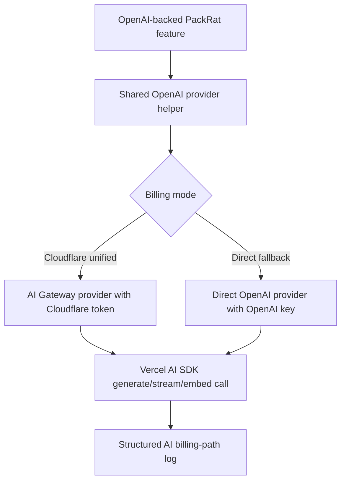

# feat: Add Cloudflare AI Gateway Unified Billing for OpenAI

## Summary

Introduce a shared OpenAI provider path that prefers Cloudflare AI Gateway Unified Billing in production while preserving direct OpenAI fallback for development and rollback. Migrate PackRat's remaining direct OpenAI runtime call sites into that shared path, then document which AI features are unified-billing covered versus still direct-provider.

---

## Problem Frame

PackRat already routes some OpenAI calls through Cloudflare AI Gateway, but the current path still assumes an OpenAI API key and several runtime features instantiate OpenAI directly. The result is a mixed operational model for billing, secrets, and request investigation.

---

## Requirements

- R1. PackRat must prefer Cloudflare AI Gateway Unified Billing for OpenAI-backed runtime AI requests when the required Cloudflare configuration is present.
- R2. OpenAI-backed runtime features must no longer require a direct OpenAI API key for the primary production unified billing path.
- R3. The migration must preserve existing direct-provider behavior for Google/Gemini template generation and Perplexity web search.
- R4. PackRat must retain a clear direct OpenAI fallback for local development, emergency rollback, or environments not configured for unified billing.
- R5. Failures must make the active billing/authentication path clear enough for operators to distinguish Cloudflare unified billing issues from direct-provider key issues.
- R6. OpenAI-backed requests routed through Cloudflare must expose enough request metadata for operators to correlate PackRat logs with Cloudflare AI Gateway observability.
- R7. PackRat documentation or runbooks must identify which AI features are covered by unified billing and which remain direct-provider exceptions.

**Origin actors:** A1 PackRat operator, A2 PackRat user, A3 Implementation agent
**Origin flows:** F1 OpenAI-backed request uses Cloudflare unified billing, F2 Unsupported or non-migrated provider remains direct
**Origin acceptance examples:** AE1 production chat through Cloudflare without direct OpenAI key, AE2 Google/Gemini remains direct, AE3 local direct OpenAI fallback

---

## Scope Boundaries

- In scope: OpenAI-backed runtime AI features, including chat, embeddings, catalog/vector flows, pack generation, image gear detection, wildlife identification, and season suggestions.
- In scope: direct OpenAI fallback for local development, emergency rollback, and environments not configured for Cloudflare unified billing.
- In scope: operator-facing logging and docs that identify the active billing/authentication path.
- Out of scope: model, prompt, UX, embedding dimension, and catalog schema behavior changes.
- Out of scope: user- or admin-facing provider selection.

### Deferred to Follow-Up Work

- Google/Gemini pack-template analysis: Cloudflare unified billing supports Google AI Studio, so this is a good follow-up after OpenAI is stable.
- Perplexity web search: Cloudflare AI Gateway has a Perplexity provider integration, but unified billing support must be verified before migration.
- Multi-provider abstraction beyond OpenAI: keep the current plan focused on the dominant runtime provider and avoid designing a provider menu prematurely.

---

## Context & Research

### Relevant Code and Patterns

- `packages/api/src/utils/ai/provider.ts` is the existing shared provider helper. It currently routes OpenAI through Cloudflare AI Gateway's OpenAI provider endpoint but still requires `OPENAI_API_KEY`.
- `packages/api/src/services/embeddingService.ts` centralizes embedding generation through `createAIProvider`, and is used by catalog, pack item, and ETL flows.
- `packages/api/src/routes/chat.ts`, `packages/api/src/routes/packs/index.ts`, `packages/api/src/routes/catalog/index.ts`, `packages/api/src/services/catalogService.ts`, and `packages/api/src/services/etl/processValidItemsBatch.ts` already use the shared provider path for some OpenAI-backed behavior.
- `packages/api/src/services/imageDetectionService.ts`, `packages/api/src/services/wildlifeIdentificationService.ts`, `packages/api/src/services/packService.ts`, and `packages/api/src/routes/seasonSuggestions.ts` still instantiate OpenAI directly.
- `packages/api/src/utils/env-validation.ts` currently requires `OPENAI_API_KEY` in production and validates `AI_PROVIDER` as `openai | cloudflare-workers-ai`.
- `packages/api/src/utils/ai/logging.ts` exists but is not wired into active AI call sites and only extracts Cloudflare IDs for `cloudflare-workers-ai`.
- `.github/scripts/env.ts`, `README.md`, and `packages/api/wrangler.jsonc` describe the repo's root `.env.local` to API `.dev.vars` environment flow.

### Institutional Learnings

- `docs/solutions/developer-experience/better-auth-cli-cloudflare-worker-factory-2026-05-02.md` reinforces that Cloudflare Worker runtime bindings and CLI/local contexts often need separate static/dev-safe configuration. This plan should preserve local fallback rather than assuming production bindings exist everywhere.

### External References

- Cloudflare Unified Billing docs: <https://developers.cloudflare.com/ai-gateway/features/unified-billing/>
  - Unified billing uses Cloudflare credits and Cloudflare API token authentication for supported third-party models.
  - Workers AI models are not charged via unified billing.
  - HTTP unified billing provider set includes OpenAI, Anthropic, Google AI Studio, Google Vertex AI, xAI, and Groq.
  - Spend limits and ZDR are gateway-level operational concerns; ZDR currently applies to OpenAI and Anthropic.
- Cloudflare Vercel AI SDK integration: <https://developers.cloudflare.com/ai-gateway/integrations/vercel-ai-sdk/>
  - Use `ai-gateway-provider` and `createAiGateway(...)` with provider wrappers such as `createUnified()` or provider-specific wrappers.
  - The current package version observed during planning is `ai-gateway-provider@3.1.3`.
- Cloudflare supported models docs: <https://developers.cloudflare.com/ai-gateway/supported-models/>
  - Model availability should be checked during implementation for PackRat's exact OpenAI chat and embedding model IDs.

---

## Key Technical Decisions

- Use Cloudflare's AI SDK gateway provider as the preferred integration path: PackRat already uses Vercel AI SDK functions for chat, objects, and embeddings, so a provider-level change avoids hand-authored REST clients.
- Add an explicit billing mode instead of relying only on secret presence: operators need a predictable rollback switch between Cloudflare unified billing and direct OpenAI.
- Keep the shared provider helper OpenAI-focused for this pass: Google/Gemini and Perplexity remain direct-provider exceptions, so a broad multi-provider abstraction would add unnecessary design surface.
- Make `OPENAI_API_KEY` optional only when Cloudflare unified billing is configured: production should not fail validation solely because the OpenAI key is absent, but direct fallback must still validate the direct key before use.
- Treat observability as structured billing-path metadata plus Cloudflare correlation IDs where available: the plan should not promise a specific header if the AI SDK integration does not expose it for every response type.

---

## Open Questions

### Resolved During Planning

- Should Gemini be included in this implementation? No. Cloudflare unified billing supports Google AI Studio, but the active implementation should stay OpenAI-first and defer Gemini to follow-up work.
- Should Perplexity be included in this implementation? No. Cloudflare AI Gateway supports Perplexity as a provider integration, but unified billing support was not confirmed during planning.
- Which integration family should be preferred? Use Cloudflare's Vercel AI SDK provider unless implementation proves a specific OpenAI call shape is unsupported.
- How should fallback be selected? Use an explicit billing mode with direct OpenAI fallback requiring `OPENAI_API_KEY`; do not silently fall back from production Cloudflare failures unless the operator has configured direct mode.

### Deferred to Implementation

- Exact model ID mapping: verify whether PackRat's current chat and embedding model IDs should stay provider-native or use unified model prefixes with the selected `ai-gateway-provider` wrapper.
- Correlation metadata availability: confirm what metadata the AI SDK gateway provider exposes for stream, object, and embedding calls, then log the strongest available correlation fields.
- Exact environment variable names: prefer names that match existing repo conventions and Cloudflare docs, but settle final names while editing `env-validation` and deployment docs.

---

## High-Level Technical Design

> *This illustrates the intended approach and is directional guidance for review, not implementation specification. The implementing agent should treat it as context, not code to reproduce.*

---

## Implementation Units

### U1. Add billing-mode environment contract

**Goal:** Define and validate the configuration that selects Cloudflare unified billing versus direct OpenAI fallback.

**Requirements:** R1, R2, R4, R5

**Dependencies:** None

**Files:**
- Modify: `packages/api/src/utils/env-validation.ts`
- Modify: `packages/api/src/utils/__tests__/env-validation.test.ts`
- Modify: `packages/api/test/setup.ts`
- Modify: `.github/scripts/env.ts`
- Modify: `README.md`
- Modify: `packages/api/wrangler.jsonc`

**Approach:**
- Introduce an explicit AI billing mode for OpenAI-backed requests, with values for Cloudflare unified billing and direct OpenAI fallback.
- Add Cloudflare AI Gateway token validation for the unified billing path.
- Make `OPENAI_API_KEY` optional only when the selected mode does not need a direct OpenAI key.
- Preserve existing Google and Perplexity env validation because those providers remain direct in this plan.
- Document how root `.env.local` fans out into API `.dev.vars`, and which secrets belong in Cloudflare dashboard or Wrangler secrets for production.

**Patterns to follow:**
- `packages/api/src/utils/env-validation.ts` conditional validation style around `apiEnvSchema` and test schema.
- `.github/scripts/env.ts` root-env fanout into `packages/api/.dev.vars`.
- `packages/api/wrangler.jsonc` comments for operational environment guidance.

**Test scenarios:**
- Happy path: production env with Cloudflare billing mode, Cloudflare account/gateway/token, and no OpenAI key validates successfully.
- Happy path: production env with direct billing mode and valid OpenAI key validates successfully.
- Error path: direct billing mode without OpenAI key fails validation with a clear configuration error.
- Error path: Cloudflare billing mode without Cloudflare token fails validation with a clear configuration error.
- Regression: Google and Perplexity direct-provider secrets remain required according to the current production env contract.

**Verification:**
- Env validation tests prove production can run OpenAI unified billing without a direct OpenAI key.
- Local test setup still provides a valid environment for existing API tests.

---

### U2. Replace the OpenAI provider helper with unified billing support

**Goal:** Make the shared provider helper produce an OpenAI-compatible AI SDK provider for either Cloudflare unified billing or direct OpenAI fallback.

**Requirements:** R1, R2, R4, R5, R6

**Dependencies:** U1

**Files:**
- Modify: `packages/api/package.json`
- Modify: `package.json`
- Modify: `bun.lock`
- Modify: `packages/api/src/utils/ai/provider.ts`
- Modify: `packages/api/src/utils/ai/logging.ts`
- Create or modify: `packages/api/src/utils/ai/__tests__/provider.test.ts`
- Create or modify: `packages/api/src/utils/ai/__tests__/logging.test.ts`
- Modify: `packages/api/test/setup.ts`

**Approach:**
- Add `ai-gateway-provider` to the API workspace dependencies.
- Keep one public helper for OpenAI-backed call sites, but have it select Cloudflare unified billing or direct OpenAI based on validated env/config.
- Return the same kind of AI SDK model factory interface call sites already expect, so `streamText`, `generateObject`, `embed`, and `embedMany` can keep their existing call shape.
- Include billing path, provider, model, gateway ID, and available Cloudflare correlation metadata in logging output.
- Remove or quarantine the misleading `cloudflare-workers-ai` behavior that currently returns OpenAI through the gateway, unless implementation needs a short compatibility bridge.

**Patterns to follow:**
- Existing `createAIProvider` call-site shape in `packages/api/src/routes/chat.ts` and `packages/api/src/services/embeddingService.ts`.
- Existing `logAIRequest` structure in `packages/api/src/utils/ai/logging.ts`.
- Global provider mocks in `packages/api/test/setup.ts`.

**Test scenarios:**
- Happy path: Cloudflare billing mode creates an AI Gateway-backed provider with Cloudflare account, gateway, and token values.
- Happy path: direct billing mode creates a direct OpenAI provider and passes the OpenAI key.
- Error path: Cloudflare billing mode with missing token throws a configuration error that identifies Cloudflare unified billing.
- Error path: direct billing mode with missing OpenAI key throws a configuration error that identifies direct OpenAI.
- Observability: logging records billing path and model for both Cloudflare and direct modes.
- Observability: when Cloudflare correlation metadata is available, logging includes it without requiring it for direct mode.

**Verification:**
- Provider tests pin the selection rules so later call-site migrations cannot accidentally reintroduce a required OpenAI key for unified billing.
- Type checks confirm the returned provider still satisfies existing AI SDK usage.

---

### U3. Migrate direct OpenAI runtime services into the shared provider path

**Goal:** Eliminate direct OpenAI SDK setup from OpenAI-backed runtime services that are currently outside the shared helper.

**Requirements:** R1, R2, R4, R5, R6

**Dependencies:** U2

**Files:**
- Modify: `packages/api/src/services/imageDetectionService.ts`
- Modify: `packages/api/src/services/wildlifeIdentificationService.ts`
- Modify: `packages/api/src/services/packService.ts`
- Modify: `packages/api/src/routes/seasonSuggestions.ts`
- Modify: `packages/api/src/services/__tests__/packService.test.ts`
- Create or modify: `packages/api/src/services/__tests__/imageDetectionService.test.ts`
- Create or modify: `packages/api/src/services/__tests__/wildlifeIdentificationService.test.ts`
- Create or modify: `packages/api/src/routes/__tests__/seasonSuggestions.test.ts`

**Approach:**
- Replace direct `createOpenAI` usage with the shared OpenAI provider helper.
- Preserve model IDs, prompts, schemas, temperatures, and response handling.
- Add or adjust unit coverage so the services prove they call the shared provider instead of direct OpenAI.
- Keep image and wildlife behavior unchanged; this unit is about billing/auth path only.

**Execution note:** Use characterization-style tests for services that currently lack focused tests, asserting current prompts/schema-facing behavior enough to guard against accidental behavior changes while moving provider setup.

**Patterns to follow:**
- `packages/api/src/routes/chat.ts` for current shared-provider usage.
- `packages/api/src/services/__tests__/packService.test.ts` for mocking OpenAI/provider behavior in service tests.

**Test scenarios:**
- Covers AE1. Happy path: image detection uses the shared provider and still passes image content to the AI SDK object generation call.
- Happy path: wildlife identification uses the shared provider and preserves the current structured response schema.
- Happy path: pack generation uses the shared provider and preserves count-driven concept generation.
- Happy path: season suggestions use the shared provider and preserve inventory/location/date prompt inputs.
- Error path: provider configuration failure surfaces as an AI/provider configuration error rather than a misleading missing OpenAI key when Cloudflare mode is active.
- Regression: generated object schemas and temperatures stay equivalent to current behavior.

**Verification:**
- `rg "createOpenAI" packages/api/src` shows no remaining OpenAI direct runtime usage except intentionally excluded scripts/tests or direct fallback internals.
- Service tests prove the direct OpenAI SDK imports are no longer needed in migrated runtime files.

---

### U4. Remove OpenAI-key hard requirements from shared-provider callers

**Goal:** Update existing shared-provider call sites so OpenAI unified billing no longer fails before reaching the provider helper.

**Requirements:** R1, R2, R4, R5, R6

**Dependencies:** U2

**Files:**
- Modify: `packages/api/src/services/embeddingService.ts`
- Modify: `packages/api/src/services/catalogService.ts`
- Modify: `packages/api/src/services/etl/processValidItemsBatch.ts`
- Modify: `packages/api/src/routes/chat.ts`
- Modify: `packages/api/src/routes/packs/index.ts`
- Modify: `packages/api/src/routes/catalog/index.ts`
- Modify: `packages/api/src/services/__tests__/embeddingService.test.ts`
- Modify: `packages/api/test/etl.test.ts`
- Modify or create: `packages/api/test/catalog.test.ts`
- Modify or create: `packages/api/test/packs.test.ts`

**Approach:**
- Stop checking `OPENAI_API_KEY` before invoking embedding or chat provider helpers when Cloudflare unified billing is configured.
- Pass a normalized provider config or env-derived provider object rather than raw OpenAI key assumptions through embedding and route layers.
- Preserve direct OpenAI fallback checks inside the provider helper so missing-key errors remain clear when direct mode is selected.
- Add billing-path logging around high-value shared-provider entry points, especially chat and embedding generation.

**Patterns to follow:**
- Existing embedding normalization and empty-input behavior in `packages/api/src/services/embeddingService.ts`.
- Existing route-level error handling in `packages/api/src/routes/packs/index.ts` and `packages/api/src/routes/catalog/index.ts`.
- Existing ETL embedding failure fallback logging in `packages/api/src/services/etl/processValidItemsBatch.ts`.

**Test scenarios:**
- Covers AE1. Happy path: chat route can create a stream in Cloudflare billing mode without an OpenAI key.
- Covers AE3. Happy path: chat and embedding flows can use direct OpenAI mode locally when an OpenAI key is present.
- Happy path: catalog item creation and update can generate embeddings in Cloudflare billing mode without an OpenAI key.
- Happy path: pack item creation and update can generate embeddings in Cloudflare billing mode without an OpenAI key.
- Error path: direct mode without an OpenAI key returns or throws the existing clear service-unavailable style error.
- Regression: empty embedding inputs still return `null` or `[]` without creating a provider.
- Integration: ETL valid-item processing still falls back gracefully when embedding generation fails.

**Verification:**
- No in-scope runtime route blocks unified billing solely because `OPENAI_API_KEY` is absent.
- Existing API tests continue to cover direct-mode behavior through test setup.

---

### U5. Preserve non-OpenAI direct-provider exceptions

**Goal:** Keep Google/Gemini pack-template analysis and Perplexity web search working exactly as direct-provider integrations, while making their exception status explicit.

**Requirements:** R3, R7

**Dependencies:** U1

**Files:**
- Modify: `packages/api/src/routes/packTemplates/index.ts`
- Modify: `packages/api/src/services/aiService.ts`
- Modify or create: `packages/api/src/routes/packTemplates/__tests__/generateFromOnlineContent.test.ts`
- Modify or create: `packages/api/src/services/__tests__/aiService.test.ts`

**Approach:**
- Avoid migrating Google/Gemini and Perplexity in this implementation pass.
- Add lightweight comments or logs only where useful to prevent future confusion that these direct-provider paths were accidentally skipped.
- Ensure env validation and tests still prove these providers require their direct keys.

**Patterns to follow:**
- Existing `AIService.perplexitySearch` direct-provider pattern.
- Existing `packTemplates` Google/Gemini object generation path.

**Test scenarios:**
- Covers AE2. Happy path: Google/Gemini template generation still uses the configured Google provider path.
- Happy path: Perplexity web search still uses the configured Perplexity provider path.
- Regression: OpenAI billing mode changes do not alter Google or Perplexity provider setup.
- Error path: missing Google or Perplexity keys continue to fail through the direct-provider configuration path, not the OpenAI billing mode.

**Verification:**
- Non-OpenAI tests demonstrate that OpenAI unified billing configuration does not intercept or break Google/Gemini or Perplexity usage.

---

### U6. Add operator documentation and rollout notes

**Goal:** Document setup, coverage, fallback, spend controls, and troubleshooting for operators.

**Requirements:** R5, R6, R7

**Dependencies:** U1, U2, U3, U4, U5

**Files:**
- Create or modify: `docs/runbooks/ai-gateway-unified-billing.md`
- Modify: `README.md`
- Modify: `packages/api/README.md`

**Approach:**
- Document the production setup path: Cloudflare credits, spend limits, AI Gateway authentication token, gateway ID, and chosen billing mode.
- List covered OpenAI runtime features and direct-provider exceptions.
- Describe rollback to direct OpenAI mode and what secret is required for that fallback.
- Explain how to correlate PackRat logs with Cloudflare AI Gateway observability using the metadata available after implementation.
- Note that Gemini is a follow-up candidate because Google AI Studio is unified-billing supported, while Perplexity needs billing verification.

**Patterns to follow:**
- Existing operational style in `docs/runbooks/etl-pipeline.md`.
- Existing setup guidance in `README.md` and `packages/api/README.md`.

**Test scenarios:**
- Test expectation: none -- documentation-only unit.

**Verification:**
- A developer or operator can identify which AI features are covered, which secrets are needed for each mode, and how to roll back without reading source code.

---

## System-Wide Impact

- **Interaction graph:** Shared OpenAI provider creation affects chat, object generation services, embeddings, catalog/vector flows, pack item routes, and ETL embedding jobs.
- **Error propagation:** Provider configuration errors should identify the billing mode so operators can distinguish Cloudflare token/gateway issues from direct OpenAI key issues.
- **State lifecycle risks:** Embedding generation failures already have fallback paths in ETL and some catalog flows; the migration must preserve those paths and avoid partial writes caused by earlier configuration checks.
- **API surface parity:** Public API response shapes and mobile/web client behavior should not change.
- **Integration coverage:** Unit tests can verify provider selection, but route/service integration tests are needed to prove existing flows no longer pre-block on `OPENAI_API_KEY`.
- **Unchanged invariants:** Model IDs, prompt text, schemas, embedding dimensions, database columns, and AI feature UX are intentionally unchanged.

---

## Risks & Dependencies

| Risk | Mitigation |
|------|------------|
| Cloudflare AI Gateway provider wrapper does not support one PackRat call shape, especially embeddings or object generation | Verify model creation against each AI SDK function during U2/U4; if a call shape is unsupported, use the closest Cloudflare-documented OpenAI-compatible provider path for that specific shape while preserving the shared helper boundary |
| Unified billing model IDs differ from current OpenAI provider-native IDs | Confirm exact chat and embedding model IDs during implementation and keep mapping localized to the provider helper |
| Env validation accidentally weakens direct-provider failures | Add explicit tests for both Cloudflare mode and direct mode, including missing-secret cases |
| Production loses the emergency OpenAI rollback path | Require direct mode to remain supported and document the rollback variable/secret set in U6 |
| Observability promises exceed what the AI SDK exposes | Log billing path, provider, model, and gateway ID unconditionally; add Cloudflare request correlation only when available |
| Google/Gemini support through unified billing tempts scope creep | Keep Gemini in documentation as follow-up work, not active implementation |

---

## Documentation Plan

- Add an AI Gateway unified billing runbook under `docs/runbooks/`.
- Update setup docs to describe the new Cloudflare token and direct OpenAI fallback.
- Include a provider coverage table: OpenAI covered, Google/Gemini deferred, Perplexity direct pending verification, Workers AI billed separately.

---

## Operational / Rollout Notes

- Configure Cloudflare AI Gateway credits, spend limits, and gateway authentication before production cutover.
- Roll out in a non-production environment first with direct OpenAI key intentionally absent to prove unified billing is not accidentally depending on it.
- Keep the direct OpenAI key available only for rollback environments or direct billing mode.
- During initial rollout, monitor Cloudflare AI Gateway logs and PackRat structured logs for matching provider/model/billing-path metadata.

---

## Sources & References

- Origin requirements: `docs/brainstorms/2026-05-23-cf-gateway-unified-billing-openai-requirements.md`
- Cloudflare Unified Billing: <https://developers.cloudflare.com/ai-gateway/features/unified-billing/>
- Cloudflare Vercel AI SDK integration: <https://developers.cloudflare.com/ai-gateway/integrations/vercel-ai-sdk/>
- Cloudflare supported models: <https://developers.cloudflare.com/ai-gateway/supported-models/>
