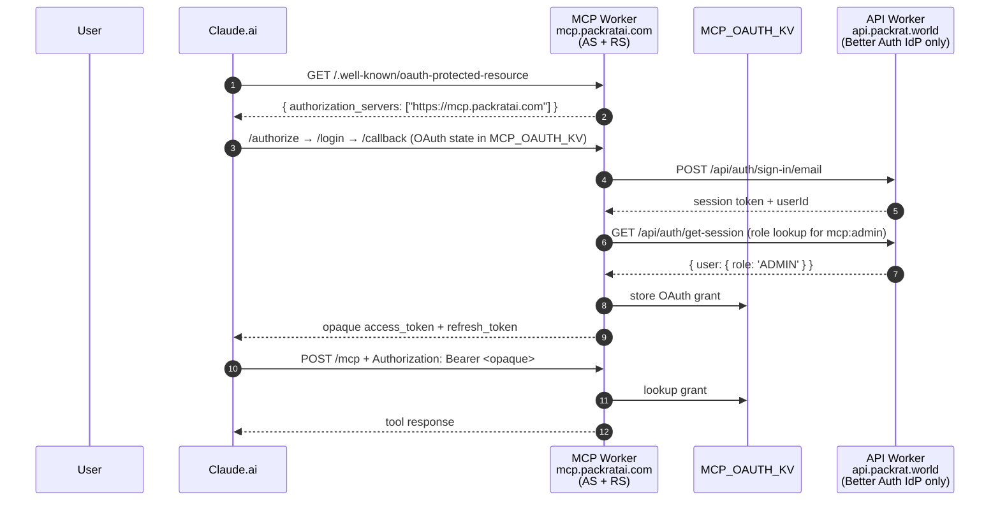

# refactor: Consolidate MCP OAuth onto Better Auth OAuth Provider plugin

## Summary

Move the PackRat MCP Worker off `@cloudflare/workers-oauth-provider` onto `@better-auth/oauth-provider` (the modern, non-deprecated Better Auth OAuth 2.1 plugin) hosted in the existing `packages/api` worker. The MCP and Better Auth OAuth machinery converge on Better Auth, eliminating the duplicated OAuth state machine on the MCP side; the legacy HS256 admin-JWT path used by `apps/admin` stays as documented back-compat. The MCP becomes a pure protected resource that validates JWT access tokens locally against Better Auth's JWKS. Built on top of the current 22-commit `plan/mcp-connector-store-readiness` branch — the connector-store readiness work (tools, annotations, output envelopes, resources, elicitations, rate limits, observability, CI, listing artifacts) all carries forward unchanged; only the OAuth machinery on both workers gets rewritten.

---

## Problem Frame

The current MCP Worker runs its own OAuth 2.1 authorization server via `@cloudflare/workers-oauth-provider`, on top of which we layered: custom DCR gating with a pre-shared bearer (U4), a custom Better Auth `/callback` bridge to look up `user.role` and grant `mcp:admin` (U5), a `trustedOrigins` repair so the MCP could call Better Auth's `/sign-in/email` (U6), a branded login page (U11). This works but the architectural cost is two parallel auth systems: every feature (passkeys, MFA, social provider, scope, rate-limit policy) has to be considered twice; the `/callback` role bridge is glue code papering over the split; admin role checks happen via a synchronous Better Auth HTTP call on every OAuth grant.

Mid-session research discovered Better Auth (v1.6.11) ships first-class MCP support — the `mcp` and `oidcProvider` plugins in core, plus the newer separate `@better-auth/oauth-provider` package that's the actively-maintained replacement for the now-deprecated bundled plugins. The plan eliminates the duplication by hosting the OAuth AS in Better Auth and reducing the MCP Worker to a pure protected resource.

A prior plan (`docs/plans/2026-04-30-feat-better-auth-migration-plan.md`) explicitly considered and rejected this architecture in April for cross-origin discovery brittleness. Two things changed: (1) Better Auth's MCP support matured (it didn't exist in April), and (2) Anthropic's connector troubleshooting docs now explicitly support and document the cross-origin AS pattern. The refactor re-litigates that decision deliberately.

---

## Requirements

- R1. `mcp.packratai.com` validates JWT access tokens locally against `api.packrat.world`'s JWKS (no per-request HTTP introspection round-trip).
- R2. OAuth 2.1 + PKCE S256 + RFC 8707 audience binding is enforced; tokens are audience-bound to `https://mcp.packratai.com/mcp`; access tokens are short-lived; refresh tokens rotate with proper invalidation of the prior token. **Spike-confirmed**: `validAudiences` enforces RFC 8707 strictly (`checkResource` throws 400 `invalid_request` for unknown audiences). JWT tokens are issued only when the client sends a `resource` parameter AND `disableJwtPlugin` is unset/false — Claude.ai MUST send `resource` per the MCP spec; verify empirically in U9 dev verification (regression guard: a request without `resource` receives an opaque token, not a JWT, which breaks the cross-worker JWKS validation architecture).
- R3. `/.well-known/oauth-authorization-server` (RFC 8414) is served at the root path on `https://api.packrat.world` (NOT `/api/auth/.well-known/...`); `/.well-known/oauth-protected-resource` (RFC 9728) is served at the root path on `https://mcp.packratai.com` and advertises `authorization_servers: ["https://api.packrat.world"]`. The `issuer` claim in the AS metadata exactly matches the URL the metadata is fetched from.
- R4. Claude is pre-registered as a trusted OAuth client in Better Auth — both `https://claude.ai/api/mcp/auth_callback` and `https://claude.com/api/mcp/auth_callback` allowlisted, `type: 'public'` (PKCE-only, no shared secret), end users still see the consent screen. The plugin does NOT expose a `trustedClients` config array (per doc-review inspection of the installed package source — that was an outdated assumption from external docs); registration happens via the plugin's `POST /oauth2/create-client` endpoint or a DB seed against the `oauthClient` table. Mechanism choice is a planning-time decision (see Open Questions).
- R5. The four MCP scopes (`mcp`, `mcp:read`, `mcp:write`, `mcp:admin`) are declared in `@better-auth/oauth-provider`'s scope catalog. `mcp:admin` is granted only when the authenticated user has `role === 'ADMIN'`. **Enforcement mechanism** (verified by spike against the actual plugin source — see `docs/mcp/better-auth-oauth-provider-spike-2026-05-25.md`): a custom `consentPage` URL is registered with the plugin; the page server-side reads the user's role and POSTs a filtered `scope` field to `/oauth2/consent` (which accepts a reduced subset of the originally-requested scopes — first-class plugin behavior). Non-admin users requesting `mcp:admin` end up with a JWT that does NOT carry the scope. **Defense in depth**: the MCP worker also re-checks `user.role` via the PackRat API for any `mcp:admin`-scoped tool call (cached 5s, fail-closed). Both ship; the consentPage is the user-facing primary, the RS re-check is the safety net.
- R6. The MCP Worker's `@cloudflare/workers-oauth-provider` dependency and every line of the OAuth state machine it required (handleAuthorize, handleLogin*, handleCallback, dcrRegisterGate, CSRF/Origin helpers, isAdminUser bridge, grantedScopesFor, login-page.ts, scheduled.ts purgeExpiredData cron, register-claude-clients.ts script) is deleted; only the protected-resource surface (well-known metadata, JWT validation, /health, /status, /mcp, /favicon.ico, CORS for Claude origins) remains.
- R7. `MCP_OAUTH_KV` bindings and namespaces (`MCP_OAUTH_KV` prod `0ac2e23bb4f04dc5a39cfd3d7bc900e0`, `MCP_OAUTH_KV_dev` `be554ba7448c4c13a48e85d9a0cdabc8`) and the `MCP_INITIAL_ACCESS_TOKEN` secret are removed from `wrangler.jsonc`; namespaces deprovisioned via `wrangler kv namespace delete`. The KV-purge cron is removed.
- R8. Every preserved component continues working: scope filter in `init()` (now sourced from JWT `scope` claim), Workers Rate Limiting binding `MCP_TOOLS_RL` keyed `${userId}:${toolName}` (now from JWT `sub`), audit logs with `actor: { userId, scopes }`, all 103 `packrat_*` tools + annotations, structured outputs + isError + pagination, resources + glossary, elicitations on destructive admin tools, `/health` probing KV+API, `/status` advertising scopes, favicon at OAuth domain, all submission-readiness probes pass against the new architecture.
- R9. `apps/admin`'s legacy HS256 admin-JWT path is preserved (the U5 dual-path `adminAuthGuard` in `packages/api/src/routes/admin/index.ts` still accepts both an HS256 `packrat-admin` JWT and a Better Auth bearer where `user.role === 'ADMIN'`). No migration of `apps/admin` in this plan.
- R10. JWT access tokens are signed via Better Auth's `jwt()` plugin (already installed) using its JWKS — same `jwks` table that today serves `/api/auth/jwks`. Stale-while-revalidate caching on the MCP side, with single-retry on stale `kid` per the April plan's documented commitment.
- R11. Dev-environment verification gate: before the prod cutover, an operator manually installs the connector in a real Claude.ai account against the dev deploy URLs (`packrat-mcp-dev.workers.dev` + `packrat-api-dev.workers.dev`) and confirms the full OAuth → initialize → tool-call flow works end-to-end. If verification fails, fallback to reverse-proxying AS endpoints onto `mcp.packratai.com` is documented but not built unless needed.
- R12. All MCP unit tests pass after refactor (current baseline: 1134 tests across 17 unit + 4 integration files). New JWKS-cache + JWT-validation unit tests added. Tests tightly coupled to deleted code (auth.test.ts OAuth-state machine tests, login-page.test.ts, scheduled.test.ts) are removed; surviving tests are kept.

---

## Scope Boundaries

- No new dedicated auth worker. Better Auth stays in `packages/api`. (Re-locked from prior dialogue.)
- No DB switch. Neon Postgres + Drizzle + `AUTH_KV` namespace stays.
- No `apps/admin` migration off the legacy HS256 JWT path.
- No custom-branded OIDC consent UI in v1. Better Auth's default consent screen, served at `https://api.packrat.world`, is the v1 UX. Reviewer-perception polish deferred.
- No changes to tool implementations, descriptions, annotations, resources, glossary, elicitations, listing artifacts, branding, legal pages.
- No new social providers (Google + Apple already in Better Auth; SSO buttons on the deleted MCP login page are gone with it).
- No production deploy from this plan. CI deploys on tag push (operator action). Local validation is vitest only — no `wrangler deploy` invoked from any unit.

### Deferred to Follow-Up Work

- ~~Custom-branded OIDC consent UI~~ — **promoted to in-scope** in U1 after the spike (`docs/mcp/better-auth-oauth-provider-spike-2026-05-25.md`) confirmed it doubles as the scope-filtering mechanism. We're already building consent UI for `mcp:admin` gating (R5); branding it in the same pass is incremental work. Lifted from Future Considerations.
- **`apps/admin` migration off HS256 admin JWT**: defer until the SPA is rewritten or has a clear ownership owner; the dual-path guard preserves back-compat indefinitely.
- **MCP SSO via Better Auth social providers**: the U11 deferral is now structurally implementable (the OAuth flow lives entirely on `api.packrat.world`, so the cookie-domain blocker between `packratai.com` and `packrat.world` no longer applies to MCP login). Wire SSO buttons on Better Auth's default consent screen if/when reviewers ask — but defer the work itself.
- **Per-feature scope refinement** (`mcp:trails:read`, `mcp:packs:write`, etc.): the four coarse scopes ship; finer granularity defers per the original connector-store plan.
- **JWKS rotation policy + key-rollover runbook**: Better Auth's `jwks` table supports rotation but the project has no documented operator procedure for rolling keys. Defer; document the steady-state assumption (one key, no rotation) until needed.
- **Migration of any production OAuth grants in `MCP_OAUTH_KV`**: no live grants exist today (the connector hasn't deployed to prod). If grants exist by execution time, document that they invalidate atomically with the AS swap — Claude users re-authorize.
- **`better-auth-cloudflare@^0.3.0`**: this package is in `packages/api/package.json` but has zero imports anywhere in the source tree (verified via grep). Remove during U1 as a one-line cleanup; not a separate unit.

---

## Context & Research

### Relevant Code and Patterns

- `packages/api/src/auth/index.ts` (lines 25-169) — Better Auth runtime instance, per-isolate `WeakMap`-cached singleton (`authCache`), full plugin set (`bearer`, `jwt`, `admin`, `expo`), social providers, rate-limit config (`window: 60, max: 100`, secondary-storage), `trustedOrigins` (currently includes `https://mcp.packratai.com` from **prior-plan U6**; this refactor REMOVES that entry — the MCP worker no longer calls Better Auth sign-in endpoints directly).
- `packages/api/src/auth/auth.config.ts` (lines 22-80) — static CLI config that must stay in lockstep with `index.ts` for schema generation. Documented drift hazard.
- `packages/api/src/index.ts` (lines 122-128) — Cloudflare `fetch` handler intercepts `/api/auth/**` before Elysia, calls `getAuth(env)`, returns `auth.handler(request)`. The mount point for the new OAuth provider's endpoints.
- `packages/db/src/schema.ts` (lines 25-108) — current Better Auth tables (`users`, `session`, `account`, `verification`, `jwks`). NO `oauthApplication`/`oauthAccessToken`/`oauthConsent` tables — adding the plugin requires a new migration.
- `packages/api/auth-schema.ts` — drift artifact at the API package root, parallel to `packages/db/src/schema.ts`. Generated by Better Auth CLI; not imported. Either delete or sync during U1.
- `packages/api/src/routes/admin/index.ts` (lines 168-205) — `adminAuthGuard` with the dual-path (HS256 JWT OR Better Auth bearer with role check). Preserved unchanged.
- `packages/mcp/src/index.ts` (lines 75-555) — `PackRatMCP` Durable Object, outer fetch wrapper, OAuthProvider config block, `mcpApiHandler` wrapper, `scheduled()` handler. The outer fetch shrinks substantially; the OAuthProvider config block + apiHandler + scheduled all delete.
- `packages/mcp/src/auth.ts` (1095 lines) — the bulk to delete. Survivors: `handleHealth`, `handleStatus`, `__resetHealthCacheForTests`, `PUBLIC_LINKS`. Everything else (OAuth state machine, CSRF, Origin checks, dcrRegisterGate, role bridge, `betterAuthErrorCopy`, `checkLoginRateLimit`) deletes.
- `packages/mcp/src/metadata.ts` — `buildResourceMetadata` (still served by MCP for RFC 9728) keeps its shape; `authorization_servers` value changes from `https://mcp.packratai.com` to `https://api.packrat.world`. `SCOPES_SUPPORTED` constant stays (still advertised). `unauthorizedResponse` + `buildWwwAuthenticateHeader` stay.
- `packages/mcp/src/scopes.ts` — pure functions, transport-agnostic. Survives unchanged; gets re-bound via different input source (JWT `scope` claim, not `props.scopes`).
- `packages/mcp/wrangler.jsonc` — `kv_namespaces[].OAUTH_KV` (both prod + dev), `triggers.crons`, `MCP_INITIAL_ACCESS_TOKEN` secret all removed. `rate_limiting`, `durable_objects`, `custom_domain`, `observability` all stay.

### Institutional Learnings

- `docs/solutions/developer-experience/better-auth-cloudflare-worker-factory-2026-05-02.md` — Better Auth CLI requires a static `auth.config.ts` that mirrors the runtime config because per-request factories can't be statically imported. Schema regen via `bunx auth generate --config src/auth/auth.config.ts`. **Directly applies to U1**: adding `@better-auth/oauth-provider` is a plugin addition; the static config file must mirror exactly or schema generation diverges from runtime.
- `docs/plans/2026-04-30-feat-better-auth-migration-plan.md` — architectural parent. Decisions to preserve: (1) per-isolate `authCache` singleton pattern with isolate-rotation discipline on deploy (`docs/mcp/runbook.md` "Forcing isolate rotation"), (2) KV rate-limit windows ≥ 60s (Cloudflare KV TTL floor), (3) `trustedOrigins` in both `index.ts` and `auth.config.ts`, (4) Apple per-isolate client-secret JWT signing. Decision to **re-litigate**: this plan rejected cross-origin AS as "more brittle"; this refactor reverses that decision and verifies empirically in dev (R11).
- `docs/plans/2026-05-22-001-feat-mcp-connector-store-readiness-plan.md` — connector-store readiness, completed. Every U7-U18 surface must keep working. The auth-surface units (U3-U6) get superseded.
- `docs/mcp/runbook.md` — operator-facing reality of the connector-store work. Heavy rewrites in U8: the DCR gating contract section deletes, login form security section deletes (U6 work goes away), KV provisioning section rewrites, OTel pipeline + custom domain sections stay.
- No prior `docs/solutions/` entries for: OIDC providers on Cloudflare Workers, JWKS cache patterns with stale-while-revalidate, cross-domain OAuth (RFC 9728 cross-origin), `@better-auth/oauth-provider` plugin usage. This refactor is greenfield institutional territory and should produce 2-3 new `docs/solutions/` entries when it lands.

### External References

- [Better Auth OAuth 2.1 Provider docs](https://better-auth.com/docs/plugins/oauth-provider) — the new package's reference. Configuration shape, `trustedClients`, `validAudiences`, `customAccessTokenClaims({user, scopes, resource, client})`, `formatRefreshToken`, per-client `require_pkce`, refresh rotation with old-token invalidation.
- [Better Auth MCP plugin docs](https://better-auth.com/docs/plugins/mcp) — bundled `mcp` plugin reference; we're NOT using this directly but it confirms the deprecation track and the `createMcpAuthClient` HTTP-introspection alternative we're choosing to avoid.
- [@better-auth/oauth-provider on npm](https://www.npmjs.com/package/@better-auth/oauth-provider) — package metadata. Latest 1.6.x track.
- [MCP Authorization spec 2025-11-25](https://modelcontextprotocol.io/specification/2025-11-25/basic/authorization) — RFC 8414 + 9728 + 8707 requirements; the `WWW-Authenticate: Bearer resource_metadata="..."` 401 contract; `issuer` claim must match the metadata-fetch URL; PKCE S256 mandatory.
- [Anthropic Connector troubleshooting](https://claude.com/docs/connectors/building/troubleshooting) — explicit blessing of cross-origin AS pattern + warning about WAF blocking discovery probes from Anthropic's egress range + redirect-loses-Authorization-header trap.
- [anthropics/claude-ai-mcp#82, #248, #291, #11814] — closed-as-not-planned issues about Claude.ai cross-origin AS bugs. Real but unconfirmed-current; the R11 dev verification gate catches them.
- [better-auth#5496] — "OIDC plugin sets incorrect issuer at non-root basePath" — fixed pre-1.6.11, verify token `iss` claim during U1.
- [better-auth#9654] — `verifyAccessToken` passes raw `jose` errors through; wrap try/catch and map to 401.
- [better-auth#6423] — expired OAuth tokens not auto-deleted; track for cleanup cron in follow-up if needed.

---

## Key Technical Decisions

- **Use `@better-auth/oauth-provider` (separate npm package), NOT the bundled `oidcProvider`/`mcp` plugins.** The bundled plugins are `@deprecated` in `better-auth@1.6.11`'s own source. Going "all in on Better Auth's docs" means going on the actively-maintained package. The new package adds: real RFC 8707 audience binding (`validAudiences`), proper refresh rotation (with `oauthRefreshToken` table tracking), per-client PKCE config, JWT-signable access tokens (default — no opt-in flag required; the relevant option is `disableJwtPlugin?: boolean` which defaults to `false`). Note: `customAccessTokenClaims` is NOT a scope-reduction hook (inspection-confirmed); scope-gating mechanism is a planning decision (see Open Questions / R5).
- **JWT access tokens, signed via the `jwt()` plugin's JWKS, validated locally on the MCP worker via `jose.createRemoteJWKSet` + stale-while-revalidate cache.** Avoids per-request HTTP introspection round-trip (~50ms latency saved per MCP call). Matches the April plan's documented JWKS caching commitment.
- **Discovery endpoints mounted at root via `@better-auth/oauth-provider`'s metadata helpers.** Better Auth defaults to subpath (`/api/auth/.well-known/...`); RFC 5785 + MCP clients expect root (`/.well-known/...`). The package exports the AS-side helpers as `oauthProviderAuthServerMetadata` and `oauthProviderOpenIdConfigMetadata` (verified via doc-review inspection of `dist/index.d.mts:64`); the protected-resource metadata helper does NOT ship from the AS-side package — keep the existing `packages/mcp/src/metadata.ts` `buildResourceMetadata` for that (it's served by the MCP worker anyway, which is the architecturally correct location per RFC 9728).
- **Pre-register Claude via DB seed against the `oauthClient` table (NOT a plugin config — `trustedClients` doesn't exist).** `allowDynamicClientRegistration: false` everywhere; both Claude callback URLs are seeded with `type: 'public'` (PKCE-only) into the `oauthClient` table at deploy time via a one-shot script that calls `auth.api.createOAuthClient(...)`. Operator script analog to the deleted `register-claude-clients.ts` but targeting Better Auth's admin endpoint instead of workers-oauth-provider's. Document in U1.
- **Admin-scope gating mechanism is a planning-time decision (see R5).** `customAccessTokenClaims` only spreads into JWT claims; the scope field is overwritten downstream — confirmed by inspection of `dist/index.mjs:339-363`. Two viable enforcement paths: (a) custom `consentPage` that pre-filters scopes before `/oauth2/consent` is called, (b) resource-server re-check of `user.role` for any `mcp:admin`-scoped call from the MCP worker (defense-in-depth always-on; primary if no consent UI built). The plan ships path (b) unconditionally and adds path (a) if branded consent UI lands in U1 — see Open Questions.
- **Audience binding pinned to `https://mcp.packratai.com/mcp`.** Plugin's `validAudiences: ['https://mcp.packratai.com/mcp']` rejects tokens minted for any other audience. MCP worker validates `aud` claim during JWT verification. Spec-correct RFC 8707.
- **Build refactor first, verify in dev before prod tag.** Standard sequence — develop locally, validate via vitest, deploy to dev via CI tag-push, operator manually installs in real Claude.ai against dev URLs to confirm cross-origin flow works. Prod tag only after dev verification.
- **All local validation via vitest; no `wrangler deploy` invoked from any unit.** Per user constraint. CI handles deploys.
- **Cutover is clean — no feature-flag, no parallel mounting.** Delete `workers-oauth-provider` machinery in the same arc of commits that adds Better Auth's OAuth provider. Rollback via `git revert` of the merge. Zero deployed OAuth grants exist today, so no migration cost.
- **`better-auth-cloudflare@^0.3.0` dead code removed.** Listed in deps, zero imports. One-line cleanup during U1.

---

## Open Questions

### Resolved During Planning

- **Which Better Auth package?** `@better-auth/oauth-provider` (new). Confirmed by user direction.
- **Cross-origin verification posture?** Build first, verify in dev pre-cutover. Confirmed.
- **Auth-server topology?** Stays in `packages/api`. Confirmed earlier — no new auth worker.
- **Consent UI?** **Custom branded `consentPage`** (promoted from deferred to in-scope after spike). Doubles as the scope-filter mechanism. See `docs/mcp/better-auth-oauth-provider-spike-2026-05-25.md`.
- **Admin scope gating mechanism?** Custom `consentPage` filters at grant time (POSTs reduced scope to `/oauth2/consent` — first-class plugin behavior); MCP worker re-checks role on `mcp:admin` calls as defense-in-depth. Both ship in U1/U2.
- **`apps/admin` migration?** Out of scope. Dual-path `adminAuthGuard` stays.
- **`better-auth-cloudflare` package?** Dead code, delete during U1.
- **`trustedClients` config?** Doesn't exist (spike-verified); pre-register Claude via `auth.api.createOAuthClient` seed script.
- **Schema tables?** Four (`oauthClient`, `oauthAccessToken`, `oauthRefreshToken`, `oauthConsent`) — `oauthRefreshToken` was missing from the original plan; spike caught it.
- **JWT vs opaque tokens?** JWT default; only issued when `resource` parameter present (spike finding §Q4). Claude.ai sends `resource` per spec; U9 verifies.

### Deferred to Implementation

- **Exact path the `@better-auth/oauth-provider` plugin uses for its endpoints** — likely `/api/auth/oauth2/authorize` and `/api/auth/oauth2/token` per Better Auth conventions, but verify against the installed package's docs at implementation time and update the runbook accordingly.
- **JWKS cache backend** — Workers Cache API (`caches.default`) vs. KV-backed vs. isolate-local LRU. Pick at implementation time based on the actual JWKS payload size + rotation cadence; isolate-local is cheapest if rotation is rare.
- **Stale-while-revalidate retry mechanics** — exact code shape for "JWT signature failed → fetch JWKS once via `ctx.waitUntil` → retry verification → if still failing, 401 with `error: token_expired`". Implementer's call.
- **Final issuer URL** — `https://api.packrat.world` vs `https://api.packrat.world/api/auth` depending on what `@better-auth/oauth-provider` v1.6.x advertises after the basePath fixes (issue #5496). Verify the `iss` claim in a real issued token matches what the AS metadata's `issuer` field says.
- **Reverse-proxy fallback shape** if dev verification fails — sketch only documented; build only if needed. Likely a per-route proxy on the MCP worker fronting `/.well-known/oauth-authorization-server` + `/oauth2/authorize` + `/oauth2/token` against `api.packrat.world`.
- **D5 — JWT audience mismatch for MCP→API proxied tool calls.** Three options on the table: (a) extend `validAudiences` to accept both `https://mcp.packratai.com/mcp` and `https://api.packrat.world` so the same JWT is accepted by both; (b) mint a separate API-audience token alongside the MCP token; (c) MCP holds a separate API credential per user (Better Auth bearer fetched via session). Pick at U2 implementation time when proxied call shape is concrete.
- ~~`customAccessTokenClaims` scope-reduction behavior~~ — **resolved by spike**: confirmed claims-only (cannot reduce scope); using `consentPage` mechanism instead. See `docs/mcp/better-auth-oauth-provider-spike-2026-05-25.md` §Q1-Q2.

---

## High-Level Technical Design

> *This illustrates the intended approach and is directional guidance for review, not implementation specification. The implementing agent should treat it as context, not code to reproduce.*

### Architecture diff

**Before (current state, post-connector-store-readiness):**



**After (this plan):**

```mermaid
sequenceDiagram
    autonumber
    participant U as User
    participant C as Claude.ai
    participant M as MCP Worker<br/>mcp.packratai.com<br/>(RS only)
    participant A as API Worker<br/>api.packrat.world<br/>(AS via @better-auth/oauth-provider)

    Note over C,M: Cross-origin discovery (RFC 9728)
    C->>M: GET /.well-known/oauth-protected-resource
    M-->>C: { authorization_servers: ["https://api.packrat.world"] }
    C->>A: GET /.well-known/oauth-authorization-server
    A-->>C: { issuer, authorization_endpoint, token_endpoint, jwks_uri, scopes_supported }

    Note over C,A: OAuth on api.packrat.world (single origin for entire flow)
    C->>A: /oauth2/authorize?client_id=claude&scope=mcp+mcp:read+mcp:write&resource=https://mcp.packratai.com/mcp&code_challenge=...
    A->>U: Better Auth default consent screen
    U->>A: approve
    A-->>C: redirect to claude.ai/api/mcp/auth_callback?code=...
    C->>A: POST /oauth2/token + PKCE verifier + resource=https://mcp.packratai.com/mcp
    A->>A: customAccessTokenClaims: if user.role !== 'ADMIN', strip mcp:admin
    A-->>C: JWT access_token (aud=mcp/, iss=api/, scope="mcp:read mcp:write") + rotating refresh_token

    Note over C,M: Tool calls (per-call JWT validation, no network round-trip)
    C->>M: POST /mcp + Authorization: Bearer <JWT>
    M->>M: jose.jwtVerify(JWT, jwks) — JWKS cached SWR from api.packrat.world/api/auth/jwks
    M->>M: assert iss + aud + exp; extract sub + scopes
    M-->>C: tool response
```

### Scope-to-tool gating model (unchanged from the prior plan's U5 — `packages/mcp/src/scopes.ts`; this plan changes only the input source)

| Token scopes | Visible tool prefixes | Notes |
|---|---|---|
| `mcp` | read tools | back-compat umbrella; `customAccessTokenClaims` includes by default |
| `mcp:read` | read tools | |
| `mcp:write` | read + write tools | |
| `mcp:admin` | read + write + admin tools | only granted when `user.role === 'ADMIN'` (enforced via `customAccessTokenClaims`) |

Source of `props.scopes`: today, OAuthProvider injects from KV grants → `Props` schema. After: outer fetch wrapper parses JWT `scope` claim → builds equivalent `Props` shape → DO `init()` reads `props.scopes` unchanged.

### Cross-origin failure-mode catalog

The R11 dev verification gate exists because these are real risks:

| Symptom in Claude.ai install | Likely root cause | Mitigation |
|---|---|---|
| Claude shows generic "OAuth failed" without ever reaching api.packrat.world | CORS preflight on `POST /mcp` from `claude.ai` origin failing | U2 outer fetch wrapper allowlists `https://claude.ai` and `https://claude.com` for `Access-Control-Allow-Origin` + exposes `WWW-Authenticate` |
| OAuth completes but Claude shows "Authorization with the MCP server failed" | The MCP returns `301/302` redirect after install, dropping `Authorization` header | Ensure `mcp.packratai.com/mcp` returns 401 (not 302) when token missing; same for any redirect path |
| Claude ignores `authorization_endpoint` from AS metadata (issue #82) | Claude.ai bug with non-`/authorize` paths on cross-origin AS | Try Better Auth's default endpoint paths; if rejected, mount aliases at `/authorize` and `/token` on `api.packrat.world` root |
| `initialize` never sent after OAuth (issue #291) | CORS-on-POST-/mcp + missing `Access-Control-Expose-Headers: mcp-session-id` | Confirm CORS exposes both `WWW-Authenticate` and `mcp-session-id` |
| Token validation 500s instead of 401 on bad token | `jose.jwtVerify` throws raw error; not caught and mapped (issue #9654) | U2 wraps verify call in try/catch, maps to 401 + WWW-Authenticate |
| Discovery probe from Anthropic egress blocked at zone | WAF / Bot Fight Mode on `api.packrat.world` blocking unknown user agents | Explicit allow rule for `/.well-known/*` paths; document in runbook |

---

## Implementation Units

### U1. Install `@better-auth/oauth-provider`, configure plugin, regenerate schema

**Goal:** Add the new OAuth provider plugin to Better Auth on the API worker, configure it with the four MCP scopes + Claude pre-registration + audience binding + admin-scope gating, generate the new database tables.

**Requirements:** R2, R3, R4, R5, R9, R10

**Dependencies:** None

**Files:**
- Modify: `packages/api/package.json` (add `@better-auth/oauth-provider@^1.6.0` to dependencies; remove `better-auth-cloudflare@^0.3.0` from devDependencies — dead code per repo audit)
- Modify: `packages/api/src/auth/index.ts` (add the plugin to `plugins: [...]`; **remove** `'https://mcp.packratai.com'` from `trustedOrigins` — the MCP worker no longer calls Better Auth sign-in endpoints directly after this refactor, so the trusted-origin entry expands CORS/CSRF bypass surface unnecessarily. CORS for MCP-originated traffic to specific routes can be handled per-route via Elysia's CORS plugin if needed.)
- Modify: `packages/api/src/auth/auth.config.ts` (mirror the plugin config in the static CLI surface — lockstep per `docs/solutions/developer-experience/better-auth-cloudflare-worker-factory-2026-05-02.md`; also mirror the `trustedOrigins` removal of `'https://mcp.packratai.com'`)
- Modify: `packages/db/src/schema.ts` (add the **four** new tables: `oauthClient` (NOT `oauthApplication` — that's the bundled OIDC plugin's name), `oauthAccessToken`, `oauthRefreshToken`, `oauthConsent` — copy shape from `packages/api/auth-schema.ts` after regen. The `oauthRefreshToken` table is required for R2's refresh-token rotation; omitting it breaks refresh grants at first attempt per doc-review inspection of the plugin source)
- Modify: `packages/api/src/index.ts` (mount `oauthProviderAuthServerMetadata` and `oauthProviderOpenIdConfigMetadata` helpers at root paths `/.well-known/oauth-authorization-server` and `/.well-known/openid-configuration` — replaces Better Auth's default subpath mount for these specific endpoints. Note: protected-resource metadata helper does NOT ship from the AS-side package; that's served by the MCP worker via the existing `buildResourceMetadata` in `packages/mcp/src/metadata.ts`)
- Create: `packages/api/src/auth/consent-page.ts` (server-rendered branded consent page registered as `consentPage: '/oauth/consent'` in the plugin config; reads `client_id`, `scope`, `code` query params; server-side checks current user's Better Auth session role; filters `mcp:admin` from the displayed scope set for non-admins so the user can't approve a scope they're not eligible for; renders PackRat-branded consent UI with logo, client name from the `oauthClient` record's `name`/`logo_uri` fields, scope-by-scope description, and the four URI links (`policy_uri` → privacy, `tos_uri` → terms, `client_uri` → docs); POSTs to `/api/auth/oauth2/consent` with the approved filtered `scope` field per the plugin's first-class scope-reduction mechanism — see spike findings in `docs/mcp/better-auth-oauth-provider-spike-2026-05-25.md`)
- Create: `packages/api/src/auth/__tests__/consent-page.test.ts` (assertions: non-admin requesting `mcp:admin` sees that scope absent from the form; POST with filtered scope causes the issued JWT to omit `mcp:admin`; admin sees and can approve all four scopes; CSRF protection inherits from Better Auth session middleware on `/oauth2/consent`)
- Create: `packages/api/drizzle/<auto-generated>.sql` (drizzle-kit migration emitted by `bun run db:generate`)
- Delete: `packages/api/auth-schema.ts` (drift artifact at API package root, parallel to `packages/db/src/schema.ts`, not imported anywhere; remove after copying the new tables into the real schema)
- Test: `packages/api/test/oauth-provider.test.ts` (new — discovery doc shape, trustedClients are visible, /authorize redirects correctly)

**Approach:**
- Install the plugin. Configure with: `scopes: ['openid', 'profile', 'email', 'offline_access', 'mcp', 'mcp:read', 'mcp:write', 'mcp:admin']`; `requirePKCE: true`; `allowPlainCodeChallengeMethod: false`; `allowDynamicClientRegistration: false`; `validAudiences: ['https://mcp.packratai.com/mcp']`; `consentPage: '/oauth/consent'`; `loginPage: '/sign-in'` (or wherever Better Auth's sign-in page lives in the API). **JWT access tokens are the default** (option name is `disableJwtPlugin?: boolean`, default `false` — leave unset). **Critical**: JWT tokens are only issued when the client sends a `resource` parameter (spike-verified `isJwtAccessToken = audience && !disableJwtPlugin`); Claude.ai sends `resource` per MCP spec, but verify in U9. `trustedClients` is NOT a valid config option (verified by spike); use the seed mechanism in the next bullet instead.
- Pre-register Claude via DB seed: create a one-shot script at `packages/api/scripts/seed-claude-oauth-client.ts` that calls `auth.api.createOAuthClient({ headers: <admin session>, body: { redirect_uris: ['https://claude.ai/api/mcp/auth_callback', 'https://claude.com/api/mcp/auth_callback'], token_endpoint_auth_method: 'none', grant_types: ['authorization_code', 'refresh_token'], response_types: ['code'], client_name: 'Claude', scope: 'openid profile email offline_access mcp mcp:read mcp:write', logo_uri: 'https://packratai.com/mcp-logo-256.png', policy_uri: 'https://packratai.com/privacy-policy', tos_uri: 'https://packratai.com/terms-of-service' } })`. The `redirect_uris` field uses the API's snake_case wire shape; the schema column is `redirectUris` (camel-case) — both are correct depending on the layer. The four client-metadata URI fields (`logo_uri`, `client_uri`, `policy_uri`, `tos_uri`) are load-bearing for the consent screen — they're what users read during install.
- **Admin-scope gating is primarily at consent time, defended-in-depth at the resource server.** The custom `consentPage` (new file in this unit) reads the user's role from the Better Auth session and POSTs a filtered `scope` field to `/oauth2/consent` — the plugin natively accepts a reduced subset (spike-verified, see `docs/mcp/better-auth-oauth-provider-spike-2026-05-25.md` §Q2). Non-admin users requesting `mcp:admin` receive a JWT without it. The MCP worker's `verifyMcpToken` also re-checks `user.role` via a cached Better Auth `getSession` call (5s timeout, fail-closed) for any tool call where `mcp:admin` appears in the JWT scope — defense-in-depth backstop against a misconfigured consent page or a stolen admin JWT.
- Schema regen flow per `CLAUDE.md` "Migration discipline": edit both `auth/index.ts` and `auth/auth.config.ts` in lockstep; run `cd packages/api && bunx auth generate --config src/auth/auth.config.ts`; review the generated `packages/api/auth-schema.ts`; copy the four new tables (`oauthClient`, `oauthAccessToken`, `oauthRefreshToken`, `oauthConsent` — `oauthRefreshToken` is required for R2's refresh-token rotation) into `packages/db/src/schema.ts`; run `cd packages/api && bun run db:generate`; **do not rename the generated SQL file**; run `bunx drizzle-kit check`.
- Mount discovery at root: in `packages/api/src/index.ts`'s fetch dispatcher, intercept `GET /.well-known/oauth-authorization-server` and `GET /.well-known/oauth-protected-resource` before Elysia, call Better Auth's `oAuthDiscoveryMetadata(auth)` and `oAuthProtectedResourceMetadata(auth)` helpers respectively. RFC 5785 requires these at root; Better Auth's default mount under `/api/auth/.well-known/...` doesn't satisfy clients.
- Verify in test: the AS metadata `issuer` claim equals `https://api.packrat.world` (or whatever URL the metadata is served from — they MUST match per spec).

**Patterns to follow:**
- Per-isolate `authCache` singleton stays (lines 22, 26, 167 of `packages/api/src/auth/index.ts`); the new plugin gets captured into the singleton at first request per isolate. Document the isolate-rotation requirement for the deploy in U7.
- Schema additions follow the existing Better Auth section in `packages/db/src/schema.ts` (after line 102 `jwks`).
- `bunx drizzle-kit check` is the validation gate per `CLAUDE.md`.

**Test scenarios:**
- Happy path: `GET https://api.packrat.world/.well-known/oauth-authorization-server` returns JSON with `issuer: "https://api.packrat.world"`, `code_challenge_methods_supported: ["S256"]`, `scopes_supported` includes all four MCP scopes plus the standard OIDC scopes, `authorization_endpoint` and `token_endpoint` on `api.packrat.world`.
- Happy path: a registered trusted client `claude-ai` appears when calling `auth.api.listOAuthClients()` (or equivalent); the redirect URL list contains both Claude callback URLs.
- Edge case: requesting `mcp:admin` as a non-admin user — assert that the access token's `scope` claim does NOT contain `mcp:admin` after the `customAccessTokenClaims` hook fires. If empirically the hook doesn't reduce scopes, this test red-flags the gap so the implementer falls back to a custom consent page.
- Edge case: requesting `mcp:admin` as an admin user — token contains it.
- Error path: requesting an unsupported scope (e.g., `mcp:nonsense`) returns `invalid_scope` error.
- Integration: a full PKCE S256 authorization-code flow against the deployed dev instance (via `mcp-cli` or `@modelcontextprotocol/inspector`) issues a JWT access token whose `aud` claim equals exactly `https://mcp.packratai.com/mcp` and whose `iss` matches the AS metadata `issuer`. (Marked `it.todo` if vitest-pool-workers still has the ajv blocker per U17 of the prior plan; otherwise live.)

**Verification:**
- `cd packages/api && bunx drizzle-kit check` is green.
- `cd packages/api && bun run test:unit` shows the OAuth provider discovery test passing.
- A reviewer can `curl` the well-known URL from outside Cloudflare and see the discovery JSON.

---

### U2. MCP-side JWT validation infrastructure (JWKS cache + verify helper)

**Goal:** Build the protected-resource validation surface — a JWKS-aware token verifier with stale-while-revalidate caching, fail-closed semantics, RFC 8707 audience claim enforcement, and the integration seam the U3 deletion expects.

**Requirements:** R1, R2, R10

**Dependencies:** U1 (the JWKS endpoint at `api.packrat.world/api/auth/jwks` must serve the same keys that signed the JWTs)

**Files:**
- Create: `packages/mcp/src/token-verify.ts` (the JWKS cache + JWT verify wrapper)
- Create: `packages/mcp/src/__tests__/token-verify.test.ts` (unit tests against fixture JWTs)
- Modify: `packages/mcp/package.json` (add `jose@^6.x` — verify version against Workers compat date; Better Auth uses jose internally so it's likely already in the workspace tree)

**Approach:**
- The verifier exposes a single function: `async verifyMcpToken(token: string, env: Env): Promise<{ sub: string; scopes: string[]; token: string } | null>`. Returns `null` on any verification failure (caller maps to 401 with `WWW-Authenticate`).
- Internally: `jose.createRemoteJWKSet(new URL('https://api.packrat.world/api/auth/jwks'), { cacheMaxAge: 600_000 })` (10-minute cache); call `jose.jwtVerify(token, jwks, { issuer: 'https://api.packrat.world', audience: 'https://mcp.packratai.com/mcp', algorithms: ['ES256', 'RS256'] })`.
- Stale-while-revalidate retry: on first `jose.errors.JWSSignatureVerificationFailed` (possible stale JWKS cache after key rotation), fire `ctx.waitUntil(jwks.coolingDown(0))` to force refresh, then retry verification once. On second failure, return `null`. Per the April plan's documented commitment.
- Wrap `jose.jwtVerify` in try/catch — any thrown error returns `null` (per issue better-auth#9654, raw thrown errors break the WWW-Authenticate-driven discovery retry).
- Extract `payload.sub` and `payload.scope` (space-separated string per RFC 6749 §3.3) → split → return as `scopes: string[]`. Return the raw token alongside for the legacy `betterAuthToken` field in `Props` (used by `packages/mcp/src/client.ts` to forward as Bearer to the PackRat API for proxied calls).

**Execution note:** Build the verifier test-first with fixture JWTs (use `jose.SignJWT` to mint test tokens against an in-memory key). The verifier is the most security-critical surface in the refactor; correctness via tests before integration.

**Technical design:**

```
function makeJwksCache(env: Env, ctx: ExecutionContext):
    jwks ← jose.createRemoteJWKSet('${PACKRAT_API_URL}/api/auth/jwks', { cacheMaxAge: 10min })
    return jwks

async function verifyMcpToken(token, env, ctx):
    try:
        { payload } ← jose.jwtVerify(token, jwks, {
            issuer: 'https://api.packrat.world',
            audience: 'https://mcp.packratai.com/mcp',
            algorithms: ['ES256','RS256'],
        })
        return { sub: payload.sub, scopes: payload.scope?.split(' ') ?? [], token }
    catch e:
        if e is signature error AND first try:
            ctx.waitUntil(jwks.reload())
            retry once
        return null
```

Frame: directional guidance, not implementation specification. The implementing agent should treat this as context, not code to reproduce.

**Patterns to follow:**
- Better Auth's own client uses `jose` — mirror the version and import shape (`import { jwtVerify, createRemoteJWKSet } from 'jose'`).
- Existing pattern: `packages/mcp/src/metadata.ts`'s `unauthorizedResponse` helper — call it from the outer fetch wrapper when `verifyMcpToken` returns null.

**Test scenarios:**
- Happy path: a JWT signed by a test JWKS key, with valid `iss`, `aud`, `exp`, returns `{ sub, scopes, token }`.
- Happy path: scopes are correctly split from space-separated string.
- Edge case: token with no `scope` claim returns `scopes: []`.
- Edge case: token with `aud` as array (rather than string) including the MCP audience verifies successfully (RFC 7519 allows both).
- Error path: token with wrong `iss` returns `null`.
- Error path: token with wrong `aud` returns `null`.
- Error path: expired token returns `null`.
- Error path: token signed with an unknown key returns `null` after one retry (stale-while-revalidate exercised).
- Error path: malformed JWT (not three base64 segments) returns `null` without throwing.
- Error path: token signed with `alg: none` returns `null` (algorithm allowlist enforced).
- Integration: real `api.packrat.world/api/auth/jwks` endpoint reachable from the test environment returns a JWKS document `jose` accepts. (May be `it.todo` if integration-test infrastructure is still blocked.)

**Verification:**
- `bun run test --filter @packrat/mcp` shows the new token-verify suite passing.
- A real token issued by a U1-configured dev API instance can be verified by this helper end-to-end (manual smoke).

---

### U3. Rewrite MCP outer fetch wrapper; delete `workers-oauth-provider` machinery

**Goal:** Replace the OAuthProvider-based outer fetch wrapper in `packages/mcp/src/index.ts` with a thin dispatcher that does JWT validation on `/mcp`, serves the well-known + favicon + health + status routes directly, and delegates `/mcp` to the Durable Object. Delete every line of OAuth state machinery (auth.ts handlers, login-page.ts, scheduled.ts, register-claude-clients.ts) and the `@cloudflare/workers-oauth-provider` dependency.

**Requirements:** R3, R6

**Dependencies:** U2 (the JWT verifier is the replacement for OAuthProvider's apiHandler gate)

**Files:**
- Modify: `packages/mcp/package.json` (remove `@cloudflare/workers-oauth-provider`; remove `magic-regexp` — its only consumers were the CSRF-cookie regexes in `auth.ts` deleted in this unit and the escapeHtml regexes in `login-page.ts` deleted in this unit, leaving zero remaining usages)
- Modify: `packages/mcp/src/index.ts` (rewrite the default export: drop OAuthProvider config block lines ~431-499, drop `mcpApiHandler` wrapper lines ~383-412, drop `dcrRegisterGate` call, drop `scheduled` arm; new outer fetch dispatcher: route `/.well-known/oauth-protected-resource` to a static handler, `/health` + `/status` + `/favicon.ico` to surviving auth.ts handlers, `OPTIONS *` for CORS preflight from Claude origins, default to `/mcp` → JWT-validate via `verifyMcpToken` → build `Props` → forward to DO; `Props` shape stays the same so DO consumers don't change)
- Modify: `packages/mcp/src/auth.ts` (delete: `handleAuthorize`, `handleLoginGet`, `handleLoginPost`, `handleCallback`, `dcrRegisterGate`, `extractBearer`, `timingSafeEqual`, `csrfEqual`, `isOriginAcceptable`, `parseCookieHeader`, `buildCsrfSetCookie`, `betterAuthErrorCopy`, `checkLoginRateLimit`, `isAdminUser`, `grantedScopesFor`, `PackRatAuthHandler`, KV-key helpers `oauthStateKey`/`sessionKey`/`csrfKey`, all `magic-regexp` imports tied to deleted helpers, all `OAUTH_KV` references. Keep: `handleHealth`, `handleStatus`, `__resetHealthCacheForTests`, `PUBLIC_LINKS`, `serviceMetadata`. The file should be a small module exporting health/status handlers + the public-links constant.)
- Modify: `packages/mcp/src/metadata.ts` (change `authorization_servers` value in `buildResourceMetadata` from `https://mcp.packratai.com` to `https://api.packrat.world` — this is the load-bearing one-line change connector-store-readiness submission depends on)
- Modify: `packages/mcp/src/types.ts` (drop `Env.OAUTH_KV`, drop `Env.OAUTH_PROVIDER`, drop `Env.MCP_INITIAL_ACCESS_TOKEN`; keep `Env.MCP_TOOLS_RL`, `Env.MCP_FEATURE_FLAGS`, `Env.MCP_COMMIT_SHA`, `Env.PACKRAT_API_URL`, `Env.PackRatMCP`; `Props` shape unchanged but `betterAuthToken` is now the validated JWT)
- Delete: `packages/mcp/src/login-page.ts` (entire file)
- Delete: `packages/mcp/src/scheduled.ts` (entire file)
- Delete: `packages/mcp/scripts/register-claude-clients.ts` (entire file)
- Modify: `packages/mcp/src/cors.ts` (comment cleanup: refs to OAuthProvider context are stale; substance correct)
- Modify: `packages/mcp/src/client.ts` (comment cleanup: ref to OAuthProvider-injected bearer is stale)

**Approach:**
- The outer fetch wrapper is the only auth surface that survives on the MCP. Sketch of the new dispatcher (directional, not specification):
  - `OPTIONS *` from `https://claude.ai`/`claude.com` Origin → 204 with CORS headers (preflight handling already lives in `cors.ts`; reuse).
  - `GET /.well-known/oauth-protected-resource` → static JSON from `buildResourceMetadata(env)`; the `authorization_servers` value now points at `api.packrat.world`.
  - `GET /favicon.ico` → existing `faviconResponse()`.
  - `GET /health` → existing `handleHealth(request, env)`.
  - `GET /status` → existing `handleStatus(request, env)`.
  - `POST /mcp` (or anything starting with `/mcp`) → extract `Authorization: Bearer <token>`; `verifyMcpToken(token, env, ctx)`; if `null`, return `unauthorizedResponse(env)` (401 with `WWW-Authenticate`); else build `Props = { betterAuthToken: token, userId: result.sub, scopes: result.scopes }` and delegate to the Durable Object via the same SDK pattern OAuthProvider used (`McpAgent.serve('/mcp').fetch` or similar — check `agents@^0.13.2` API).
  - Anything else: 404.
- The DO `PackRatMCP` class (lines 75-353 of `index.ts`) stays unchanged in shape — `props` arrives via the same `ctx.props` channel the SDK uses, just sourced from the JWT instead of OAuthProvider grants. The `init()` scope filter, `getAuditContext`, `currentUserId`, rate-limit binding wrapper all consume `this.props.userId` and `this.props.scopes` exactly as today.
- `metadata.ts` change is the load-bearing one for connector-store correctness — the AS URL Claude discovers MUST match the URL where the AS metadata is served. Update + verify.

**Patterns to follow:**
- The existing CORS + `WWW-Authenticate` infrastructure stays (U6 work). Reuse `cors.ts`'s `applyCorsHeaders` and `metadata.ts`'s `unauthorizedResponse`.
- DO delegation pattern: study how the current `mcpApiHandler` calls `mcpDoHandler.fetch(...)` — same pattern, fewer header manipulations (no admin-token header injection since admin is now JWT scope).

**Test scenarios:**
- Happy path: `GET /.well-known/oauth-protected-resource` returns JSON with `authorization_servers: ["https://api.packrat.world"]` (the load-bearing change).
- Happy path: `POST /mcp` with a valid JWT calls the DO and returns the DO's response.
- Error path: `POST /mcp` with no bearer returns 401 + `WWW-Authenticate: Bearer resource_metadata="https://mcp.packratai.com/.well-known/oauth-protected-resource"`.
- Error path: `POST /mcp` with invalid bearer (wrong issuer, wrong audience, expired) returns 401.
- Error path: `POST /mcp` with bearer that throws inside `jose` returns 401 (not 500 — guards against issue better-auth#9654).
- Edge case: `OPTIONS /mcp` from `Origin: https://claude.ai` returns 204 with `Access-Control-Allow-Origin`, `Access-Control-Expose-Headers: WWW-Authenticate, mcp-session-id`, `Access-Control-Allow-Methods: POST, OPTIONS`.
- Edge case: `OPTIONS /mcp` from `Origin: https://evil.example` does NOT get `Access-Control-Allow-Origin` set.
- Edge case: `/.well-known/oauth-protected-resource` includes the `scopes_supported` from `metadata.ts` (all four MCP scopes).
- Integration: `GET /favicon.ico` returns 200 + image/x-icon with .ico magic bytes (existing U13 test survives unchanged).

**Verification:**
- `bun run test --filter @packrat/mcp` — surviving tests still pass (auth.test.ts has been trimmed to /health, /status, PUBLIC_LINKS only; see U6).
- `git ls-files packages/mcp/src/auth.ts` → file exists but is ~10% of its prior size.
- `git ls-files packages/mcp/src/login-page.ts packages/mcp/src/scheduled.ts packages/mcp/scripts/register-claude-clients.ts` → all return no output (files deleted).
- `grep -r '@cloudflare/workers-oauth-provider' packages/mcp/` → returns nothing.

---

### U4. Re-bind `props.userId` + `props.scopes` from JWT claims (plumbing migration)

**Goal:** Update the `Props` source-of-truth across the Durable Object's consumers — every place that reads `this.props.userId` or `this.props.scopes` now reads the JWT-validated claim shape — without changing the consumer code itself (the Props shape stays identical, only the source changes).

**Requirements:** R8

**Dependencies:** U3 (the outer fetch wrapper builds the Props shape)

**Files:**
- Modify: `packages/mcp/src/index.ts` (`PropsSchema` Zod schema validation — `betterAuthToken: z.string()`, `userId: z.string()`, `scopes: z.array(z.string())` — unchanged shape, just the source documentation in the comments updates)
- Modify: `packages/mcp/src/index.ts` (`State` interface — drop `adminToken` if any lingering reference exists; the interface should already be `{ authToken: string }` after U5 of the prior plan)
- Verify: `packages/mcp/src/index.ts` (`getAuditContext()`, `currentUserId()`, `applyScopeFilter(props.scopes)`, `installToolRegistrationProxy` rate-limit key — all consume `this.props.userId` / `this.props.scopes` unchanged; only the upstream source changed)
- Verify: `packages/mcp/src/tools/admin.ts` (admin audit logs `actor: { userId, scopes }` — unchanged)
- Verify: `packages/mcp/src/tools/packTemplates.ts` (audit logs — unchanged)
- Verify: `packages/mcp/src/scopes.ts` (pure functions, unchanged)
- Test: extend `packages/mcp/src/__tests__/scopes.test.ts` to assert the scope filter still works when scopes come from a JWT-shaped Props object (use a fixture Props instead of a Better Auth callback)

**Approach:**
- This unit is mostly a verification + comment-update pass. The Props shape stays the same; the U3 outer fetch wrapper produces the same object, just from a different upstream. Consumers don't care.
- The only "rewire" is at the construction point (U3) and the validation schema (this unit). Make sure the Zod schema's documentation reflects the new source.
- For tests: the test pattern shifts from mocking OAuthProvider's `propsResult.data` to constructing a Props directly from a JWT claim shape. The scope-filter test was previously testing "OAuthProvider injects scopes → init() filters tools"; now it tests "JWT scope claim → init() filters tools". Same matrix, different fixture.

**Execution note:** characterization-first. Before changing anything, run the existing scope-filter tests against the current code to lock down the expected behavior; then assert the same matrix holds after the source change. This unit's risk is invisible behavior change.

**Patterns to follow:**
- The `Props` shape is the contract. Don't change it; don't add fields; don't remove fields. Source change only.

**Test scenarios:**
- Happy path: a Props built from a JWT claim with `scope: 'mcp:read mcp:write'` filters tools to read + write (same matrix the scope-filter test covered before).
- Happy path: a Props with `scope: 'mcp:admin'` shows admin tools.
- Edge case: empty scope claim → fail-closed (no tools visible). Matches `scopes.ts`'s `getVisibleTools(empty)` returning all-false.
- Edge case: `mcp` (umbrella, back-compat) scope shows read tools only. Matches U5 scope model.
- Edge case: `userId` from JWT `sub` is correctly forwarded to rate-limit key, audit log actor, `currentUserId()`.
- Error path: PropsSchema rejection (missing field) surfaces as 401 from the outer fetch wrapper, not a 500.

**Verification:**
- All scope-related tests pass under the new source.
- The rate-limit binding test (existing) confirms key shape `${userId}:${toolName}` still works.
- The audit log allowlist test (existing, U15) confirms `actor.userId` and `actor.scopes` flow through unredacted.

---

### U5. Strip KV bindings, cron, and `MCP_INITIAL_ACCESS_TOKEN` from `wrangler.jsonc`; document namespace deprovisioning

**Goal:** Remove the MCP-side KV binding (no longer used), the `triggers.crons` block (`purgeExpiredData` is gone), and the `MCP_INITIAL_ACCESS_TOKEN` secret (DCR is gone). Operator-side: deprovision the two `MCP_OAUTH_KV` namespaces and remove the secret from Cloudflare via dashboard / wrangler CLI (post-merge, not in any unit).

**Requirements:** R7

**Dependencies:** U3 (no MCP code path references `OAUTH_KV` or `MCP_INITIAL_ACCESS_TOKEN` after U3 lands)

**Files:**
- Modify: `packages/mcp/wrangler.jsonc` (delete `kv_namespaces[].OAUTH_KV` from top-level and from `env.prod` and from `env.dev`; delete `triggers.crons` from top-level and both envs; delete the comment block referencing the KV setup recipe; update the header comment to drop `MCP_INITIAL_ACCESS_TOKEN` from the required-secrets list)
- Modify: `packages/mcp/.dev.vars.example` (delete `MCP_INITIAL_ACCESS_TOKEN=...` line + surrounding comment block)
- Modify: `docs/mcp/runbook.md` (rewrite § "One-time operator setup → 1. KV namespaces" — change from "create and bind" to "deprovision once stale code is removed"; document `wrangler kv namespace delete <id>` for both `0ac2e23bb4f04dc5a39cfd3d7bc900e0` (prod) and `be554ba7448c4c13a48e85d9a0cdabc8` (dev); delete § "3. Set secrets per environment → MCP_INITIAL_ACCESS_TOKEN"; delete § "4. Pre-register Claude as a trusted OAuth client (U4)" — replaced by Better Auth's `trustedClients` config baked at deploy time; delete § "DCR gating contract (U4)" entirely; delete § "Login form security (U6)" entirely (form is gone); delete § "CORS allowlist on /.well-known/* (U6)" — wait, KEEP this one, CORS on well-known still applies; the well-known endpoint still lives on MCP)
- Add to `docs/mcp/runbook.md`: new § "AS lives on api.packrat.world (post-refactor)" describing the cross-origin discovery flow, the JWKS endpoint, the `customAccessTokenClaims` admin-gating mechanism, and the trustedClients config location

**Approach:**
- Code-side: 6-8 line deletions across `wrangler.jsonc` + `.dev.vars.example`. Mechanical.
- Doc-side: the runbook needs substantial rewrites — about half its content becomes stale or wrong after this refactor. Keep the structure (Domains, One-time setup, Common operations, Known issues) but rewrite the auth-specific subsections to reflect the new architecture.
- Operator action documented BUT NOT performed in any unit: post-merge, after CI deploys the new code, operator runs `wrangler kv namespace delete <id>` for both KV namespaces and `wrangler secret delete MCP_INITIAL_ACCESS_TOKEN --env prod` + `--env dev` to clean up Cloudflare state. The runbook records the commands so the operator doesn't have to look them up.

**Test scenarios:**
- Test expectation: none -- pure config/doc change. The actual binding removal is verified by the U3 verification step (`grep '@cloudflare/workers-oauth-provider' packages/mcp/`) — if the code doesn't reference the binding, the binding can be safely removed from config.

**Verification:**
- `packages/mcp/wrangler.jsonc` no longer contains `OAUTH_KV` or `triggers.crons` or `MCP_INITIAL_ACCESS_TOKEN`.
- Runbook reads coherently for an operator unfamiliar with the prior architecture — the deleted sections don't leave dangling references.

---

### U6. Rewrite + delete tests tightly coupled to deleted OAuth machinery

**Goal:** Bring the MCP test suite back to green after the deletions in U3. Delete tests against gone code; rewrite tests whose fixtures were tied to OAuthProvider; preserve every test against code that survives (~80% of the 1134 unit tests).

**Requirements:** R12

**Dependencies:** U3 (the deletions are complete), U4 (the Props source change is settled)

**Files:**
- Delete: `packages/mcp/src/__tests__/login-page.test.ts` (entire — login-page.ts is gone)
- Delete: `packages/mcp/src/__tests__/scheduled.test.ts` (entire — scheduled.ts is gone)
- Delete: `packages/mcp/src/__tests__/integration/dcr-gate.test.ts` (entire — dcrRegisterGate is gone)
- Modify: `packages/mcp/src/__tests__/auth.test.ts` (trim from 1238 lines to ~150-200 lines — keep ONLY: `handleHealth` tests (probe behavior, cache, both-probes-green, KV-down, API-down, 503 mapping), `handleStatus` tests (full block, scopes_supported, commitSha, secret-denylist), `PUBLIC_LINKS` consistency tests, the `/favicon.ico` route smoke test. Delete: every dcrRegisterGate test, every handleAuthorize/handleLoginPost/handleCallback test, every CSRF test, every Origin-check test, every betterAuthErrorCopy mapping test, every isAdminUser test, every grantedScopesFor test, every checkLoginRateLimit test (the function is gone; the U14 binding stays but its key wrapper moves to test-friendly location))
- Modify: `packages/mcp/src/__tests__/rate-limit.test.ts` (drop the `loginRateLimitKey` tests — function is gone; keep `toolRateLimitKey` tests since the binding stays + key shape stays)
- Modify: `packages/mcp/src/__tests__/observability.test.ts` (drop fixtures that mock `env.OAUTH_KV` since OAUTH_KV is gone from Env; the redaction tests and audit log tests survive)
- Modify: `packages/mcp/src/__tests__/scopes.test.ts` (rewrite test setup to construct Props from JWT-claim fixtures instead of OAuthProvider grants; the assertion matrix stays the same — every scope combination still produces the same visible-tool set)
- Modify: `packages/mcp/src/__tests__/submission-readiness.test.ts` (update the probe URLs: AS metadata now on `api.packrat.world/.well-known/oauth-authorization-server`, NOT `mcp.packratai.com/.well-known/oauth-authorization-server`; PRM still on `mcp.packratai.com/.well-known/oauth-protected-resource` but its `authorization_servers` value asserts `api.packrat.world`; DCR-gate probe test deleted; trustedClients probe added (verify Claude appears in registered clients via a discovery-list call))
- Modify: `packages/mcp/src/__tests__/integration/well-known.test.ts` (update the `authorization_servers` URL assertion; the `it.todo` stubs stay deferred per the U17 ajv blocker)
- Modify: `packages/mcp/src/__tests__/integration/oauth-flow.test.ts` (already `it.todo` — update the descriptions to reflect the cross-origin AS flow; flow now goes through `api.packrat.world`)
- Modify: `packages/mcp/src/__tests__/metadata.test.ts` (update the `authorization_servers` URL assertion in `buildResourceMetadata` tests)
- Verify (no changes): `annotations.test.ts` (758 tests), `output-schemas.test.ts` (38), `resources.test.ts` (25), `elicit.test.ts` (20), `tools-admin.test.ts` (19), `favicon.test.ts` (6), `enums.test.ts` (13), `constants.test.ts` (19), `client.test.ts` (n/a or 67 — check) — all should pass without modification

**Approach:**
- Run the existing test suite first; capture which tests fail. Most failures will be in the files above; deletions and rewrites address them.
- The Props-source change (U4) means scope test fixtures shift from `OAuthProvider's propsResult.data.scopes` to `JWT.payload.scope.split(' ')`. The assertion matrix doesn't change — same scope combinations → same visible tools.
- After the rewrites: baseline should be ~900-1000 unit tests (down from 1134 because the 4 deleted files removed ~200-250 tests of code that's gone). Add the new ~25-50 tests from U2 (token-verify) and U1 (oauth-provider configuration) and the total lands in the same neighborhood as today.

**Test scenarios:**
- This is a test-rewrite unit; its "scenarios" are the meta-assertion that ALL surviving tests pass after the refactor. Specifically:
  - Pre-refactor baseline: 1134 unit tests, 17 files, 4 integration files (most `it.todo`'d).
  - Post-refactor target: ≥900 unit tests passing, 0 failures. New unit tests from U1 + U2 bring total back to ~1000+.
  - The annotations catalog test still asserts every tool has `title`, `readOnlyHint`, etc. — no regression on U7's work.
  - The output-schemas tests still validate every tier-1 tool's structured output shape — no regression on U8.
  - The resources tests still validate the glossary + list providers + search template — no regression on U9.
  - The elicitations tests still validate the destructive-tool confirmation flow — no regression on U10.

**Verification:**
- `cd packages/mcp && bun run test` is green.
- `git diff --stat HEAD~1 packages/mcp/src/__tests__/` shows the expected file deletions + size reductions.

---

### U7. Update CI workflows + `submission-readiness.ts` script for the new architecture

**Goal:** Keep the U17 CI workflows (PR test + tag deploy) working post-refactor; update the `submission-readiness.ts` script (U18) so the 13-check probe targets the new AS host.

**Requirements:** R3, R8, R11

**Dependencies:** U1, U2, U3, U5 (the deployable state of the refactor must be settled)

**Files:**
- Modify: `.github/workflows/mcp-test.yml` (path filters stay correct — `packages/mcp/**`, `packages/api-client/**`, `packages/api/src/auth/**`, `packages/api/src/routes/admin/**`; the "Re-run API auth + admin guard tests" step at line 74-75 becomes more critical post-refactor since the API now owns the AS; possibly add `packages/db/src/schema.ts` to the path filters since the schema migration touches it)
- Modify: `.github/workflows/mcp-deploy.yml` (drop the `MCP_INITIAL_ACCESS_TOKEN` operator-setup callout in the workflow comments; the deploy step itself doesn't change)
- Modify: `.github/workflows/mcp-readiness.yml` (the workflow_dispatch trigger stays; inputs unchanged; the script it runs targets the new URLs per the next bullet)
- Modify: `packages/mcp/scripts/submission-readiness.ts` (the 13-check probe — update check #3 and #4 to probe `https://api.packrat.world/.well-known/oauth-authorization-server` instead of `https://mcp.packratai.com/.well-known/oauth-authorization-server`; check #6 (DCR gate) is deleted entirely — DCR is gone; check #5 (Claude pre-registration) probes the AS host now; check #8 (public docs URL on packratai.com) stays; all other checks stay structurally similar with URL host updates where applicable; the `--claude-client-id` arg is no longer needed since trustedClients are baked into the AS config — remove from the CLI surface)
- Modify: `packages/mcp/src/__tests__/submission-readiness.test.ts` (per U6, already includes this; this unit just confirms the test passes against the new script behavior)
- Modify: `docs/mcp/submission-packet.md` (update the field-by-field mapping: "Server URL" stays at `https://mcp.packratai.com/mcp`, "AS URL" is implicit in the `.well-known/oauth-protected-resource` document so no separate field; "OAuth callback URLs" stay at the two Claude domains but the registration mechanism changes from "run register-claude-clients.ts" to "baked into Better Auth trustedClients config"; the operator-checklist § "Once the worker is deployed and MCP_INITIAL_ACCESS_TOKEN is set" deletes its second clause)

**Approach:**
- Mechanical updates following the architecture change. The 13-check shape stays largely intact; the URLs and one check (DCR) shift.
- The most important re-verification: check #4 (`code_challenge_methods_supported: ["S256"]` advertised in AS metadata) now probes `api.packrat.world` — if `@better-auth/oauth-provider` advertises `["S256", "plain"]` despite our `allowPlainCodeChallengeMethod: false` config, the probe catches it.

**Test scenarios:**
- Happy path: running `bun packages/mcp/scripts/submission-readiness.ts --url https://mcp.packratai.com` against a fully-deployed refactor returns 13/13 passed.
- Edge case: a misconfigured AS that advertises `["S256", "plain"]` triggers the PKCE check failure with a clear message.
- Edge case: a misconfigured PRM that points `authorization_servers` at the wrong host triggers the cross-reference check failure.
- Integration: the workflow_dispatch trigger on `mcp-readiness.yml` runs the script against an operator-provided URL and uploads the JSON report as an artifact.

**Verification:**
- A dry run of the readiness script against a hypothetical post-refactor deployment passes 13/13 (modulo `--url` parameter pointing at a real instance).

---

### U8. Update landing-site MCP docs + runbook + submission packet for the new architecture

**Goal:** Bring the user-facing docs (landing page, runbook, submission packet) in line with the post-refactor architecture so reviewers + operators + future engineers see a consistent story.

**Requirements:** R8

**Dependencies:** U1, U2, U3, U5, U7 (the actual architecture must be settled before the docs describe it)

**Files:**
- Modify: `apps/landing/app/mcp/page.tsx` (rewrite § "Quickstart" to describe the install flow: Claude.ai → Settings → Connectors → Add custom connector → URL: `https://mcp.packratai.com/mcp` → Claude redirects to `api.packrat.world` for OAuth → consent → back to Claude → done. Add a note about cross-origin AS for technical reviewers who notice the domain switch during install)
- Modify: `apps/landing/app/mcp/page.tsx` § "Scopes" — copy stays factually identical (four scopes, mcp:admin admin-only), but mention the granting mechanism in passing ("admin scope is granted server-side based on PackRat user role")
- Modify: `docs/mcp/runbook.md` per U5 (this unit confirms the doc rewrite is coherent end-to-end; the previous unit modified specific sections)
- Modify: `docs/mcp/submission-packet.md` per U7 (this unit confirms the packet reads correctly for an operator filing the form)
- Modify: `packages/mcp/README.md` (update the OAuth architecture section: AS lives on `api.packrat.world` via Better Auth's `@better-auth/oauth-provider`; MCP is a pure protected resource validating JWTs via JWKS; remove the four-scopes-and-DCR section paragraph and replace with the new architecture)
- Modify: `docs/mcp/README.md` (architecture diagram update: cross-origin AS+RS pattern, Better Auth as AS)

**Approach:**
- Doc-rewrite unit. Coherence and consistency check. Pull the architecture diagram (the mermaid sequence diagram from this plan's HLD) into the public docs page as a visual aid.
- Ensure no dangling references to `MCP_OAUTH_KV`, `MCP_INITIAL_ACCESS_TOKEN`, `register-claude-clients.ts`, or `dcrRegisterGate` anywhere in `docs/` or in any README.

**Test scenarios:**
- Test expectation: none -- pure documentation update. Verified by a coherence read after merging.
- Lightweight assertion: grep `docs/` `packages/mcp/README.md` `apps/landing/app/mcp/` for the stale terms above; expect zero hits.

**Verification:**
- `grep -rE 'MCP_OAUTH_KV|MCP_INITIAL_ACCESS_TOKEN|dcrRegisterGate|register-claude-clients' docs/ packages/mcp/README.md apps/landing/app/mcp/` returns no results.
- A reviewer reading `docs/mcp/runbook.md` end-to-end sees a coherent operator narrative without architectural contradictions.

---

### U9. Dev verification: operator manually installs in real Claude.ai against dev deploy

**Goal:** Validate the cross-origin AS flow works against a real Claude.ai account before tagging the prod release. This is the R11 gate — the dev verification posture the user explicitly chose over pre-flight smoke testing.

**Requirements:** R11

**Dependencies:** U1, U2, U3, U4, U5, U6, U7, U8 — every code-side unit must be merged so CI can deploy the full refactor to dev

**Files:**
- Modify: `docs/mcp/submission-packet.md` § "Pre-submission verification" — add a "Step 0: dev verification" subsection describing the manual install flow the operator runs before tagging prod

**Approach:**

This unit is operator-driven; no code lands. The plan documents the verification checklist the operator follows.

Operator runs:
1. Tag a dev release (`git tag mcp-v3.0.0-rc.1 && git push --tags`) — CI deploys to `packrat-mcp-dev` + `packrat-api-dev` via the existing U17 deploy workflow.
2. Open `https://claude.ai` in a fresh browser profile.
3. Settings → Connectors → Add custom connector → URL: `https://packrat-mcp-dev.<account>.workers.dev/mcp` (or whatever dev URL the deploy assigns).
4. Walk through the OAuth flow. Expected flow per the HLD mermaid: Claude → MCP dev → 401+WWW-Authenticate → Claude fetches PRM from MCP → reads `authorization_servers` → fetches AS metadata from API dev → opens browser to `https://packrat-api-dev.<account>.workers.dev/.../authorize` (or wherever Better Auth dev mounts).
5. Sign in with the reviewer test account credentials from `docs/mcp/submission-packet.md` § 4.
6. Approve the consent screen.
7. Confirm redirect back to Claude.
8. In Claude.ai, ask a simple prompt that exercises a `mcp:read` tool: *"List the packs I have on PackRat."*
9. Confirm a tool call fires and returns expected output.
10. Ask a `mcp:write` prompt: *"Create a new pack called 'Dev Verification Test'."*
11. Confirm the write succeeds.
12. If the test account has admin role: ask a `mcp:admin` prompt that confirms admin tools are visible. If not admin: confirm admin tools are absent from `tools/list`.
13. Wait at least 65 minutes (longer than 60-min access token TTL) and confirm refresh-token grant happens transparently — another tool call works without re-consent.

If any step fails, the operator escalates per the runbook's "Cross-origin failure-mode catalog" table (this plan's HLD section).

If verification passes: operator tags `mcp-v3.0.0` and CI deploys to prod.

If verification fails: operator does NOT tag prod. The plan's deferred fallback (reverse-proxy AS endpoints onto `mcp.packratai.com`) becomes a follow-up plan.

**Patterns to follow:**
- The R11 verification is documented in `docs/mcp/submission-packet.md` so an operator can re-run it on any future re-deploy or on rotation.

**Test scenarios:**
- Test expectation: none -- this is an operator runbook unit. The verification IS the test. Pass/fail is binary: did Claude.ai successfully install + call tools against the cross-origin AS?
- Optional: a recorded video / screenshot of the successful install flow attached to the PR description, for reviewer reference.

**Verification:**
- Operator confirms in chat / commit message that 13/13 steps passed against dev before tagging prod.
- If any step failed, a follow-up plan is filed for the reverse-proxy fallback.

---

## System-Wide Impact

- **Interaction graph:**
  - **Removed:** MCP → Better Auth `/sign-in/email` (login flow), MCP → Better Auth `/get-session` (role lookup), MCP → KV (OAuth grants storage), MCP → KV (CSRF nonces), MCP → KV (session storage), MCP `scheduled()` → `purgeExpiredData` cron.
  - **Added:** Claude.ai → API `/.well-known/oauth-authorization-server` (discovery), Claude.ai → API `/oauth2/authorize` (auth code flow), Claude.ai → API `/oauth2/token` (token exchange + refresh), MCP → API `/api/auth/jwks` (JWKS fetch, cached 10min SWR).
  - **Unchanged:** MCP → PackRat API for tool data (Bearer JWT forwarded), API admin guard still accepts dual-path bearers (HS256 legacy + Better Auth role-check), `apps/admin` → API `/admin/login` HS256 flow.
- **Error propagation:**
  - MCP-side JWT validation failures: 401 + `WWW-Authenticate: Bearer resource_metadata="..."` so Claude triggers re-auth. Never 500 from a malformed token (per better-auth#9654 mitigation).
  - API-side OAuth provider failures: standard OAuth 2.1 error envelope (`error: invalid_request`, etc.). Better Auth's plugin handles these natively.
  - Cross-origin failures during install: caught by U9 dev verification before prod; fallback plan to reverse-proxy AS endpoints documented but not built.
- **State lifecycle risks:**
  - KV deprovisioning (U5 operator step) must happen AFTER code drops the binding (U3). Reverse order = runtime errors on every MCP request.
  - Schema migration (U1) must run BEFORE code deploys reference the new tables. The drizzle-kit migration is idempotent; running it pre-deploy is safe.
  - Existing connector-store-readiness OAuth grants in `MCP_OAUTH_KV` invalidate atomically when the AS swap happens. No users today; document for completeness.
- **API surface parity:** `apps/admin` HS256 path unaffected; its `adminAuthGuard` dual-path stays. Mobile/web apps already use Better Auth bearer for API auth — unchanged.
- **Integration coverage:** U9 is the integration scenario that mocks can't prove. Vitest-pool-workers integration tests are still blocked by the ajv issue (per U17 of the prior plan); the operator manual install IS the integration test for this refactor.
- **Unchanged invariants:** 103 `packrat_*` tool registrations + their annotations (U7), output envelope shape `{ content, structuredContent, isError }` (U8), 6 resource URIs (U9), elicitation contract on 6 destructive admin tools (U10), Workers Rate Limiting binding `MCP_TOOLS_RL` + key shape `${userId}:${toolName}` (U14), structured logger + audit log shapes (U15), `/health` + `/status` JSON shapes (U16), all 21 deferred `it.todo` integration tests (U17), submission packet doc structure (U18). Every U7-U18 surface of the prior plan keeps working bit-for-bit.

---

## Risks & Dependencies

| Risk | Likelihood | Impact | Mitigation |
|---|---|---|---|
| Claude.ai cross-origin AS install fails (issues #82/#248/#291) | Med | High | R11 dev verification gate catches before prod tag; fallback to reverse-proxy AS endpoints onto MCP host documented but not built |
| `@better-auth/oauth-provider`'s `customAccessTokenClaims` doesn't actually reduce granted scopes when returning fewer | Med | Med | U1 test scenario red-flags this empirically; fallback is custom consent page that pre-filters scopes (more work, documented in Open Questions) |
| Better Auth schema regen produces unexpected changes to existing tables | Med | Med | `bunx drizzle-kit check` is the gate; the generated migration is reviewed line-by-line before commit per `CLAUDE.md` discipline; backup plan is hand-curating the 3 new tables in `schema.ts` and skipping the regen |
| JWKS rotation breaks MCP validation mid-flight | Low | Med | SWR cache + single-retry on stale `kid` per April plan's commitment; if both fail, 401 with `error: token_expired` triggers client re-auth |
| WAF/Bot Management on `api.packrat.world` blocks Anthropic discovery probes | Med | High (rejection cause) | Explicit allow rule for `/.well-known/*` and `/oauth2/*` paths from any UA documented in runbook; operator applies pre-submission |
| Existing OAuth state in `MCP_OAUTH_KV` causes confusion during cutover | Low | Low | Zero deployed grants today (per audit); deprovision namespaces post-code-drop |
| `better-auth-cloudflare@^0.3.0` is silently load-bearing (audit missed an import) | Low | Low | The repo audit grep returned zero imports; if a future import surfaces, fail-loud at install time |
| `auth.config.ts` drift from `index.ts` during the plugin addition | Med | Med | Documented learning + this plan's U1 explicitly calls out lockstep; doc-review or CI lint can add a future check |
| Per-isolate `authCache` retains stale config across deploy | Low | Med | Force isolate rotation via a benign env var bump on deploy; runbook step |
| Test rewrites in U6 miss a surviving behavior and drop coverage | Med | Med | Characterization-first: run existing tests pre-change to capture matrix; assert same matrix post-change; reviewer spot-checks coverage report diff |
| Cross-origin domain in consent URL ("api.packrat.world" not "packratai.com") confuses reviewers | Med | Low | Document in submission packet; consent screen branding is a deferred follow-up if flagged |

---

## Dependencies / Prerequisites

- `@better-auth/oauth-provider@^1.6.x` published on npm and compatible with `better-auth@1.6.11` (verified via npm listing during research).
- Cloudflare API token + account ID already configured for CI (from U17 operator setup).
- `BETTER_AUTH_SECRET` stable through the refactor — rotating it would invalidate the HS256 admin JWT path used by `apps/admin`.
- Anthropic's connector-store submission docs continue to bless cross-origin AS pattern (verified via research; subject to change without notice).
- Operator availability for the U9 dev verification step.

---

## Phased Delivery

### Phase 1 — API-side OAuth provider (U1)
Lands the OAuth provider plugin on `api.packrat.world` with schema migration. After this phase, the AS exists and is discoverable, but the MCP worker still runs its own AS in parallel. No live cutover yet — Claude.ai is still installed against the old MCP-as-AS architecture (if anyone had installed it pre-tagging).

### Phase 2 — MCP-side JWT validation (U2)
Lands the protected-resource validation infrastructure. The MCP worker can NOW validate JWTs issued by the new AS, but the outer fetch wrapper still routes through the old OAuthProvider.

### Phase 3 — Cutover (U3, U4)
The atomic deletion + replacement arc. After this phase merges, the MCP worker no longer has `@cloudflare/workers-oauth-provider` — it's a pure protected resource. The old AS endpoints (handleAuthorize, /login, /callback) return 404.

### Phase 4 — Cleanup (U5, U6, U7, U8)
Wrangler config trim, test rewrites, CI + readiness-script updates, doc rewrites. No behavioral changes; the system already works after Phase 3.

### Phase 5 — Verification (U9)
Operator dev install + verification before tagging prod. The R11 gate.

---

## Documentation Plan

- `docs/mcp/runbook.md` — heavy rewrites (U5 + U8): deprovision KV section, rewrite OAuth architecture description, drop DCR + login form sections, add JWKS + cross-origin AS section.
- `docs/mcp/submission-packet.md` — field/value updates (U7), § "pre-submission verification" expanded with the R11 manual install steps (U9).
- `apps/landing/app/mcp/page.tsx` — Quickstart copy update (U8) describing the cross-origin install flow + AS domain awareness.
- `packages/mcp/README.md` — architecture section rewrite (U8).
- After the plan lands, write 2-3 `docs/solutions/` entries: (a) "Better Auth OAuth Provider on Cloudflare Workers — config patterns" (b) "Cross-origin OAuth: protected-resource + AS on separate workers" (c) "JWKS cache with stale-while-revalidate on Cloudflare Workers". These document the institutional learnings the connector-store plan flagged as greenfield.

---

## Operational / Rollout Notes

- **No `wrangler deploy` from any unit in this plan** per user constraint. All deploys go through CI on tag push.
- **Tagging sequence:** dev release (`mcp-v3.0.0-rc.1`) → CI deploys to dev → operator runs U9 verification → tag prod release (`mcp-v3.0.0`) → CI deploys to prod.
- **Isolate rotation after prod deploy:** force a benign env-var change to rotate isolates, ensuring the new per-isolate `authCache` instances pick up the new plugin config. Document in runbook.
- **WAF allowlist before submission:** operator confirms `/.well-known/*` and `/oauth2/*` paths on `api.packrat.world` are not blocked by Bot Management for unknown UAs (Anthropic egress range).
- **Namespace deprovisioning timing:** AFTER prod deploy, AFTER U9 confirms the new architecture works. Operator runs `wrangler kv namespace delete <id>` for both namespaces. Per the runbook recipe.
- **Rollback:** `git revert` of the merge commit, re-tag, CI re-deploys old code. No KV state to restore (the old MCP_OAUTH_KV namespaces are deprovisioned in the cleanup step; if rollback is needed BEFORE deprovisioning, the namespaces are still there with zero data; if AFTER, the rollback would require re-creating the namespaces — document the timing in the runbook).
- **`BETTER_AUTH_SECRET` stability:** do not rotate during this refactor. Rotating invalidates `apps/admin`'s HS256 admin JWT path.

---

## Alternative Approaches Considered

- **Use Better Auth's bundled `oidcProvider` + `mcp` plugins (not the separate `@better-auth/oauth-provider` package).** Faster to wire (no new dependency); the `mcp` plugin auto-mounts the `.well-known/*` endpoints. **Rejected** because: (1) bundled `oidcProvider` is `@deprecated` in `better-auth@1.6.11`'s own source; (2) bundled plugin issues opaque tokens, forcing per-request HTTP introspection from MCP to API (~50ms latency per call) instead of local JWKS validation; (3) no RFC 8707 audience binding support (the MCP spec requires it); (4) no `customAccessTokenClaims` hook (would require custom consent page to gate `mcp:admin`); (5) partial refresh-token rotation (old tokens not invalidated). Net: shipping on the deprecated plugin means a follow-up migration within 6 months anyway, plus more code to write up front for the consent page workaround.
- **Stay on `@cloudflare/workers-oauth-provider` indefinitely.** Zero migration cost. **Rejected** because the duplication tax across every future auth feature (passkeys, MFA, social providers, new scopes) compounds, and the U5 `/callback` role-lookup bridge is load-bearing glue between two OAuth systems that should be one.
- **Extract Better Auth to its own dedicated worker (`auth.packratai.com`).** Cleaner bounded context; auth scales independently. **Rejected** by user direction (avoid multiplying Drizzle connections / DB bindings). Deferred to a follow-up if auth load ever genuinely diverges from API load.
- **Use Better Auth as identity-only + keep workers-oauth-provider as AS but consolidate the role-lookup bridge.** Half-measure — keeps both systems but reduces duplication slightly. **Rejected** because it doesn't actually solve the duplication problem; the `/callback` bridge is symptomatic, not root cause.
- **Parallel-mount (feature-flag) the new AS alongside the old during transition.** Safer rollback window. **Rejected** because zero live OAuth grants exist; clean cutover is simpler and `git revert` provides rollback. Adds two-system complexity for no real benefit.
- **Pre-flight smoke test the cross-origin Claude.ai flow before any refactor work.** Lowest risk of architectural blocker. **Rejected** by user direction in favor of build-first-then-verify; standard ce-work sequence.

---

## Future Considerations

- **Custom-branded consent screen** on `api.packrat.world` — if Anthropic reviewers flag the domain mismatch between `api.packrat.world` (visible during consent) and `packratai.com` (brand), a follow-up PR builds a branded consent template via `@better-auth/oauth-provider`'s `consentPage` option. The U11 deferral notes apply.
- **MCP SSO via Better Auth social providers** — structurally unblocked by this refactor. The U11 cookie-domain blocker disappears (OAuth flow lives on `api.packrat.world`; the social-provider redirect lands at the same origin). SSO buttons can be added to Better Auth's consent screen in a follow-up.
- **JWKS rotation policy** — needs operator procedure documentation when key rotation becomes operationally necessary (annually or on suspected compromise). Steady state is one key, no rotation.
- **Migrate `apps/admin` off HS256 to OIDC** — deferred indefinitely. When `apps/admin` is rewritten, the dual-path `adminAuthGuard` simplifies to Better-Auth-only.
- **Per-feature scope refinement** (`mcp:trails:read`, etc.) — defer until users + Anthropic provide feedback that coarse scopes are limiting.
- **`@better-auth/oauth-provider`'s `clientPrivileges` callback** — richer per-action gating beyond scope; possibly useful for "this client can manage its own resources but not others" patterns if PackRat ever supports third-party integrations.

---

## Sources & References

- **Connector-store readiness plan (architectural parent):** `docs/plans/2026-05-22-001-feat-mcp-connector-store-readiness-plan.md`
- **Prior Better Auth migration plan:** `docs/plans/2026-04-30-feat-better-auth-migration-plan.md` (documents the rejected Option A this refactor reverses)
- **Better Auth CLI factory pattern learning:** `docs/solutions/developer-experience/better-auth-cli-cloudflare-worker-factory-2026-05-02.md`
- **Runbook (heavy rewrite target):** `docs/mcp/runbook.md`
- **Submission packet (field-value update target):** `docs/mcp/submission-packet.md`
- Better Auth OAuth 2.1 Provider plugin docs: <https://better-auth.com/docs/plugins/oauth-provider>
- Better Auth MCP plugin docs (deprecated path; we're going around): <https://better-auth.com/docs/plugins/mcp>
- `@better-auth/oauth-provider` on npm: <https://www.npmjs.com/package/@better-auth/oauth-provider>
- MCP Authorization spec 2025-11-25: <https://modelcontextprotocol.io/specification/2025-11-25/basic/authorization>
- Anthropic connector troubleshooting (cross-origin AS guidance): <https://claude.com/docs/connectors/building/troubleshooting>
- Anthropic connector submission docs: <https://claude.com/docs/connectors/building/submission>
- Known Claude.ai cross-origin AS issues: `anthropics/claude-ai-mcp` #82, #248, #291; `anthropics/claude-code` #11814
- Better Auth issuer fix at non-root basePath: `better-auth/better-auth` #5496 (fixed pre-1.6.11)
- Better Auth `verifyAccessToken` error mapping: `better-auth/better-auth` #9654 (work around in U2)
- RFCs: [8414](https://datatracker.ietf.org/doc/html/rfc8414) (AS metadata), [9728](https://datatracker.ietf.org/doc/html/rfc9728) (Protected Resource metadata), [8707](https://www.rfc-editor.org/rfc/rfc8707.html) (Resource Indicators / audience binding), [7591](https://datatracker.ietf.org/doc/html/rfc7591) (DCR — not using but referenced for spec correctness)
- `jose` JWT library: <https://github.com/panva/jose> (the `createRemoteJWKSet` + `jwtVerify` API)
