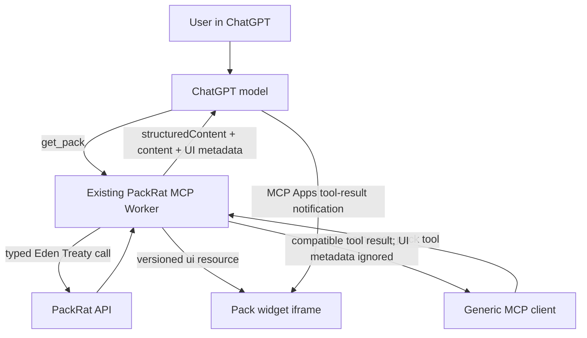

# Add ChatGPT Pack Workspace

## Goal Capsule

- **Objective:** Turn Packrat's existing remote MCP server into a ChatGPT App by adding a portable MCP Apps widget for viewing an authenticated pack, while preserving Eden Treaty as the only application-data boundary.
- **Authority:** The Product Contract and session-settled KTDs in this plan override inferred implementation preferences. Current OpenAI Apps SDK documentation and existing Packrat MCP/API conventions constrain protocol details.
- **Execution profile:** Implement the smallest production-shaped `vanilla-widget` archetype in the existing `packages/mcp` Cloudflare Worker, then verify generic MCP compatibility and Apps UI behavior.
- **Stop conditions:** Stop if ChatGPT requires an incompatible auth topology, if `@modelcontextprotocol/ext-apps` cannot run in the Worker target, or if the widget would need to receive credentials or bypass the MCP tool boundary.
- **Tail ownership:** The implementing agent owns tests, documentation, dependency updates, and PR verification. Live ChatGPT Developer Mode validation may be recorded as an explicit external verification gap when credentials or deployed bindings are unavailable.

---

## Product Contract

### Summary

Packrat already exposes more than 60 outdoor-planning tools through an OAuth 2.1 remote MCP Worker. ChatGPT Apps are not a competing transport: current OpenAI guidance defines an app as an MCP server plus optional UI resources and the MCP Apps bridge. The first Packrat app will therefore enhance the existing server rather than build a second backend.

The MVP adds a polished, read-only pack workspace when ChatGPT calls `get_pack`. The model still receives concise structured pack data and can use all existing tools; ChatGPT additionally renders the pack as an iframe widget. Other MCP clients continue to receive a valid tool result and may ignore the UI metadata.

### Problem Frame

The current MCP surface is capable but text-only. Rebuilding the same domain access in a ChatGPT-specific server would duplicate tool contracts, authentication, and error handling. Packrat needs a visible Apps SDK foothold that proves the UI integration without moving business logic out of the API or widening the first release to every tool.

### Actors

- A1. An authenticated Packrat user asking ChatGPT to inspect or reason about one of their packs.
- A2. ChatGPT, which selects Packrat MCP tools and renders a linked UI resource.
- A3. A generic MCP client, which must remain compatible with the enhanced tool result.

### Requirements

- R1. The existing `/mcp` endpoint remains the single remote tool endpoint for both generic MCP clients and the ChatGPT App.
- R2. `get_pack` continues to fetch authoritative data through `@packrat/api-client` and Eden Treaty; the widget must not call Packrat API routes directly.
- R3. A successful `get_pack` result includes concise `structuredContent` suitable for both the model and widget, a terse text `content` fallback, and no credentials or sensitive widget-only payloads.
- R4. The `get_pack` descriptor links to a versioned `ui://` resource using MCP Apps standard metadata and accurate read-only annotations.
- R5. The widget renders the pack name, aggregate weight/count information, and an accessible item/category breakdown from the tool result, including empty and failure states.
- R6. The widget uses the MCP Apps bridge as the portable integration surface and treats `window.openai` only as an optional compatibility/host enhancement.
- R7. The resource declares the narrowest practical CSP and avoids remote scripts, direct API access, and bearer/admin token exposure.
- R8. Existing non-App MCP tool behavior, OAuth 2.1/PKCE handling, admin-tool visibility, resources, and prompts remain unchanged.
- R9. Automated tests protect the tool descriptor, UI resource, structured result, error fallback, and generic-client compatibility.
- R10. Developer documentation explains local Worker startup, MCP Inspector validation, HTTPS tunneling, ChatGPT Developer Mode connection, and the required refresh after metadata changes.
- R11. User-controlled pack and item text renders only through safe DOM text APIs after runtime snapshot validation; API data is never interpolated through `innerHTML`.
- R12. The model/widget snapshot is deterministically bounded by field length, item-row count, and serialized size, and reports total/truncated counts when the API result exceeds those limits.

### Key Flow

- F1. View a pack in ChatGPT
  - **Trigger:** A1 asks to inspect a known pack or selects one after `list_packs`.
  - **Actors:** A1, A2.
  - **Steps:** ChatGPT calls `get_pack`; the Worker calls the Packrat API through Eden Treaty; the tool returns structured pack data and its output-template link; ChatGPT loads the versioned widget resource and delivers the result over the MCP Apps bridge; the widget renders the same durable Packrat record the model is discussing.
  - **Outcome:** The user receives a visual pack workspace without creating a separate data path.
  - **Covered by:** R1-R7.

### Acceptance Examples

- AE1. Given an authenticated user owns a populated pack, when ChatGPT calls `get_pack`, then the model receives concise structured data and the widget renders the pack totals and items without making a direct Packrat API request.
- AE2. Given an authenticated user owns an empty pack, when ChatGPT calls `get_pack`, then the widget renders a useful empty state rather than failing or inventing items.
- AE3. Given the API returns 401, 403, or 404, when `get_pack` runs, then the existing actionable MCP error remains available and ChatGPT does not render stale or credential-bearing data.
- AE4. Given a generic MCP client that does not implement MCP Apps, when it calls `get_pack`, then it can still consume the text/structured tool result and safely ignore the linked UI resource.

### Scope Boundaries

This release is read-only and pack-focused. It does not add widget-initiated mutations, expose admin/auth-management tools in UI, redesign all MCP tool contracts, add a second ChatGPT deployment, or prepare a public directory submission. Trip workspaces, pack editing, persistent widget state, file upload, and richer ChatGPT-only APIs are deferred until the single-pack flow is validated in Developer Mode.

---

## Planning Contract

### Key Technical Decisions

- KTD1. **Use the existing MCP Worker as the ChatGPT App server** `(session-settled: user-directed — chosen over duplicating domain/business logic in separate MCP and ChatGPT layers: Eden Treaty keeps both interfaces thin and prevents drift)`. Current OpenAI documentation confirms an MCP server is required for a ChatGPT App and that MCP Apps metadata/UI can be layered onto ordinary tools.
- KTD2. **Adopt the MCP Apps standard first.** Add `@modelcontextprotocol/ext-apps` beside the existing TypeScript MCP SDK, register a `text/html;profile=mcp-app` resource, and use the `ui/*` bridge. Use OpenAI compatibility metadata only where ChatGPT still requires an alias.
- KTD3. **Enhance `get_pack` instead of adding a parallel ChatGPT-only data tool.** The existing read operation already has the right user intent and Eden call. UI metadata is ignorable by other MCP clients, so one descriptor preserves tool-name and authorization parity.
- KTD4. **Ship a self-contained vanilla widget.** Keep the first widget in `packages/mcp` with no remote scripts or separate frontend deployment. This matches the official quickstart shape, avoids adding a build/deploy surface before the protocol seam is proven, and keeps CSP empty by default.
- KTD5. **Return model-visible data intentionally.** Extend the MCP result helper so successful pack reads can expose a schema-validated, bounded `structuredContent` snapshot while preserving a text fallback. Do not dump the full API response into `_meta`; omit sensitive fields, cap strings and item rows with explicit truncation metadata, and let the API remain authoritative.

### High-Level Technical Design

### Assumptions

- The current OAuth provider's protected `/mcp` flow is accepted by ChatGPT Developer Mode; implementation must verify discovery and challenge behavior before claiming live compatibility.
- `@modelcontextprotocol/ext-apps` is compatible with the repo's MCP SDK and Cloudflare Worker bundle. If not, use the standard SDK resource APIs with the documented MIME type and metadata rather than creating another server.
- The API's current pack response contains the aggregate and item fields needed by the widget; implementation may normalize the returned subset but must not add business calculations that belong in the API.

### System-Wide Impact and Risks

- **MCP compatibility:** Changing the result envelope can affect existing clients. Preserve `content`, add standard fields, and test that unknown UI metadata remains optional.
- **Type-check pressure:** `packages/mcp` has disabled strict `tsc` because deep MCP/Eden types exhaust memory. Keep new helper types structural and verify through focused tests plus the Wrangler production bundle.
- **Authentication:** Browser-style cookie behavior and server bearer behavior differ. The widget does not own auth and must route any future data action through MCP tools. Existing OAuth tokens remain server-side.
- **UI security:** A self-contained resource minimizes CSP domains and supply-chain/runtime fetches. Any later external asset or API domain must be explicitly allowlisted.
- **Untrusted content and payload size:** Pack/item text is user-controlled. The widget must use `textContent`/safe DOM construction, never data-bearing `innerHTML`, and the server must bound the snapshot so hostile or accidental oversized packs cannot inflate model context or iframe work without limit.
- **Protocol churn:** MCP Apps standard fields are preferred over OpenAI-only aliases; tests should assert the intentional compatibility metadata so upgrades are visible.

### Sources and Patterns

- `packages/mcp/src/index.ts` — existing Worker, OAuth provider, and tool registration lifecycle.
- `packages/mcp/src/client.ts` — Eden result normalization and actionable auth/ACL errors.
- `packages/mcp/src/tools/packs.ts` — `get_pack` registration and typed Treaty call.
- `packages/mcp/src/resources.ts` — existing MCP resource conventions.
- `packages/api-client/src/index.ts` — shared Treaty client and adapter-owned auth hooks.
- `docs/solutions/integration-issues/web-auth-cross-origin-cors-credentials-secure-store-stub-2026-06-01.md` — keep auth transport interface-aware and never treat a browser's unreadable HttpOnly cookie as absent authentication.
- [OpenAI Apps SDK quickstart](https://developers.openai.com/apps-sdk/quickstart) — Apps require MCP and may add an iframe component.
- [Build your MCP server](https://developers.openai.com/apps-sdk/build/mcp-server) — resource, metadata, result-envelope, and local validation contract.
- [Build your ChatGPT UI](https://developers.openai.com/apps-sdk/build/chatgpt-ui) — MCP Apps bridge-first widget guidance.
- [Apps SDK reference](https://developers.openai.com/apps-sdk/reference) — standard fields first; `window.openai` remains optional compatibility/extensions.

---

## Implementation Units

### U1. Apps-capable MCP result and resource contract

- **Goal:** Add the protocol primitives needed for a UI-bearing tool without changing Packrat business behavior.
- **Requirements:** R1-R4, R7-R9.
- **Dependencies:** None.
- **Files:** `packages/mcp/package.json`, `bun.lock`, `packages/mcp/src/client.ts`, `packages/mcp/src/apps/pack-widget.ts`, `packages/mcp/src/__tests__/apps.test.ts`.
- **Approach:** Add the version-matched Apps helper dependency; define and contract-test a registration helper for one versioned, self-contained pack-widget resource with the documented Apps MIME type and resource metadata; extend the successful result shape to support an explicitly supplied, concise `structuredContent` while retaining text `content` and existing error semantics. U2 owns calling the helper during server initialization.
- **Patterns to follow:** Structural types in `packages/mcp/src/client.ts`; resource registration lifecycle in `packages/mcp/src/resources.ts`; no direct API/service imports beyond `@packrat/api-client`.
- **Test scenarios:**
  1. The resource registration helper uses the versioned `ui://` URI and Apps MIME type.
  2. The resource HTML is self-contained, declares its intended CSP metadata, and contains no credential, API URL, or remote script.
  3. A structured success returns both concise `structuredContent` and the existing text fallback.
  4. Existing 401/403/404/error normalization is unchanged and does not emit stale structured data.
- **Verification:** Focused MCP tests pass and Wrangler can bundle the Worker with the Apps dependency.

### U2. Visualize `get_pack` through the shared Eden path

- **Goal:** Make the existing pack-detail intent render as a ChatGPT/MCP Apps widget while preserving generic MCP behavior.
- **Requirements:** R2-R9, R11-R12; F1; AE1-AE4.
- **Dependencies:** U1.
- **Files:** `packages/mcp/src/index.ts`, `packages/mcp/src/tools/packs.ts`, `packages/mcp/src/apps/pack-widget.ts`, `packages/mcp/src/__tests__/apps.test.ts`, `packages/mcp/src/__tests__/client.test.ts`.
- **Approach:** Register the U1 widget helper during server initialization; attach the resource URI and read-only annotations to `get_pack`; normalize and runtime-validate the successful Treaty result into a bounded pack snapshot shared by model and widget; render totals, categories, and item rows from MCP Apps tool-result notifications using safe DOM construction and `textContent` for every API-derived string. Include accessible semantics, responsive layout, light/dark host styling, loading/empty/error states, explicit truncation indicators, and a text fallback for hosts that ignore the resource.
- **Execution note:** Characterize the current `get_pack` text result first, then add the standard fields and prove the old fallback remains consumable.
- **Patterns to follow:** The typed Treaty call in `packages/mcp/src/tools/packs.ts`; `call()` error behavior in `packages/mcp/src/client.ts`; bridge-first guidance from the official ChatGPT UI documentation.
- **Test scenarios:**
  1. Covers F1 / AE1. A populated API response yields the expected concise pack snapshot, text fallback, output-template metadata, and widget sections.
  2. Covers AE2. An empty item list produces zero-safe totals and a useful empty state.
  3. Covers AE3. API auth/ACL/not-found failures remain MCP errors and contain no structured success snapshot.
  4. Covers AE4. The result retains ordinary `content`, and no widget-specific requirement is imposed on the caller.
  5. A tool-result notification re-renders the widget from `structuredContent`; messages from non-parent sources or malformed envelopes are ignored.
  6. The descriptor marks the tool read-only, non-destructive, idempotent, and closed-world accurately.
  7. Pack/item strings containing HTML, script, and event-handler payloads render as inert text; no API-derived value reaches `innerHTML`.
  8. Oversized strings and item lists produce a bounded serialized snapshot with deterministic truncation and accurate total/truncated counts.
- **Verification:** Unit/contract tests prove descriptor and result behavior; a rendered widget fixture remains usable at narrow and wide widths and under light/dark color schemes.

### U3. Document and smoke-test the ChatGPT development loop

- **Goal:** Make the app reproducible for maintainers and capture the distinction between automated protocol checks and live ChatGPT validation.
- **Requirements:** R8-R10.
- **Dependencies:** U1, U2.
- **Files:** `packages/mcp/README.md`, `package.json`, `packages/mcp/package.json`.
- **Approach:** Add focused local commands and documentation for Worker startup, MCP Inspector, an HTTPS tunnel, ChatGPT Developer Mode app creation using the tunneled `/mcp` URL, OAuth sign-in, metadata refresh, and production deployment through the existing Worker. Do not add an OpenAI API key requirement; ChatGPT connects to the MCP endpoint.
- **Patterns to follow:** Root script naming in `package.json`; existing `packages/mcp/wrangler.jsonc` environments and bindings; official Apps SDK connection steps.
- **Test scenarios:**
  1. A new maintainer can identify required local env/bindings and start the Worker from the documented commands.
  2. Inspector can list `get_pack`, read the linked resource, and observe the structured result.
  3. The live-validation checklist covers HTTPS, Developer Mode connection, OAuth, populated/empty/error packs, widget rendering, and app refresh after metadata changes.
  4. Documentation clearly distinguishes generic MCP support, MCP Apps portability, and optional ChatGPT-specific extensions.
- **Verification:** Commands are checked against package scripts, the local MCP endpoint is smoke-tested where bindings permit, and any unavailable ChatGPT account/deployment step is recorded precisely rather than claimed.

---

## Verification Contract

| Gate | Applies to | Command or evidence | Done signal |
|---|---|---|---|
| MCP unit and contract tests | U1, U2 | `bun test:mcp` | Existing and new tests pass. |
| Coverage threshold | U1, U2 | `bun run --cwd packages/mcp test --coverage` | MCP coverage remains above configured thresholds. |
| Repository lint | U1-U3 | `bun run check` | No new Biome errors. |
| Worker production bundle | U1-U3 | `bun run --cwd packages/mcp deploy --dry-run` or the supported Wrangler dry-run equivalent | Worker and embedded widget bundle successfully without publishing. |
| MCP Inspector smoke | U2, U3 | Inspect the local `/mcp` endpoint, call `get_pack`, and open its resource | Descriptor, result envelope, and widget resource are coherent. |
| ChatGPT Developer Mode | U3 | Connect a tunneled/deployed `/mcp`, complete OAuth, call `get_pack`, and inspect the widget | Live pass recorded, or a specific external credential/binding gap is documented. |

---

## Definition of Done

- `get_pack` remains a thin Eden Treaty-backed MCP operation and now advertises one versioned MCP Apps widget.
- The widget renders populated and empty packs from `structuredContent`, has accessible fallbacks, and contains no direct API/auth path.
- User-controlled text is schema-validated and rendered inertly, and oversized packs cannot create an unbounded model/widget payload.
- Generic MCP clients retain a usable text result and all unrelated tools/resources/prompts behave as before.
- Descriptor annotations, UI metadata, resource MIME/CSP, and result partitioning match current official Apps SDK guidance.
- Focused tests, MCP coverage, lint, and a production-faithful Worker bundle pass.
- Maintainer docs explain MCP Inspector and ChatGPT Developer Mode setup without introducing an OpenAI API-key dependency.
- Live-only verification gaps, if any, are explicitly recorded; no unrun integration is reported as successful.
