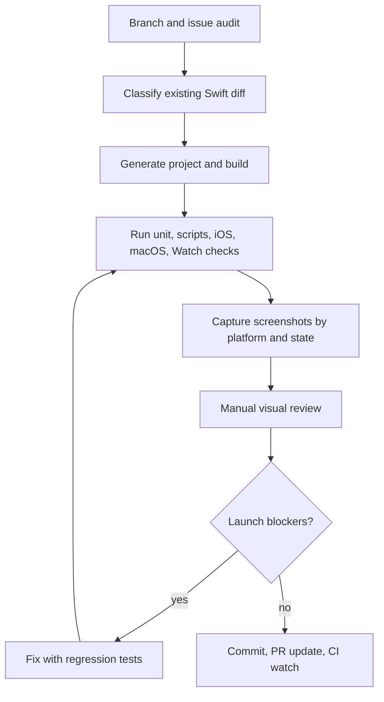

# Swift Launch Readiness QA - Plan

## Goal Capsule

- **Objective:** Bring the Swift iOS, iPad, macOS, and Watch surfaces to launch-readiness confidence as a seamless update path from the Expo app by syncing current branches, generating fresh screenshot evidence, running full Swift QA, and fixing any launch-blocking defects found.
- **Authority:** Expo production behavior remains the parity baseline; open Swift/mobile GitHub issues and live screenshot evidence override stale prior confidence claims; native SwiftUI/AppKit expectations govern UI polish.
- **Execution profile:** Audit latest branches and PRs, preserve existing uncommitted Swift tester fixes, run screenshot and E2E coverage across Apple targets, inspect failures/screenshots manually, fix real bugs with focused tests, then commit/PR/watch CI.
- **Stop conditions:** Stop only for unavailable credentials/signing infrastructure, a failing local toolchain that cannot build Apple targets, or a product decision needed to choose between Expo parity and a new Swift-native behavior.
- **Tail ownership:** The implementation run owns branch hygiene, QA artifacts, screenshot contact sheets, fixes, regression tests, PR updates, and CI follow-through.

---

## Product Contract

### Summary

The Swift app should be ready for tester distribution as the Apple-native successor to the Expo mobile experience, with no known launch-blocking gaps in core flows, auth/guest behavior, offline/local-first behavior, AI/weather/catalog/pack CRUD, visual polish, or platform packaging.

### Problem Frame

Prior Swift readiness work improved the app substantially, but repeated tester feedback showed that passing checks did not always mean screens were visually correct or deployed/TestFlight behavior was healthy. The current request is a launch-readiness reset: inspect the latest branches, generate fresh screenshots, run real QA, and keep fixing until the Swift variant is credible as a seamless update from Expo.

### Requirements

#### Branch and Ticket Reality

- R1. The working branch is synced against the latest intended base branch and all relevant open Swift/TestFlight/mobile PRs and issues are reviewed before declaring readiness.
- R2. Existing uncommitted Swift tester-fix work is preserved, understood, and either incorporated into this readiness branch or deliberately isolated with a clear reason.
- R3. PR metadata and versioning must not contradict the app binaries, TestFlight replacement settings, or Expo baseline version.

#### Screenshots and Manual Review

- R4. Fresh screenshot catalogs exist for iPhone, iPad, macOS, and Watch where tooling supports them.
- R5. Screenshot catalogs include guest, authenticated, offline/error, populated, modal, menu, form, and feature-specific states needed to visually detect broken UI.
- R6. The implementation run manually reviews the screenshot outputs for obvious errors, stale data confusion, missing icons, bad padding, broken empty states, overflow, connection-state misuse, and non-native-looking controls.

#### E2E and Functional Coverage

- R7. Swift iOS and macOS smoke/full or equivalent UI E2E suites run against the local deterministic API where possible.
- R8. Core features are testable end to end: auth/guest entry, home navigation/search, packs/trips/items CRUD, catalog add flow, templates, weather, season suggestions, trail conditions, chat/AI fallback, settings/preferences, offline/local-first behavior, and platform-specific Watch sync smoke.
- R9. Tests must verify behavior rather than hiding defects through overly broad retries, weak assertions, or fixture states that mask real deployed failures.

#### Launch Readiness

- R10. App Store/TestFlight replacement configuration is verified for bundle identifiers, display names, version/build numbers, icons, orientations, entitlements, and archive overrides.
- R11. Any issue found during QA is fixed with the smallest scoped change that follows existing SwiftUI patterns and includes regression coverage.
- R12. Readiness is reported honestly: green CI and screenshots are evidence, but remaining open tickets and untested deployed/TestFlight paths are called out.

### Key Flows

- F1. **Fresh branch audit**
  - **Trigger:** Launch-readiness run starts.
  - **Steps:** Fetch/prune remotes, inspect current branch, inspect open PRs/issues, compare branch against development/main as appropriate, and identify any stale or conflicting Swift work.
  - **Outcome:** The active branch choice and unresolved ticket list are explicit.
  - **Covered by:** R1, R2, R3.
- F2. **Screenshot-driven QA**
  - **Trigger:** Swift builds and test runners are runnable.
  - **Steps:** Generate screenshot catalogs for supported Apple platforms, inspect contact sheets and individual images, record defects, and fix visible regressions.
  - **Outcome:** Screenshots are current review artifacts, not stale confidence theater.
  - **Covered by:** R4, R5, R6, R11.
- F3. **Full functional QA**
  - **Trigger:** Branch is synced and screenshot setup is understood.
  - **Steps:** Run Swift scripts, unit tests, iOS/macOS E2E, Watch sync smoke, TestFlight preflight, and targeted tests for any changed flows.
  - **Outcome:** Core flows have executable coverage and failures are triaged as real bugs or infrastructure blockers.
  - **Covered by:** R7, R8, R9, R10.

### Acceptance Examples

- AE1. Given the current branch has stale or uncommitted Swift tester work, when launch QA begins, then that work is listed, preserved, and either validated or deliberately separated before commits are made.
- AE2. Given a fresh iPhone screenshot catalog, when a Home, form, modal, menu, Weather, Chat, Pack, Catalog, Settings, or offline state is visually broken, then a concrete issue is fixed or recorded before readiness is claimed.
- AE3. Given the Swift app is intended to replace the Expo listing, when TestFlight preflight runs, then replacement bundle IDs, version/build, archive overrides, and display metadata align with that release path.
- AE4. Given the local deterministic API is available, when iOS and macOS E2E flows run, then auth/guest and core CRUD/AI/weather flows are asserted with feature-specific expectations.
- AE5. Given some repo-wide tickets remain outside this Swift launch scope, when the final report is written, then they are named as residuals rather than implied solved.

### Scope Boundaries

- Expo implementation changes are out of scope unless they directly unblock Swift parity verification or shared API stubs.
- Broad API security tickets and unrelated web/landing issues are not launch blockers for this Swift readiness pass unless QA proves they affect Swift runtime behavior.
- Dummy data should support deterministic tests and screenshots only; it must not create confusing production user-facing defaults.
- A real TestFlight/device smoke is required for final release confidence, but this plan can only automate it when credentials, signing, and App Store Connect access are locally available.

### Sources

- Open PRs #2627 and #2653, plus any newer Swift/mobile PRs discovered during implementation.
- Existing plans `docs/plans/2026-07-17-001-fix-swift-testflight-loading-and-pr-readiness-plan.md` and `docs/plans/2026-07-23-001-fix-swift-tester-issues-plan.md`.
- Swift app sources under `apps/swift/Sources/PackRat`, Swift tests under `apps/swift/Tests`, and screenshot/E2E scripts under `apps/swift/scripts`.

---

## Planning Contract

### Key Technical Decisions

- KTD1. Use screenshot evidence as a release gate, not only test pass/fail. (session-settled: user-directed - chosen over test-only confidence: prior iterations missed visible error states and broken UI despite passing tests.)
- KTD2. Treat Expo as the parity baseline while allowing Swift-native UI improvements. (session-settled: user-directed - chosen over a standalone Swift redesign: the Swift app is intended to ship as a seamless update to the existing Expo app.)
- KTD3. Preserve and audit existing uncommitted tester fixes before editing. Uncommitted changes in this worktree are assumed to be user/prior-agent work and must not be overwritten or casually folded into unrelated commits.
- KTD4. Prefer deterministic local API and generated fixtures for E2E reliability, but do not weaken assertions or hide deployed/TestFlight bugs. Local stubs prove app behavior; deployed smoke remains a separate release gate.
- KTD5. Keep launch-readiness fixes small and SwiftUI-native. Reusable components are appropriate for repeated state/layout patterns, but unrelated refactors wait until after launch-readiness evidence is clean.

### High-Level Technical Design

### Assumptions

- The intended integration base remains `development` unless branch/PR metadata shows the Swift launch branch has moved elsewhere.
- The local machine has Xcode, simulators, and Apple tooling installed, but signing/TestFlight upload may still require credentials or manual Apple account state.
- The current worktree may be stale relative to GitHub because older fetches can hang; implementation should verify remote state with targeted GitHub commands when needed.

### Sequencing

Start by making branch and diff state explicit, because existing uncommitted Swift changes change both QA scope and commit hygiene. Then run cheap script/unit checks before expensive simulator screenshot/E2E runs. Use screenshot review to drive targeted fixes, then rerun only the affected narrow tests before final broad gates.

---

## Implementation Units

### U1. Branch, PR, and issue audit

- **Goal:** Establish the current launch-readiness baseline and avoid working from stale branch assumptions.
- **Requirements:** R1, R2, R3; KTD3.
- **Files:** `docs/plans/2026-08-06-001-swift-launch-readiness-qa-plan.md`, PR metadata, issue metadata, and any branch notes added to the PR body.
- **Approach:** Inspect current branch, uncommitted diff, open PRs, recent merged Swift branches, and open Swift/mobile/TestFlight issues. Decide whether to continue on `codex/swift-beta-tester-readiness`, switch to another branch, or create a new branch from the latest base.
- **Test scenarios:**
  1. Covers AE1. Existing uncommitted files are listed before any edits.
  2. Covers R1. Open Swift/mobile PRs and issues are summarized with scope classification.
  3. Covers R3. Version/build metadata is checked against Expo and TestFlight scripts.
- **Verification:** Branch state and issue scope are included in the final report and, when code changes ship, the PR description.

### U2. Swift build, script, and release metadata verification

- **Goal:** Prove the Swift app can build and its release metadata supports a seamless Expo replacement.
- **Requirements:** R3, R7, R10.
- **Files:** `apps/swift/project.yml`, `apps/swift/Resources/Info-iOS.plist`, `apps/swift/Resources/Info-macOS.plist`, `apps/swift/Resources/Info-watchOS.plist`, `apps/swift/scripts/lib/testflight-config.ts`, `apps/swift/scripts/verify-testflight-replacement.ts`, and related tests.
- **Approach:** Regenerate Swift config/project if needed, run Swift script tests, validate assets, inspect build settings, and run TestFlight replacement preflight/dry-run where credentials allow.
- **Test scenarios:**
  1. Covers AE3. Replacement preflight reports the intended bundle IDs, version, build number, and archive overrides.
  2. Swift script tests cover argument parsing, config generation, TestFlight config, asset validation, and screenshot runner logic.
  3. Xcode build settings expose no stale `1.0`/wrong bundle ID/default display name for the intended replacement path.
- **Verification:** `bun test:swift:scripts`, `bun swift:validate-assets`, `bun swift:testflight:preflight --replacement --production`, and Xcode build/show-settings checks pass or produce explicit blockers.

### U3. iOS, iPad, macOS, and Watch screenshot catalog

- **Goal:** Produce fresh visual evidence across supported Apple surfaces and inspect it for launch blockers.
- **Requirements:** R4, R5, R6; KTD1.
- **Files:** `apps/swift/scripts/capture-visual-screenshots.ts`, `apps/swift/Tests/PackRatUITests/VisualScreenshotTests.swift`, `apps/swift/Tests/PackRatMacUITests`, `apps/swift/scripts/watch-sync-smoke.ts`, and `artifacts/screenshots*`.
- **Approach:** Run screenshot capture for iOS, iPad, macOS, and Watch as supported. Save individual images and contact sheets. Review outputs manually and record visible defects by screen/state.
- **Test scenarios:**
  1. Covers AE2. Catalog includes Home, auth/guest, settings, packs/trips, catalog, weather, chat, templates, offline states, forms, modals, and menus.
  2. Contact sheets do not show cropped, stale, notification-obscured, or incorrectly connected states unless intentionally captured.
  3. Watch screenshot/sync smoke demonstrates companion behavior or records a tooling/signing limitation.
- **Verification:** Fresh contact sheets exist and the final report names their paths and visual findings.

### U4. Full Swift E2E and core feature QA

- **Goal:** Exercise launch-critical behavior beyond unit tests.
- **Requirements:** R7, R8, R9.
- **Files:** `apps/swift/Tests/PackRatUITests`, `apps/swift/Tests/PackRatMacUITests`, `apps/swift/Tests/PackRatTests`, `apps/swift/scripts/run-e2e.ts`, `apps/swift/scripts/run-e2e-macos.ts`, and deterministic API routes under `packages/api/src`.
- **Approach:** Run iOS smoke/full or targeted equivalent, iPad-capable screenshot/UITest paths, macOS smoke/full or targeted equivalent, Swift unit tests, and Watch sync smoke. Where full runs are too slow or flaky, identify the exact failing test and rerun targeted after fixes.
- **Test scenarios:**
  1. Authenticated and guest flows both reach expected screens without false connection-required states.
  2. Packs/trips/items CRUD and catalog add flows work with deterministic test data.
  3. Weather, season suggestions, trail conditions, and chat/AI flows show data/fallback states correctly.
  4. Settings/preferences and offline/local-first paths survive relaunch and network-disabled conditions.
- **Verification:** `bun test:swift:unit`, `bun e2e:swift:ios-smoke`, `bun e2e:swift:ios`, `bun e2e:swift:mac-smoke`, `bun e2e:swift:mac-ui`, and `bun swift:watch-sync-smoke` pass or residual blockers are filed.

### U5. Fix launch-blocking defects with regression coverage

- **Goal:** Convert QA findings into small, tested fixes without hiding real bugs.
- **Requirements:** R9, R11, R12; KTD4, KTD5.
- **Files:** Determined by findings, likely under `apps/swift/Sources/PackRat`, `apps/swift/Tests/PackRatTests`, `apps/swift/Tests/PackRatUITests`, `apps/swift/Tests/PackRatMacUITests`, and `packages/api/src/routes` for deterministic E2E stubs.
- **Approach:** For each defect, reproduce with a screenshot/test/log, apply the minimal SwiftUI-native fix, add or strengthen a regression assertion, and rerun the narrow gate plus the relevant broad gate.
- **Test scenarios:**
  1. A visible UI defect has before/after screenshot evidence.
  2. A functional defect has a failing or characterization test before the fix where practical.
  3. A residual limitation has a durable issue/PR note rather than being described as solved.
- **Verification:** Final diff contains only intentional fixes, tests pass, screenshots are refreshed after visual changes, and residuals are explicit.

---

## Verification Contract

| Gate | Applicability | Done signal |
|---|---|---|
| Branch hygiene | U1 | `git status --short --branch` is understood, with unrelated/user changes preserved |
| Swift script tests | U2 | `bun test:swift:scripts` passes |
| Asset and TestFlight metadata | U2 | `bun swift:validate-assets` and replacement preflight/dry-run pass or produce explicit credential blockers |
| Swift unit tests | U4, U5 | `bun test:swift:unit` passes |
| iOS E2E | U4, U5 | `bun e2e:swift:ios-smoke` and full or targeted iOS E2E pass |
| macOS E2E | U4, U5 | `bun e2e:swift:mac-smoke` and full or targeted macOS E2E pass |
| Screenshot catalog | U3, U5 | Fresh iOS, iPad, macOS, and Watch artifacts are generated where supported and manually reviewed |
| Watch sync smoke | U3, U4 | `bun swift:watch-sync-smoke` passes or a concrete watchOS tooling blocker is recorded |
| CI | All units | PR checks are green or non-Swift residuals are explicitly separated from Swift launch readiness |

---

## Definition of Done

- Latest branch, PR, and issue state has been checked and summarized.
- Existing uncommitted Swift tester fixes are preserved and either shipped or separated.
- Fresh screenshots/contact sheets exist for supported iPhone, iPad, macOS, and Watch states.
- Screenshots have been manually reviewed and any visible launch blockers are fixed or filed.
- Swift script, unit, iOS E2E, macOS E2E, and Watch smoke gates have passed or produced named blockers.
- TestFlight replacement metadata is consistent with the intended seamless Expo update path.
- Any code changes have focused regression coverage and do not weaken assertions to pass tests.
- PR/commit history clearly communicates what was fixed, what was validated, and what remains outside scope.
